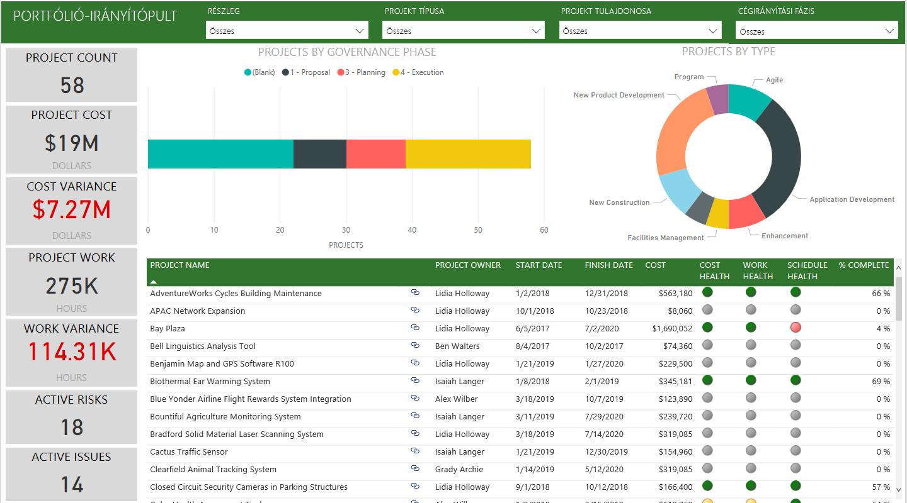
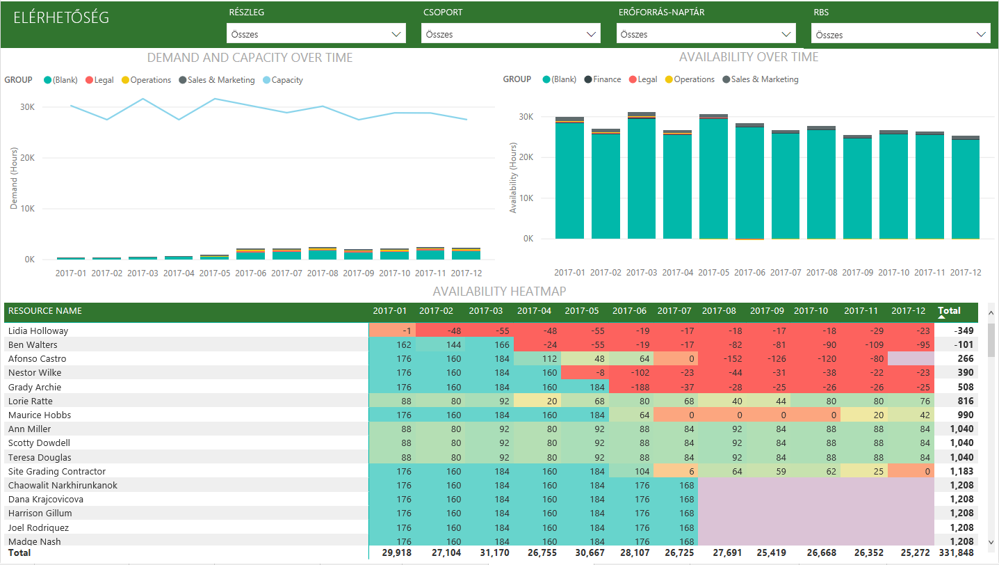
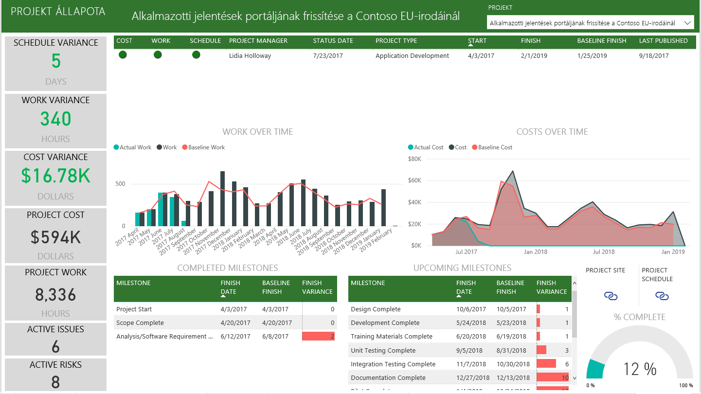

# Csatlakozás a Project Online-hoz a Power BI használatával
A Microsoft Project Online a projektportfólió-kezeléshez (PPM) és a mindennapi munkához nyújt rugalmas online megoldást. A Project Online lehetővé teszi a cég számára, hogy megtegye az előkészületeket, rangsorolja a projektporfólió-befektetéseket, és elérje a tervezett üzleti eredményt. A Power BI Project Online tartalomcsomagjával feloldhatja a Project Online elemzéseit, így könnyebben kezelheti a projekteket, a portfóliókat és az erőforrásokat.

Kapcsolódjon a Power BI-hoz készült [Project Online-tartalomcsomaghoz](https://app.powerbi.com/getdata/services/project-online).

## A csatlakozás menete
1. A bal oldali navigációs ablaktábla alján kattintson az **Adatok lekérése** elemre.
   
    
2. A **Szolgáltatások** mezőben válasza a **Beolvasás** elemet.
   
   
3. Válassza a **Microsoft Project Online** \> **Get** lehetőséget.
   
   
4. A **Project Web App URL** (Projekt Web App URL-címe) szövegdobozba írja be a csatlakoztatni kívánt Project Web App URL-címét, majd kattintson a **Következő** elemre. Vegye figyelembe, hogy ez az adat egyedi tartomány esetén eltérhet a példától. A **PWA Site Language** szövegmezőbe írja be a PWA-webhely nyelvének megfelelő számot. Angol nyelvhez az 1-es, franciához a 2-es, némethez a 3-as, brazil portugálhoz a 4-es, portugálhoz az 5-ös, spanyolhoz pedig a 6-os számot írja be. 
   
    
5. Az Authentication Method (Hitelesítési módszer) beállításnál válassza az **oAuth2** \> beállítást, majd a **Sign In** (Bejelentkezés) elemet. Amikor a rendszer kéri, adja meg a saját Projekt Online hitelesítő adatait, majd haladjon végig a hitelesítési folyamaton.
   
    
    
Vegye figyelembe, hogy portfóliómegtekintő, portfóliókezelő vagy rendszergazdai engedélyekre van szüksége ahhoz a Project Web Apphez, amelyhez csatlakozik.

6. Egy értesítés jelzi, hogy az adatok betöltése folyamatban van. A fiók méretétől függően ez eltarthat egy ideig. Miután a Power BI importálta az adatokat, egy új irányítópult, 13 jelentés és egy adatkészlet jelenik meg a bal oldali navigációs panelen. Ez az az alapértelmezett irányítópult, amelyet a Power BI létrehozott az adatok megjelenítésére. Az irányítópultot igény szerint módosíthatja, hogy az adatok a kívánt módon jelenjenek meg.

   

7. Miután az irányítópult és a jelentések elkészültek, megkezdheti a Project Online-adatokkal való munkát. A tartalomcsomag 13 részletgazdag jelentést tartalmaz portfólióáttekintéshez (6 jelentésoldal), erőforrás-áttekintéshez (5 jelentésoldal), valamint projektállapothoz (2 jelentésoldal). 

   
   
   
   
   

**Mi a következő lépés?**

* [Kérdéseket tehet fel a Q&A mezőben](consumer/end-user-q-and-a.md) az irányítópult tetején.
* [Módosíthatja az irányítópult csempéit](service-dashboard-edit-tile.md).
* [Kiválaszthatja valamelyik csempét](consumer/end-user-tiles.md) a mögöttes jelentés megnyitásához.
* Noha az adatkészlet napi frissítésre van ütemezve, módosíthatja a frissítési ütemezést, vagy igény szerint frissíthet az **Azonnali frissítés** gombbal.

**Tartalomcsomag kibontása**

Töltse le a [GitHub PBIT-fájlt](https://github.com/OfficeDev/Project-Power-BI-Content-Packs) a tartalom további testreszabásához és frissítéséhez

## Következő lépések
[Első lépések a Power BI-ban](service-get-started.md)

[Adatok lekérése a Power BI-ban](service-get-data.md)

