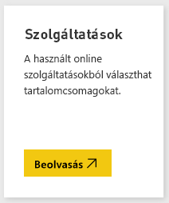
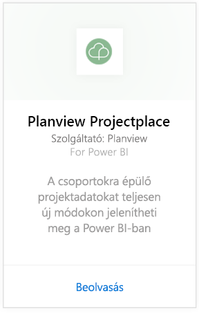
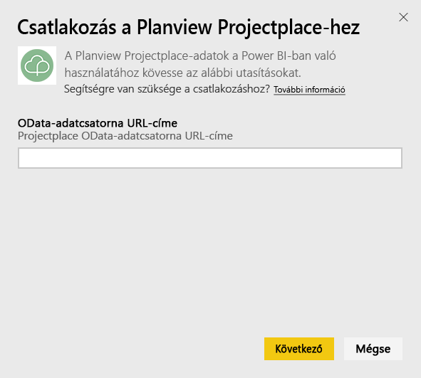
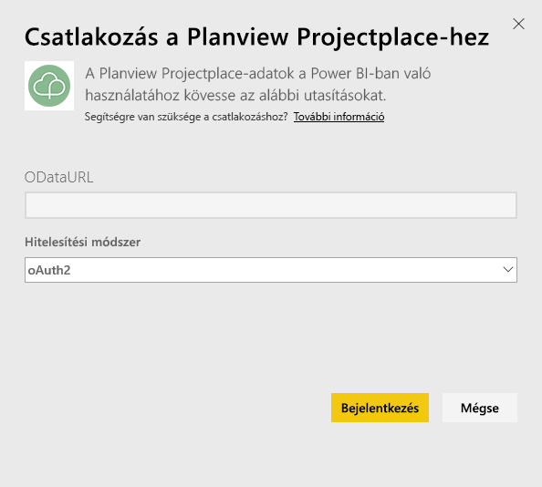
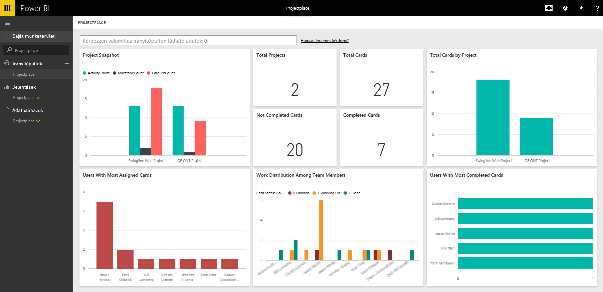

# Csatlakozás a Planview Projectplace tartalomcsomagjához a Power BI használatával
A Planview Projectplace tartalomcsomagjának segítségével egészen újszerű módon, közvetlenül a Power BI-ban jelenítheti meg az együttműködésen alapuló projektadatokat. A Projectplace-hez használt bejelentkezési hitelesítő adataival interaktívan tekintheti meg a Projectplace-fiók összes projektjének kulcsfontosságú statisztikáit, láthatja a csoport legaktívabb és leghatékonyabb tagjait, és azonosíthatja a kockázatos besorolású kártyákat valamint tevékenységeket. Az Ön számára legfontosabb elemzések megjelenítéséhez kibővítheti az előregyártott irányítópultot és a jelentéseket.

[Csatlakozás a Projectplace tartalomcsomaghoz a Power BI-ban](https://app.powerbi.com/getdata/services/projectplace)

>[!NOTE]
>Ahhoz, hogy a Power BI-ba importálhassa Projectplace-adatait, Projectplace-felhasználónak kell lennie. A további követelményeket alább tekintheti meg.

## Csatlakozás
1. A bal oldali navigációs ablaktábla alján kattintson az **Adatok lekérése** elemre.
   
    
2. A **Szolgáltatások** mezőben kattintson a **Beolvasás** elemre.
   
    
3. A Power BI oldalon jelölje ki a **Projectplace by Planview** lehetőséget, majd kattintson a **Beolvasás** elemre:  
   
    
4. Az OData-adatcsatorna URL-címe szövegmezőbe írja be a használni kívánt Projectplace OData-adatcsatorna URL-címét az alábbi ábra szerint:
   
    
5. A Hitelesítési módszer listán kattintson az **OAuth** elemre, ha még nincs kijelölve. Kattintson a **Bejelentkezés** gombra, és haladjon végig a bejelentkezés folyamatán.  
   
   
6. A bal oldali ablaktáblán, az irányítópultok listáján válassza ki a **Projectplace** lehetőséget. A Power BI az irányítópultba importálja a Projectplace adatait. Vegye figyelembe, hogy az adatok betöltése időbe telhet.  
   
    Az irányítópult csempéi megjelenítik a Projectplace adatbázisából származó adatokat. Az alábbi mintán egy Power BI-beli alapértelmezett Projectplace-irányítópult látható.
   
    

**Hogyan tovább?**

* [Kérdéseket tehet fel a Q&A mezőben](consumer/end-user-q-and-a.md) az irányítópult tetején.
* [Módosíthatja az irányítópult csempéit](service-dashboard-edit-tile.md).
* [Kiválaszthatja valamelyik csempét](consumer/end-user-tiles.md) a mögöttes jelentés megnyitásához.
* Noha az adatkészlet napi frissítésre van ütemezve, módosíthatja a frissítési ütemezést, vagy igény szerint frissíthet az **Azonnali frissítés** gombbal.

## Rendszerkövetelmények
Ahhoz, hogy a Power BI-ba importálhassa Projectplace-adatait, Projectplace-felhasználónak kell lennie. Ez az eljárás feltételezi, hogy már bejelentkezett a Microsoft Power BI kezdőlapjára egy Power BI-fiókkal. Ha még nincs Power BI-fiókja, látogasson el a [powerbi.com](https://powerbi.microsoft.com/get-started/) webhelyre, és a **Power BI - Felhőbeli együttműködés és megosztás** területen válassza az **Ingyenes próba** lehetőséget. Ez után kattintson az **Adatok letöltése** lehetőségre.

## Következő lépések
[Mi az a Power BI?](power-bi-overview.md)

[Power BI – Alapfogalmak](consumer/end-user-basic-concepts.md)

