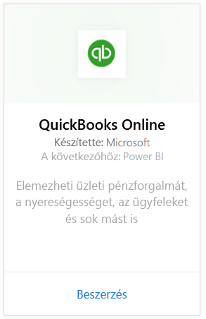
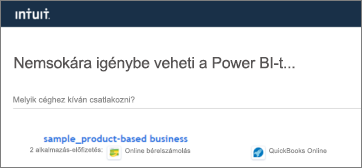
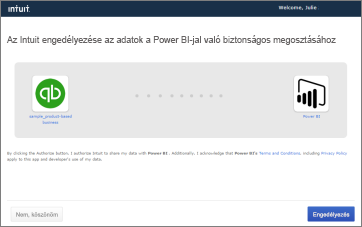
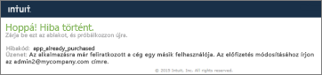
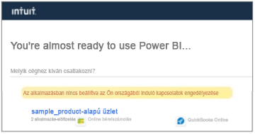

# Csatlakozás a QuickBooks Online-hoz a Power BI használatával
Amikor Power BI-ból csatlakozik a QuickBooks Online-adatokhoz, azonnal megjelenik egy Power BI-irányítópult és néhány Power BI-jelentés, amelyek alapján pénzforgalmával, jövedelmezőségével, ügyfeleivel és sok más területtel kapcsolatban összefüggéseket tárhat fel. Az irányítópultot és a jelentéseket a megjelenített formában is használhatja, illetve igényei szerint át is alakíthatja azokat, hogy azokat az információkat emeljék ki, melyek az Ön számára a legfontosabbak. Az adatokat naponta egyszer automatikusan frissíti a rendszer.

Kapcsolódjon a Power BI-hoz készült [QuickBooks Online-tartalomcsomaghoz](https://dxt.powerbi.com/getdata/services/quickbooks-online).

>[!NOTE]
>A QuickBooks Online adatok Power BI-ba történő importálásához, QuickBooks Online-fiókjában rendszergazdának kell lennie, és rendszergazdai hitelesítő adataival kell bejelentkeznie. A QuickBooks Desktop szoftverrel ez az összekötő nem használható. 

## Csatlakozás
1. A bal oldali navigációs ablaktábla alján kattintson az **Adatok lekérése** elemre.
   
    
2. A **Szolgáltatások** mezőben kattintson a **Beolvasás** lehetőségre.
   
    
3. Válassza ki **QuickBooks Online**, majd kattintson a **Letöltés most** lehetőségre.
   
   
4. Hitelesítési módszerként válassza az **oAuth2** eljárást, majd kattintson a **Bejelentkezés** lehetőségre. 
5. Amikor a rendszer kéri, adja meg QuickBooks Online hitelesítő adatait, majd haladjon végig a hitelesítési folyamaton. Ha böngészőjében már bejelentkezett a QuickBooks Online-ba, a rendszer nem feltétlenül fogja kérni hitelesítő adatait.
   >[!NOTE]
   >A QuickBooks Online-fiókjába rendszergazdai hitelesítő adatokkal kell bejelentkeznie.
6. A következő képernyőn válassza ki azt a céget, amelyet csatlakoztatni szeretne a Power BI-hoz.
   
   
7. Az importálási folyamat elindításához a következő képernyőn kattintson az **Authorize** (Engedélyezés) elemre. Ez a vállalati adatok méretétől függően néhány percet is igénybe vehet. 
   
   
   
   Miután a Power BI importálta az adatokat, a bal oldali navigációs ablaktáblán megjelenik egy új irányítópult, egy új jelentés és egy új adatkészlet. Az új elemeket sárga csillag \* jelöli.
   
   
8. Válassza ki a QuickBooks Online irányítópultot. Ez a Power BI által automatikusan létrehozott irányítópult az importált adatok megjelenítéséhez. Az irányítópultot módosíthatja, hogy az igényei szerint jelenítse meg az adatokat. 
   
   

**Hogyan tovább?**

* [Kérdéseket tehet fel a Q&A mezőben](consumer/end-user-q-and-a.md) az irányítópult tetején.
* [Módosíthatja az irányítópult csempéit](service-dashboard-edit-tile.md).
* [Kiválaszthatja valamelyik csempét](consumer/end-user-tiles.md) a mögöttes jelentés megnyitásához.
* Noha az adatkészlet napi frissítésre van ütemezve, módosíthatja a frissítési ütemezést, vagy igény szerint frissíthet az **Azonnali frissítés** gombbal.

## Hibaelhárítás
**„Hoppá! Hiba történt.”**

Ha az **Authorize** (Engedélyezés) választása után ezt az üzenetet kapja:

„Hoppá! Hiba történt.” Zárja be ezt az ablakot, és próbálkozzon újra.

Az alkalmazásra már feliratkozott a cég egy másik felhasználója. Az előfizetés módosításához írjon a [rendszergazda e-mail-címe] címre.”

... Ez azt jelenti, hogy a cég egy másik rendszergazdája már csatlakozott a vállalati adatokhoz a Power BI-jal. Kérje meg azt a rendszergazdát, hogy ossza meg Önnel az irányítópultot. Jelenleg csak egy rendszergazdai jogú felhasználó csatlakoztathat egy adott QuickBooks Online céges adatkészletet a Power BI-hoz. Ha a Power BI létrehozta az irányítópultot, a rendszergazda megoszthatja az ugyanazon a Power BI bérlőn található munkatársakkal.

**„Az alkalmazásban nincs beállítva az Ön országából induló kapcsolatok engedélyezése"**

A Power BI jelenleg csak a QuickBooks Online egyesült államokbeli kiadásait támogatja. 

## Következő lépések
[Mi az a Power BI?](power-bi-overview.md)

[Power BI – Alapfogalmak](consumer/end-user-basic-concepts.md)

