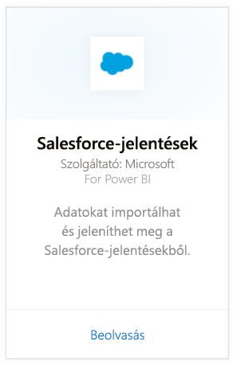
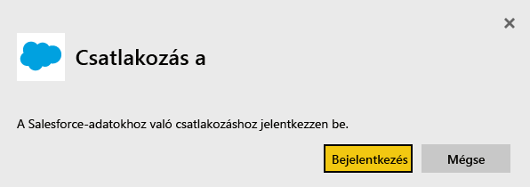
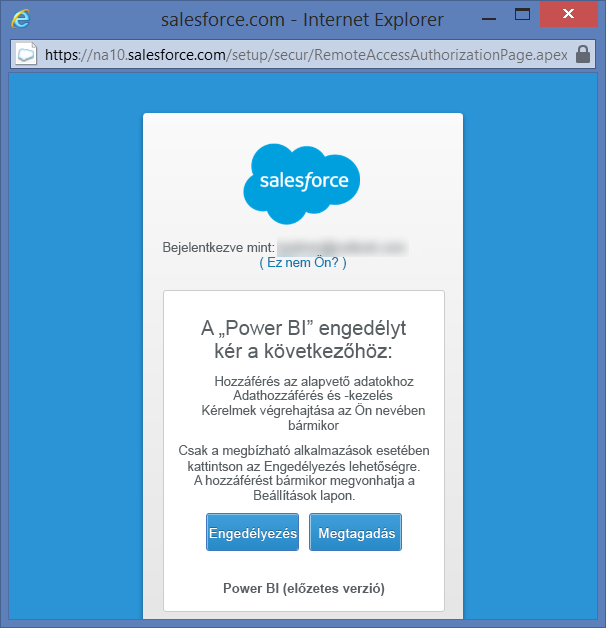
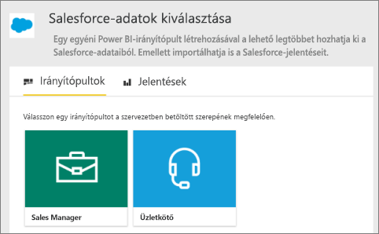
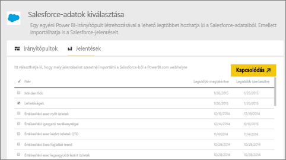
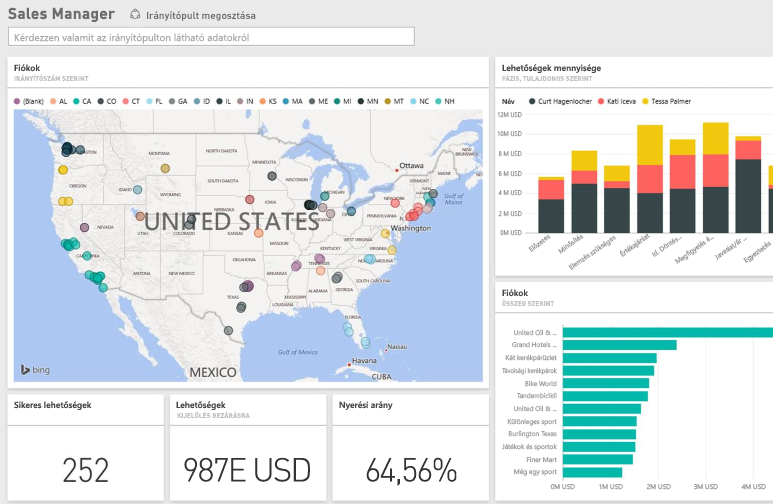

# Csatlakozás a Salesforce-hoz a Power BI-ban
A Power BI használatával könnyedén csatlakozhat a Salesforce.com-fiókjához. A létrehozott kapcsolat lekéri az adatokat, és automatikusan a rendelkezésére bocsátja az adatokhoz kapcsolódó irányítópultot és jelentéseket.

Kapcsolódjon a Power BI-hoz készült [Salesforce tartalomcsomaghoz](https://app.powerbi.com/getdata/services/salesforce), vagy tájékozódjon tovább a [Salesforce és a Power BI integrációjáról](https://powerbi.microsoft.com/integrations/salesforce).

## A kapcsolódás menete
1. Kattintson az **Adatok lekérdezése** elemre a bal oldalon lévő navigációs ablaktábla alján.
   
    
2. A **Szolgáltatások** dobozban kattintson a **Beolvasás** elemre.
   
    
3. Válassza a **Salesforce** lehetőséget, majd kattintson a **Beolvasás** elemre.  
   
   
4. A **Bejelentkezés** gombra kattintva kezdeményezze a bejelentkezési folyamatot.
   
    
5. Amikor a rendszer kéri, adja meg a Salesforce-fiókja hitelesítő adatait. Az **Engedélyezés** gombra kattintva tegye elérhetővé az alapvető Salesforce-információkat és -adatokat a Power BI számára.
   
   
6. A legördülő menü alábbi beállításával adja meg, hogy mit szeretne importálni a Power BI-ba:
   
   * **Irányítópult**
     
     Válasszon ki egy személyen (például **Értékesítési igazgató**) alapuló, előre meghatározott irányítópultot. Az ilyen irányítópultok a Salesforce adott szabvány-adatkészletét jelenítik meg, és nem tartalmaznak egyéni mezőket.
     
     
   * **Jelentések**
     
     Válasszon ki egy vagy több egyéni jelentést a Salesforce-fiókjából. Ezek a jelentések megegyeznek a Salesforce-beli saját nézetekkel, és tartalmazhatnak egyéni mezőkből és objektumokból származó adatokat.
     
     
     
     Ha nem lát jelentést, vegye fel vagy hozza létre a Salesforce-fiókban, majd kísérelje meg újra a csatlakozást.
7. Az importálás megkezdéséhez kattintson a **Csatlakozás** lehetőségre. Az importálás során megjelenik egy értesítés, hogy az importálás folyamatban van. Ha az importálás befejeződött, a bal oldali navigációs ablaktáblán megjelenik a Salesforce-adatokat tartalmazó irányítópult, jelentés és adatkészlet.
   
   

Az adatok igény szerinti megjelenítéséhez tetszés szerint módosíthatja az irányítópultot. Kérdéseket tehet fel a Q&A használatával – Vagy kattintson egy csempére [az alapjául szolgáló jelentés megnyitásához](service-dashboard-tiles.md), és [módosítsa a csempéket](service-dashboard-edit-tile.md) az irányítópulton.

**Hogyan tovább?**

* [Tegyen fel egy kérdést a Q&A mezőben](power-bi-q-and-a.md), amely az irányítópult tetején található
* [Módosítsa a csempéket](service-dashboard-edit-tile.md) az irányítópulton
* [Kattintson egy csempére](service-dashboard-tiles.md) az alapjául szolgáló jelentés megnyitásához
* Noha az adatkészlet napi frissítésre van ütemezve, módosíthatja a frissítési ütemezést, vagy igény szerint frissíthet az **Azonnali frissítés** gombbal.

## Rendszerkövetelmények és megfontolandó szempontok
- Kapcsolódás egy éles környezetben lévő Salesforce-fiókhoz, amelyen engedélyezve van az API-hozzáférés
- Engedély a Power BI alkalmazásnak a bejelentkezéskor
- Elegendő elérhető API-hívás a fiók számára az adatok lekéréséhez és frissítéséhez
- A frissítéshez érvényes hitelesítési jogkivonatra van szükség. Ellenőrizze, hogy 5, vagy annál kevesebb Salesforce-adatkészletet importált-e, mert a Salesforce legfeljebb 5 hitelesítési jogkivonatot engedélyez alkalmazásonként
- A Salesforce-jelentések API a korlátozás miatt legfeljebb 2000 adatsort támogat.

## Hibaelhárítás
Ha hibát észlel, tekintse át a fenti követelményeket. Azt is vegye figyelembe, hogy az egyéni vagy tesztkörnyezeti tartományba való bejelentkezés jelenleg nem támogatott.

### „Nem sikerült csatlakozni a távoli kiszolgálóhoz” üzenet

Ha „Nem sikerült csatlakozni a távoli kiszolgálóhoz” üzenet jelenik meg, amikor megpróbál kapcsolódni a Salesforce-fiókjához, tekintse meg a következő megoldást az Outsystems fórumon: [A Salesforce-összekötő bejelentkezési hibaüzenete: Nem sikerült csatlakozni a távoli kiszolgálóhoz](https://www.outsystems.com/forums/Forum_TopicView.aspx?TopicId=17674&TopicName=log-in-error-message-unable-to-connect-to-the-remote-server&)

## Következő lépések
[Első lépések a Power BI használatával](service-get-started.md)

[Adatok lekérése](service-get-data.md)

