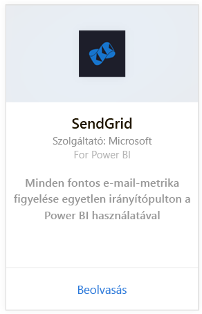
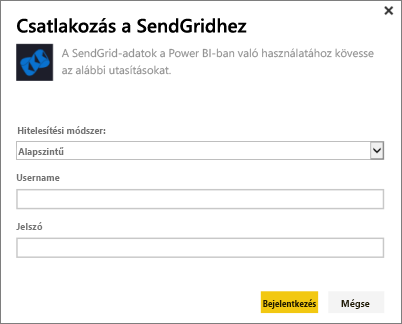
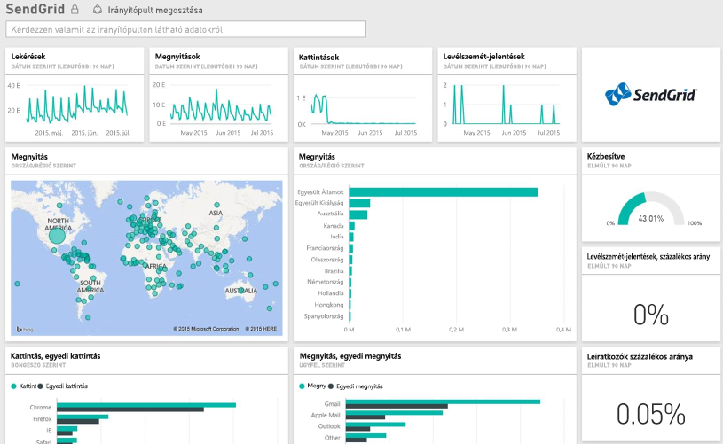

# Csatlakozás a SendGridhez a Power BI segítségével
A Power BI SendGridhez készült tartalomcsomagja elemzések és statisztikák kinyerését teszi lehetővé a SendGrid-fiókjából. A SendGrid-tartalomcsomag használatával vizualizálni tudja SendGrid-statisztikáit egy irányítópulton.

Kapcsolódjon a Power BI-hoz készült [SendGrid-tartalomcsomaghoz](https://app.powerbi.com/getdata/services/sendgrid).

## A kapcsolódás menete
1. A bal oldali navigációs ablaktábla alján kattintson az **Adatok lekérése** elemre.
   
    
2. A **Szolgáltatások** mezőben válasza a **Beolvasás** elemet.
   
    
3. Válassza ki a **SendGrid**-tartalomcsomagot, és kattintson a **Letöltés most** elemre.
   
    
4. Amikor a rendszer kéri, adja meg a SendGrid-felhasználónevét és -jelszavát. Válassza a **Bejelentkezés** lehetőséget.
   
   
5. Miután a Power BI importálta az adatokat, a navigációs ablaktáblán megjelenik egy új irányítópult, jelentés és adatkészlet, az elmúlt 90 nap levelezési statisztikáival. Az új elemeket sárga csillag \* jelöli.
   
   

**Hogyan tovább?**

* [Kérdéseket tehet fel a Q&A mezőben](power-bi-q-and-a.md) az irányítópult tetején.
* [Módosíthatja az irányítópult csempéit](service-dashboard-edit-tile.md).
* [Kiválaszthatja valamelyik csempét](service-dashboard-tiles.md) a mögöttes jelentés megnyitásához.
* Noha az adatkészlet napi frissítésre van ütemezve, módosíthatja a frissítési ütemezést, vagy igény szerint frissíthet az **Azonnali frissítés** gombbal.

## A csomag tartalma
A SendGrid-irányítópulton a következő metrikák érhetők el:

* Teljes körű levelezési statisztika: kérelmek, kézbesítések, sikertelen kézbesítések, blokkolt levélszemét, levélszemét-jelentés stb.
* Levelezési statisztika kategória szerint
* Levelezési statisztika földrajzi hely szerint
* Levelezési statisztika internetszolgáltató szerint
* Levelezési statisztika eszköz, ügyfél, böngésző szerint

## További lépések
[Első lépések a Power BI-ban](service-get-started.md)

[Adatok lekérése](service-get-data.md)

