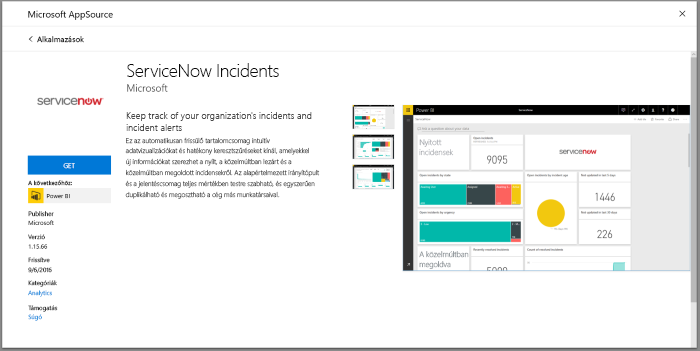
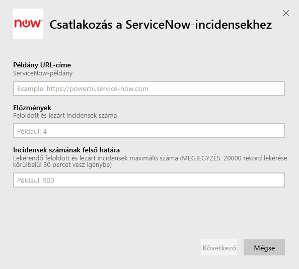
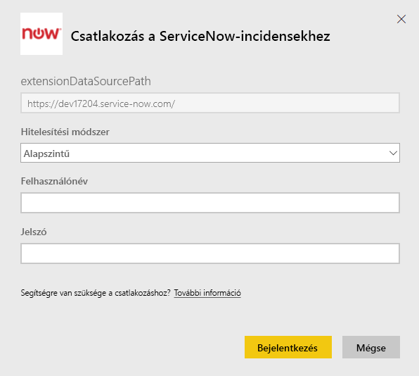
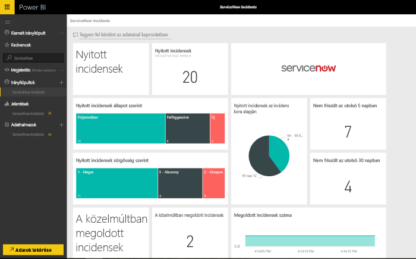

# Csatlakozás a ServiceNow-hoz a Power BI használatával incidensjelentések készítéséhez
A ServiceNow több terméket és megoldást is kínál a vállalkozások számára, köztük üzleti, üzemeltetési és informatikai felügyeleti megoldásokat. A tartalomcsomag több jelentést és elemzést is tartalmaz a nyitott, a nemrég megoldott és a nemrég lezárt incidensekkel kapcsolatban.  

Csatlakozzon a [ServiceNow-incidensekhez](https://app.powerbi.com/getdata/services/servicenow) készült Power BI-tartalomcsomaghoz.

## Csatlakozás
1. A bal oldali navigációs ablaktábla alján kattintson az **Adatok lekérése** elemre.
   
    
2. A **Szolgáltatások** mezőben kattintson a **Lekérés** elemre.
   
    
3. Kattintson a **ServiceNow-incidensek** \> **Lekérés** elemre.
   
   
4. Adja meg a ServiceNow-példánya URL-címét és a lekérni kívánt napok és rekordok tartományát. Vegye figyelembe, hogy ha a kettő korlátozás közül bármelyik teljesül, az importálás leáll.
   
   
5. Amikor a rendszer erre kéri, adja meg a ServiceNow **Alapszintű** hitelesítő adatait. Vegye figyelembe, hogy az egyszeri bejelentkezés jelenleg nem támogatott. A rendszerkövetelményekről az alábbiakban talál pontosabb részleteket.
   
   
6. A bejelentkezés folyamatának végén megkezdődik az importálás folyamata. Ha befejeződött, a navigációs panelen megjelenik egy új irányítópult, jelentés és modell. Válassza ki az irányítópultot az importált adatok megtekintéséhez.
   
    

**Mi a következő lépés?**

* [Kérdéseket tehet fel a Q&A mezőben](power-bi-q-and-a.md) az irányítópult tetején.
* [Módosíthatja az irányítópult csempéit](service-dashboard-edit-tile.md).
* [Kiválaszthatja valamelyik csempét](service-dashboard-tiles.md) a mögöttes jelentés megnyitásához.
* Noha az adatkészlet napi frissítésre van ütemezve, módosíthatja a frissítési ütemezést, vagy igény szerint frissíthet az **Azonnali frissítés** gombbal.

## Rendszerkövetelmények
A csatlakozáshoz a következőkre lesz szüksége:  

* Egy fiók, amely hozzáférhet a ceg.service-now.com címhez Alapszintű hitelesítéssel (az egyszeri bejelentkezést ez a verzió nem támogatja)  
* A fióknak rendelkeznie kell a rest_service szerepkörrel, valamint olvasási hozzáféréssel az incidens táblájához  

## Hibaelhárítás
Ha a betöltéskor a rendszer a hitelesítő adatokkal kapcsolatos hibát jelez, tekintse át a fenti hozzáférési követelményeket. Ha rendelkezik a helyes engedélyekkel, és így is problémákba ütközik, forduljon a ServiceNow-rendszergazdájához, hogy beszerezze mindazon további engedélyeket, amelyek az egyéni példánya esetén szükségesek lehetnek.

Ha hosszú betöltési időket tapasztal, ellenőrizze az incidensek és a napok számát, amelyeket a csatlakozáskor megadott, és esetleg csökkentse ezeket.

## Következő lépések
[A Power BI bemutatása](power-bi-overview.md)

[Power BI – Alapfogalmak](service-basic-concepts.md)

