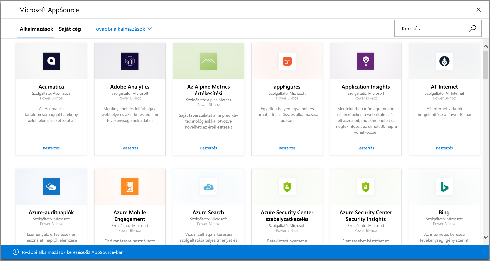
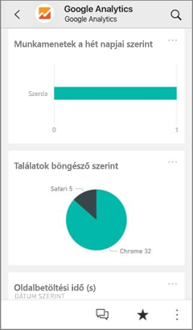
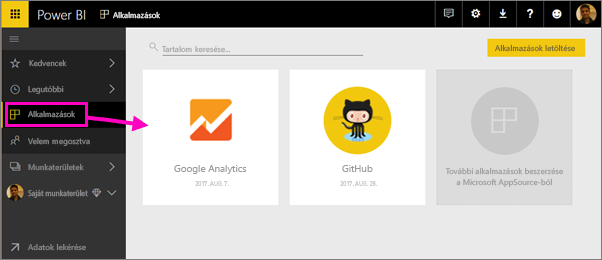
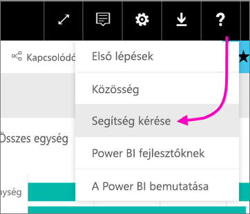

# Kapcsolódás a Power BI segítségével a használt szolgáltatásokhoz
Könnyedén kapcsolódhat a vállalkozása működtetéséhez használt olyan szolgáltatásokhoz, mint például a Salesforce, a Microsoft Dynamics és a Google Analytics. A Power BI először a hitelesítő adatok segítségével kapcsolódik a szolgáltatáshoz, majd létrehoz egy irányítópulttal rendelkező Power BI alkalmazást és néhány jelentést, amelyek automatikusan megjelenítik adatait, és vizuális elemzést biztosítanak az üzletmenetről. 

Ha meg szeretné tekinteni azon [szolgáltatásokat, amelyekhez kapcsolódni tud](https://app.powerbi.com/getdata/services), jelentkezzen be a Power BI-ba. A Power BI csapata rendszeresen új szolgáltatásokkal bővíti a kínálatát.

Az alkalmazás telepítése után az irányítópultot és a jelentéseket a Power BI szolgáltatásban ([https://powerbi.com](https://powerbi.com)) és a Power BI-mobilalkalmazásokban is megtekintheti. 

## Első lépések
[!INCLUDE [powerbi-service-apps-get-more-apps](./includes/powerbi-service-apps-get-more-apps.md)]

## Az irányítópult és a jelentések megtekintése
Az importálás befejezésekor az új alkalmazás megjelenik az Alkalmazások lapon.

1. A bal oldali navigációs panelen válassza az **Alkalmazások** ikont > válassza ki az alkalmazást.
   
     
2. A Q&A mezőben kérdéseket tehet fel, egy csempére kattintva pedig megnyithatja az alapul szolgáló jelentést. 
   
    
   
    Kiszűrheti és kiemelheti a jelentésben szereplő adatokat, a módosításokat azonban nem mentheti.

## Tartalom
A szolgáltatáshoz való csatlakozást követően látni fog egy irányítópulttal, jelentésekkel és adatkészlettel rendelkező újonnan létrehozott alkalmazást. A szolgáltatásból származó adatok egy adott forgatókönyvre vonatkoznak, és nem feltétlenül tartalmazzák a szolgáltatással kapcsolatos összes információt. Az adatok naponta egyszer automatikusan frissülnek. Az adatkészlet kiválasztásával Ön határozhatja meg az ütemezést.

A [Power BI Desktop](desktop-get-the-desktop.md) segítségével is kapcsolódhat bizonyos szolgáltatásokhoz, például a Google Analyticshez, és létrehozhatja saját, személyre szabott irányítópultjait és jelentéseit.  

Ha szeretne többet megtudni az egyes szolgáltatásokhoz való csatlakozásról, olvassa el a megfelelő súgóoldalakat.

## Hibaelhárítás
**Üres csempék**  
Amikor a Power BI először kapcsolódik egy adott szolgáltatáshoz, lehetséges, hogy üres csempéket fog látni az irányítópulton. Ha 2 óra elteltével is csak üres csempéket lát, a kapcsolat valószínűleg megszakadt. Ha nem jelenik meg a probléma megoldására vonatkozó információt tartalmazó hibaüzenet, hozzon létre egy támogatási jegyet.

* Válassza ki a kérdőjel ikont (**?**) a jobb felső sarokban >  **Segítségkérés**.
  
    

**Hiányzó információ**  
Az irányítópult és a jelentések egy adott forgatókönyvre vonatkozó szolgáltatásból származó tartalmakat foglalnak magukba, és nem tartalmazzák a szolgáltatással kapcsolatos összes információt. Ha nem lát egy bizonyos metrikát a tartalomcsomagban, jelezze azt a [Power BI támogatás](https://support.powerbi.com/forums/265200-power-bi) oldalán.

## Szolgáltatások javaslása
Használ olyan szolgáltatást, amelyből szeretné, ha Power BI-alkalmazás készülne? Keresse fel a [Power BI támogatási](https://support.powerbi.com/forums/265200-power-bi) oldalát, és írja meg nekünk, melyik szolgáltatásra gondol.

Van olyan szolgáltatása, amelyhez szeretne egy alkalmazást létrehozni? [Küldje be javaslatát](https://azure.microsoft.com/marketplace/programs/certified/apply/), és válassza ki a „Power BI tartalomcsomag közzététele” lehetőséget a folyamat elindításához.

## Következő lépések
* [Mik a Power BI szolgáltatáson belüli alkalmazások?](service-install-use-apps.md)
* [Adatok lekérése a Power BI-ban](service-get-data.md)
* További kérdései vannak? [Kérdezze meg a Power BI közösségét](http://community.powerbi.com/)

