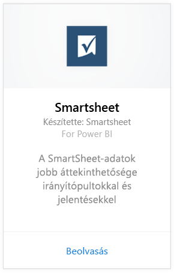
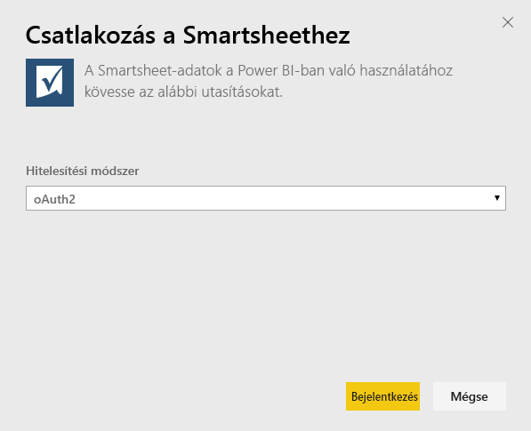
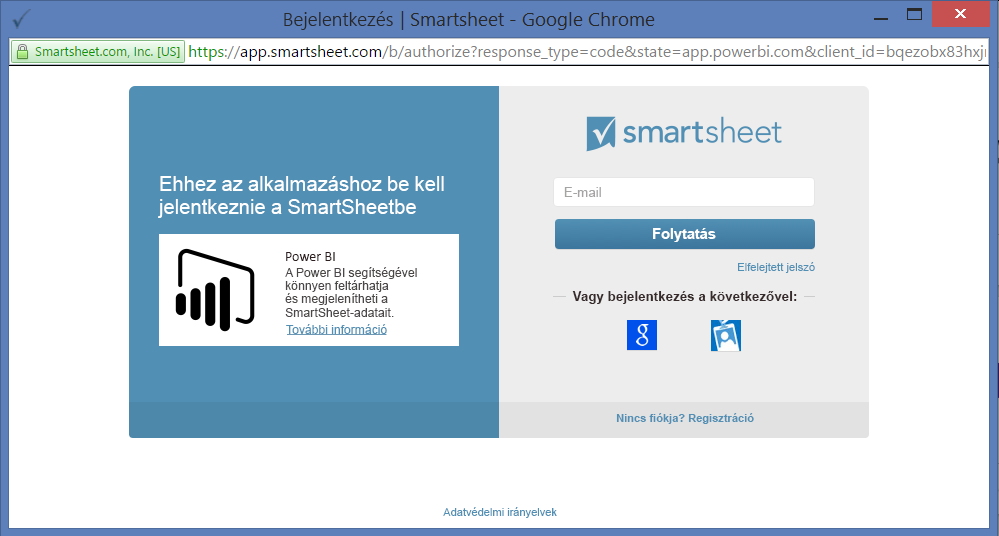
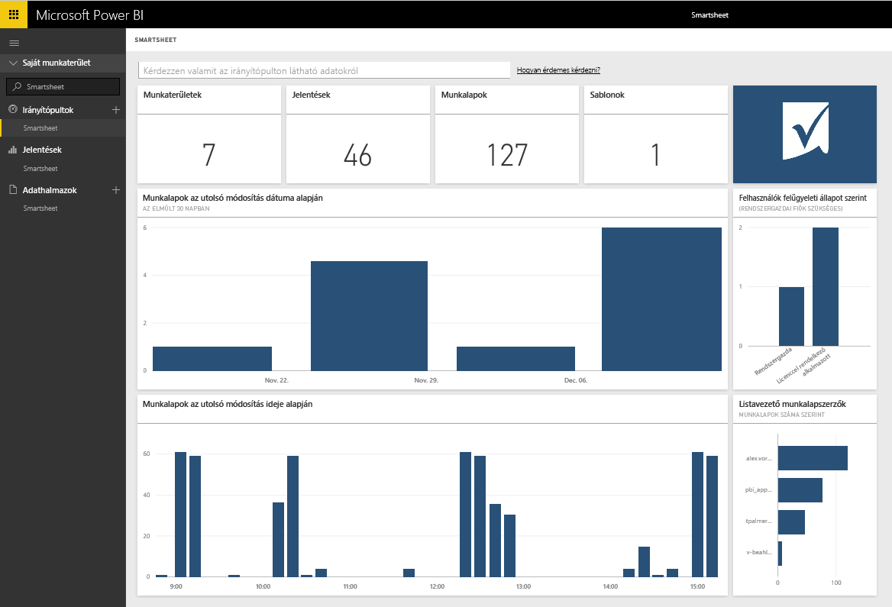

# Kapcsolódás a Smartsheethez a Power BI-jal
A Smartsheet könnyen használható platformot kínál az együttműködéshez és fájlmegosztáshoz. A Power BI-hoz készült Smartsheet-tartalomcsomag a Smartsheet-fiók áttekintését megjelenítő irányítópultot, jelentéseket és adatkészletet biztosít. A fiók egyes lapjaihoz közvetlenül is kapcsolódhat a [Power BI Desktop](desktop-connect-to-data.md) használatával. 

Kapcsolódjon a Power BI-hoz készült [Smartsheet-tartalomcsomaghoz](https://app.powerbi.com/groups/me/getdata/services/smartsheet).

>[!NOTE]
>A Power BI-tartalomcsomag betöltéséhez rendszergazdai fiók szükséges a Smartsheet szolgáltatásban, mivel ennek további hozzáférési engedélyei vannak.

## A csatlakozás menete
1. A bal oldali navigációs ablaktábla alján kattintson az **Adatok lekérése** elemre.
   
   
2. A **Szolgáltatások** mezőben kattintson a **Beolvasás** gombra.
   
    
3. Kattintson a **Smartsheet \> Beolvasás** gombra.
   
   
4. A Hitelesítési módszer beállításnál válassza az **oAuth2 \> Bejelentkezés** lehetőséget.
   
   Amikor a rendszer kéri, adja meg saját Smartsheet-beli hitelesítő adatait, majd haladjon végig a hitelesítési folyamaton.
   
   
   
   
5. Miután a Power BI importálta az adatokat, megjelenik egy új irányítópult, egy jelentés és egy adathalmaz a bal oldali navigációs ablaktáblán. Az új elemeket egy sárga csillag \* jelöli, válassza ki a Smartsheet bejegyzést.
   
   

**Hogyan tovább?**

* [Kérdéseket tehet fel a Q&A mezőben](power-bi-q-and-a.md) az irányítópult tetején.
* [Módosíthatja az irányítópult csempéit](service-dashboard-edit-tile.md).
* [Kiválaszthatja valamelyik csempét](service-dashboard-tiles.md) a mögöttes jelentés megnyitásához.
* Noha az adatkészlet napi frissítésre van ütemezve, módosíthatja a frissítési ütemezést, vagy igény szerint frissíthet az **Azonnali frissítés** gombbal.

## A csomag tartalma
A Power BI-hoz készült Smartsheet-tartalomcsomag tartalmazza a Smartsheet-fiók áttekintését, például a munkateretek, jelentések és lapok számát, ezek módosításának időpontját stb. A rendszergazdák számára a rendszer felhasználóira vonatkozó információk is megjelennek, például a legtöbb lapot létrehozó felhasználók.  

Egyéni lapokhoz való közvetlen kapcsolódáshoz a fiókban használhatja a Smartsheet-összekötőt a [Power BI Desktop](desktop-connect-to-data.md) alkalmazásban.  

## Következő lépések:

[Első lépések a Power BI-ban](service-get-started.md)

[Power BI – Adatok lekérése](service-get-data.md)