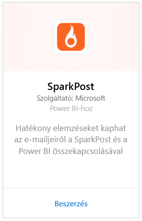
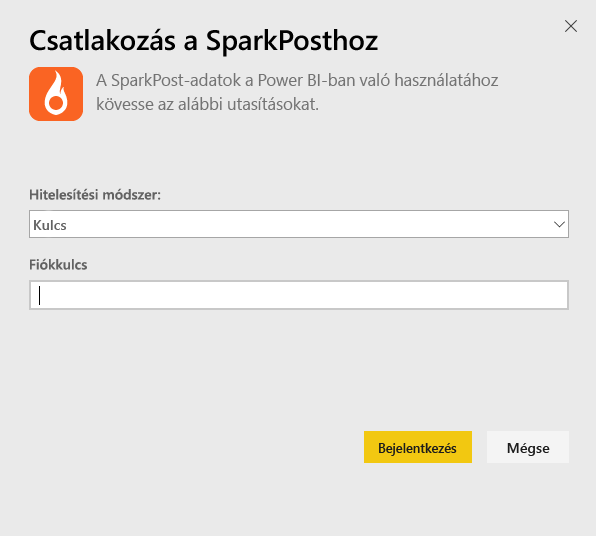
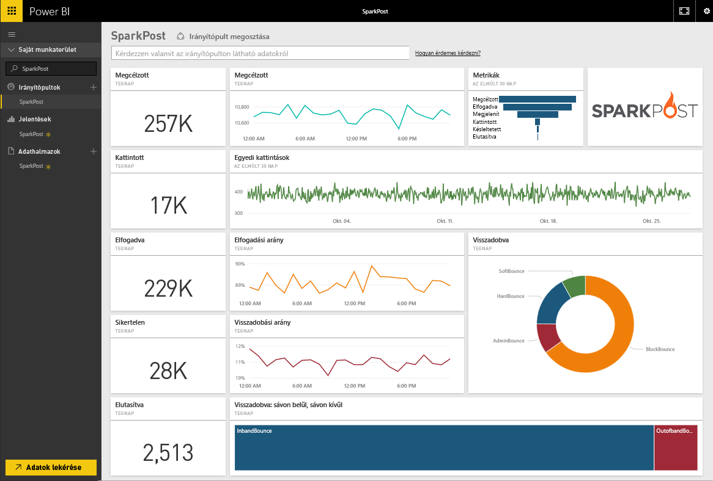
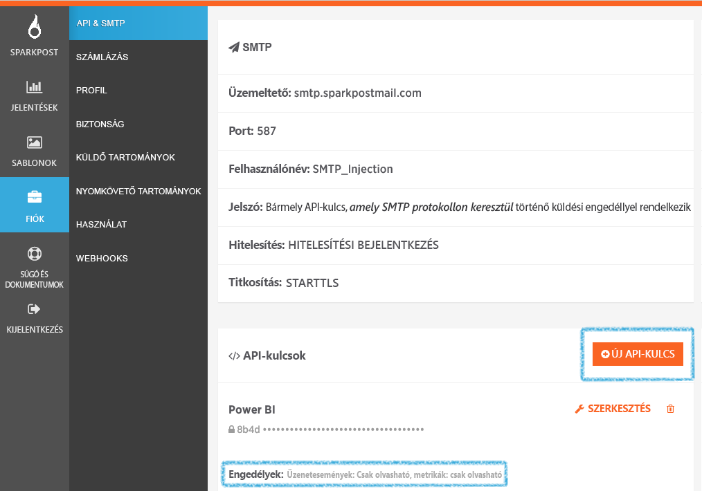

# Csatlakozás a SparkPosthoz a Power BI használatával
A Power BI SparkPosthoz készült tartalomcsomagja lehetővé teszi a SparkPost-fiók értékes adatkészleteinek kinyerését egyetlen informatív irányítópultra. A SparkPost-tartalomcsomag segítségével megjelenítheti a teljes levelezés statisztikai adatait, beleértve a tartományokat, a kampányokat és az internetszolgáltató által generált érdeklődést is.

Csatlakozás a [Power BI-hoz készült SparkPost-tartalomcsomaghoz](https://app.powerbi.com/getdata/services/spark-post).

## A csatlakozás menete
1. A bal oldali navigációs ablaktábla alján kattintson az **Adatok lekérése** elemre.
   
   
2. A **Szolgáltatások** mezőben válasza a **Beolvasás** elemet.
   
   
3. Válassza ki a **SparkPost**-tartalomcsomagot, és kattintson a **Beolvasás** elemre. 
   
   
4. Amikor a rendszer kéri, adja meg a SparkPost API-kulcsot, és kattintson a Bejelentkezés elemre. A [paraméter megkereséséről](#FindingParams) alább olvashat részletesebben.
   
   
5. Megkezdődik az adatok betöltése, ami a fiók méretétől függően eltarthat egy ideig. Miután a Power BI importálta az adatokat, a bal oldali navigációs ablaktáblán megjelenik az alapértelmezett irányítópult, a jelentés és az adatkészlet, amely az elmúlt 90 nap levelezési statisztikáit tartalmazza. Az új elemeket sárga csillag jelöli \*.
   
   

**Hogyan tovább?**

* [Kérdéseket tehet fel a Q&A mezőben](power-bi-q-and-a.md) az irányítópult tetején.
* [Módosíthatja az irányítópult csempéit](service-dashboard-edit-tile.md).
* [Kiválaszthatja valamelyik csempét](service-dashboard-tiles.md) a mögöttes jelentés megnyitásához.
* Noha az adatkészlet napi frissítésre van ütemezve, módosíthatja a frissítési ütemezést, vagy igény szerint frissíthet az **Azonnali frissítés** gombbal.

## A csomag tartalma
A Power BI-hoz készült SparkPost-tartalomcsomag többek között ezeket az információkat tartalmazza: egyedi kattintások, elfogadások aránya, visszapattanások aránya, késleltetések aránya, visszautasítások aránya.

## Paraméterek keresése
A tartalomcsomag egy API-kulcsot használ a SparkPost-fiók és a Power BI csatlakoztatásához. Az API-kulcsot a fiókjában találja meg a Fiók \> API & SMTP helyen (további részletek [itt](https://support.sparkpost.com/customer/portal/articles/1933377-create-api-keys)). Javasoljuk, hogy olyan API-kulcsot használjon, amely a következő engedélyekkel rendelkezik: `Message Events: Read-only ` és `Metrics: Read-only`

