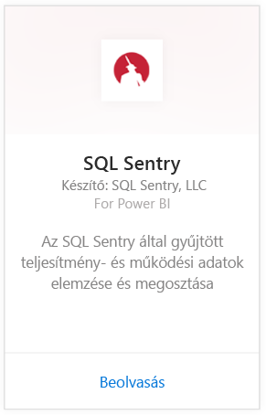
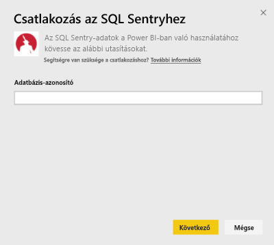
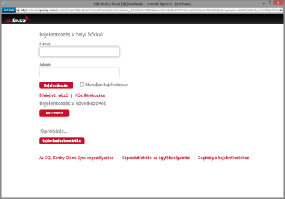
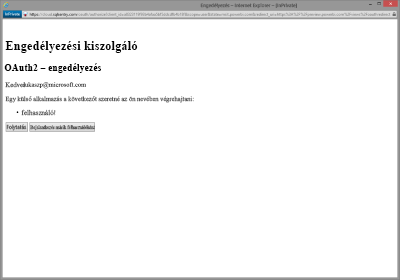
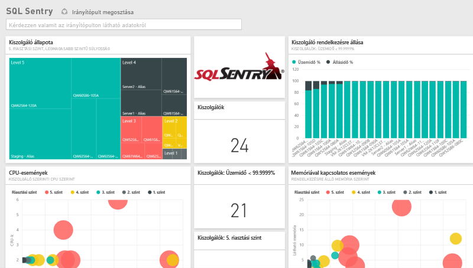
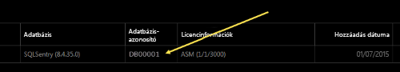
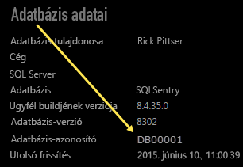

# Csatlakozás az SQL Sentryhez a Power BI használatával
Az SQL Sentry által gyűjtött teljesítményadatok egyszerűen elemezhetők a Power BI-jal. A Power BI begyűjti az adatait, majd összeállít egy alapértelmezett irányítópultot és az adatokon alapuló jelentéseket.

Kapcsolódjon a Power BI-hoz készült [SQL Sentry tartalomcsomaghoz](https://app.powerbi.com/groups/me/getdata/services/sql-sentry).

>[!NOTE]
>A kapcsolódáshoz szüksége lesz egy SQL Sentry-fiókra, amellyel a http://cloud.sqlsentry.com oldalhoz csatlakozik, valamint egy adatbázis-azonosítóra, amelyet monitorozni fog.  Az adatbázis-azonosító helyével kapcsolatos útmutatást alább találja.

## Csatlakozás
1. A bal oldali navigációs ablaktábla alján kattintson az **Adatok lekérése** elemre.
   
   
2. A **Szolgáltatások** mezőben kattintson a **Lekérés** elemre.
   
    
3. Válassza az **SQL Sentry \> Lekérés** lehetőséget.
   
   
4. Adja meg a Power BI-ban monitorozni kívánt adatbázis **adatbázis-azonosítóját**. [Ennek a helyével](#FindingParams) kapcsolatban lásd alább.
   
   
5. A Hitelesítési módszernél válassza az **oAuth2 \> Bejelentkezés** lehetőséget.
   
   Mikor a rendszer arra kéri, adja meg a cloud.sqlsentry.com oldalon használt hitelesítő adatait, és kövesse az SQL Sentry hitelesítési folyamatát.
   
   
   
   Az első csatlakozás alkalmával a Power BI megkéri, hogy adjon olvasási hozzáférést a fiókjához. Kattintson az Engedélyezés gombra az importálási folyamat indításához.  Az importálás a fiókban lévő adatok mennyiségétől függően pár percig is eltarthat.
   
   
6. Miután a Power BI importálta az adatokat, egy új irányítópult, jelentés és adatkészlet jelenik meg a bal oldali navigációs panelen. Az új elemeket egy sárga csillag \* jelöli:
   
   
7. Válassza az SQL Sentry irányítópultot.
   
   Ez a Power BI által az adatok megjelenítéséhez létrehozott alapértelmezett irányítópult. Az irányítópultot igény szerint módosíthatja, hogy az adatok a kívánt módon jelenjenek meg.
   
   

**Mi a következő lépés?**

* [Kérdéseket tehet fel a Q&A mezőben](power-bi-q-and-a.md) az irányítópult tetején.
* [Módosíthatja az irányítópult csempéit](service-dashboard-edit-tile.md).
* [Kiválaszthatja valamelyik csempét](service-dashboard-tiles.md) a mögöttes jelentés megnyitásához.
* Noha az adatkészlet napi frissítésre van ütemezve, módosíthatja a frissítési ütemezést, vagy igény szerint frissíthet az **Azonnali frissítés** gombbal.

## Tartalom
A következő, az SQL Sentryből származó adatok állnak rendelkezésre a Power BI-ban:

| Tábla neve | Leírás |
| --- | --- |
| Kapcsolat |A tábla az SQL Sentry definiált kapcsolataival kapcsolatos információkat tartalmaz. |
| Dátum  |A tábla a mai naptól visszamenőleg az első olyan napig tartalmazza a dátumokat, amelyre vonatkozóan a rendszer teljesítményadatokat gyűjtött és őrzött meg. |
| Állásidő  |A tábla a környezetben lévő monitorozott kiszolgálók állásidejével és üzemidejével kapcsolatos adatokat tartalmaz. |
| Memóriahasználat  |A tábla az egyes kiszolgálók elérhető vagy szabad memóriakapacitásával kapcsolatos adatokat tartalmaz.  |
| Kiszolgáló  |A tábla a környezetben lévő kiszolgálók rekordjait tartalmazza. |
| Kiszolgáló állapota  |A tábla a környezet egyéni feltételei által kiváltott események adatait tartalmazza a súlyossági értékekkel és darabszámokkal együtt. |

## Paraméterek helye
Az **Adatbázis-azonosító** megállapításához jelentkezzen be a <https://cloud.sqlsentry.com> oldalra egy új böngészőablakban.  Az **Adatbázis-azonosító** a fő áttekintő oldalon található meg:

    

Az **Adatbázis-azonosító** az adatbázis részleteit megjelenítő képernyőn is megtekinthető:

    

## Hibaelhárítás
Ha egyes alkalmazások adatai nem jelennek meg a Power BI-ban, ellenőrizze, hogy a megfelelő adatbázis-azonosítót használja-e, és van-e jogosultsága megtekinteni az adatokat. 

Ha nem Ön a <https://cloud.sqlsentry.com> oldallal szinkronizált SQL Sentry-adatbázis tulajdonosa, forduljon a rendszergazdához, és bizonyosodjon meg róla, hogy jogosult megtekinteni a gyűjtött adatokat.

## Következő lépések
[Első lépések a Power BI-ban](service-get-started.md)

[Power BI – Adatok lekérése](service-get-data.md)

