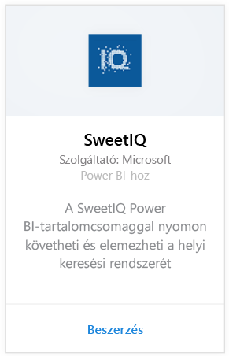
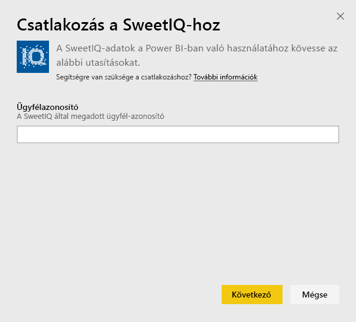
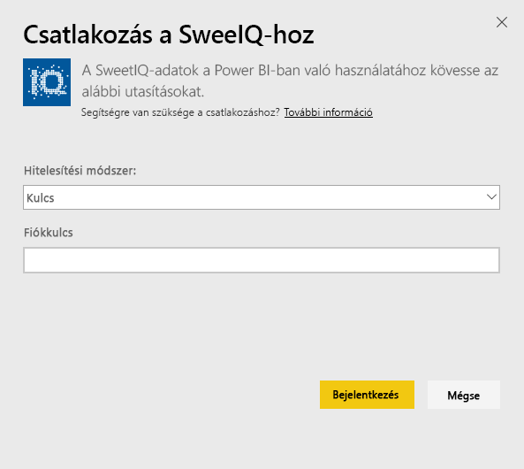

# Kapcsolódás a SweetIQ-hoz a Power BI-jal
A Power BI-tartalomcsomag a SweetIQ-fiókban található adatait használja, és előre elkészített tartalmakat generál, hogy egyszerűen feltárhassa az adatokat. A SweetIQ-tartalomcsomagot a helyeire, listáira, minősítéseire és értékeléseire vonatkozó adatok elemzésére használhatja. Az alapértelmezett beállítások szerint az adatok naponta frissülnek, hogy Ön mindig naprakész adatokat ellenőrizhessen.

Kapcsolódjon a Power BI-hoz készült [SweetIQ-tartalomcsomaghoz](https://app.powerbi.com/groups/me/getdata/services/sweetiq).

## A csatlakozás menete
1. A bal oldali navigációs sávon kattintson az **Adatok lekérése** gombra.
   
    
2. Válassza a **SweetIQ** lehetőséget, és kattintson a **Beolvasás** gombra.
   
    
3. Adja meg a SweetIQ-beli ügyfél-azonosítóját. Ez általában egy alfanumerikus érték. Az érték megkeresésére vonatkozó további részleteket lásd alább.
   
    
4. Válassza a **Kulcs** hitelesítési típust, és adja meg a SweetIQ API-kulcsát. Ez általában egy alfanumerikus érték. Az érték megkeresésére vonatkozó további részleteket lásd alább.
   
    
5. A Power BI elkezdi betölteni az adatokat, ami eltarthat egy ideig a fiókban található adatok méretétől függően. Miután befejeződött a betöltés, a bal oldali navigációs ablaktáblán megjelenik egy új irányítópult, jelentés és adatkészlet.
   
    

**Hogyan tovább?**

* [Kérdéseket tehet fel a Q&A mezőben](power-bi-q-and-a.md) az irányítópult tetején.
* [Módosíthatja az irányítópult csempéit](service-dashboard-edit-tile.md).
* [Kiválaszthatja valamelyik csempét](service-dashboard-tiles.md) a mögöttes jelentés megnyitásához.
* Az adatkészlet az ütemezés szerint naponta frissül, de módosíthatja is a frissítési ütemezést, vagy igény szerint frissíthet bármikor, az **Azonnali frissítés** lehetőségre kattintva.

## Paraméterek keresése
Ennek a tartalomcsomagnak az ügyfél-azonosítója és API-kulcsa nem azonos a SweetIQ-beli felhasználónevével és jelszavával.

Válassza az egyik olyan ügyfél azonosítóját, amelyhez a fiókja rendelkezik hozzáféréssel. Az ügyfelek listáját a SweetIQ-fiókja „Client Management” (Ügyfélkezelés) területén találja.

Az adott ügyfél adainak eléréséhez szükséges API-kulcs beszerzéséért beszéljen a rendszergazdával.

## Következő lépések
[Első lépések a Power BI-ban](service-get-started.md)

[Power BI – Adatok lekérése](service-get-data.md)

