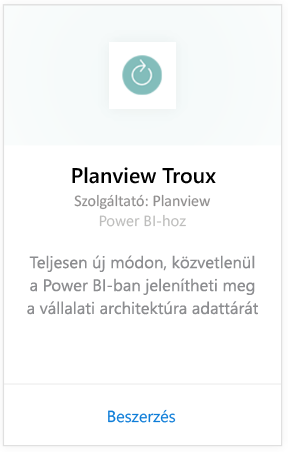
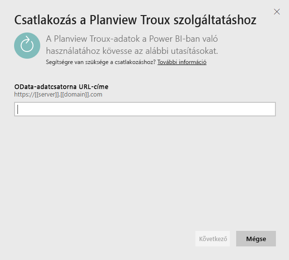
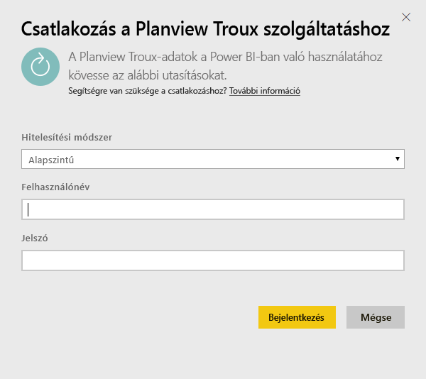
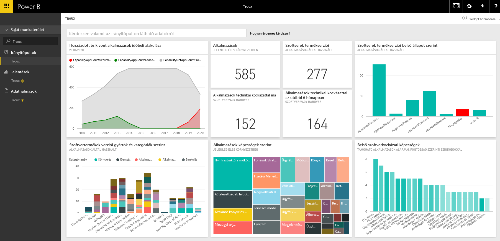

# Csatlakozás a Troux-hoz a Power BI használatával
A Troux-tartalomcsomaggal teljesen új módon, közvetlenül a Power BI-ban jelenítheti meg a vállalati architektúra adattárát. A tartalomcsomag az üzleti képességekről, a képességeket biztosító alkalmazásokról, és az alkalmazásokat támogató technológiákról nyújt elemzéseket, amelyek a Power BI segítségével teljes körűen testre szabhatók.

Csatlakozzon a Power BI-hoz készült [Troux-tartalomcsomaghoz](https://app.powerbi.com/getdata/services/troux).

## A csatlakozás menete
1. A bal oldali navigációs ablaktábla alján kattintson az **Adatok lekérése** elemre.
   
   
2. A **Szolgáltatások** mezőben válasza a **Beolvasás** elemet.
   
   
3. Kattintson a **Troux** \>  **Get** elemre.
   
   
4. Adja meg a Troux OData-csatornájának URL-címét. A [paraméterek megkereséséről](#FindingParams) alább olvashat részletesebben.
   
   
5. **Hitelesítési módszerként** válassza az **Alapszintű** lehetőséget, adja meg a felhasználónevét és a jelszavát (figyeljen a kis- és nagybetűkre), majd kattintson a **Bejelentkezés** elemre.
   
    
6. A jóváhagyás után automatikusan megkezdődik az importálás. Ha befejeződött, a navigációs panelen megjelenik egy új irányítópult, jelentés és modell. Válassza ki az irányítópultot az importált adatok megtekintéséhez.
   
     

**Mi a következő lépés?**

* [Kérdéseket tehet fel a Q&A mezőben](power-bi-q-and-a.md) az irányítópult tetején.
* [Módosíthatja az irányítópult csempéit](service-dashboard-edit-tile.md).
* [Kiválaszthatja valamelyik csempét](service-dashboard-tiles.md) a mögöttes jelentés megnyitásához.
* Noha az adatkészlet napi frissítésre van ütemezve, módosíthatja a frissítési ütemezést, vagy igény szerint frissíthet az **Azonnali frissítés** gombbal.

## Rendszerkövetelmények
Hozzáférés szükséges a Troux OData-adatcsatornához és a Troux 9.5.1-es vagy újabb verziójához.

## Paraméterek keresése
Az egyedi Troux OData-adatcsatornája URL-címéért forduljon az Ügyféltámogatáshoz

## Hibaelhárítás
Ha a hitelesítő adatok megadása után időtúllépési hibát tapasztal, kísérelje meg újra a kapcsolódást.

## További lépések
[Első lépések a Power BI-ban](service-get-started.md)

[Adatok lekérése a Power BI-ban](service-get-data.md)

