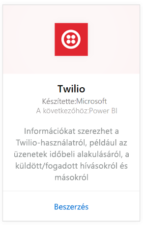
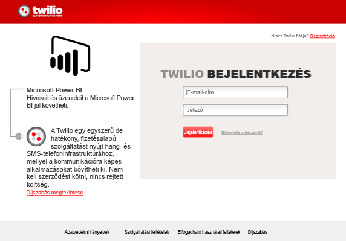
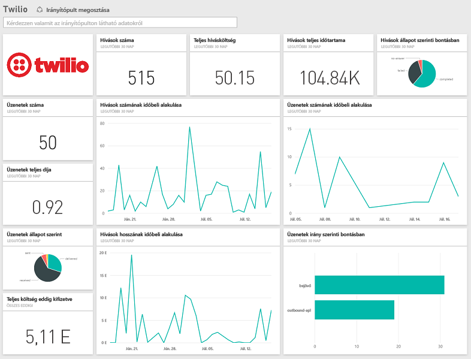

# Kapcsolódás a Twilióhoz a Power BI-jal
A Power BI-hoz készült Microsoft Twilio-tartalomcsomag lehetővé teszi az adatok beolvasását a Power BI-ba, valamint létrehoz egy előre gyártott [Twilio-irányítópultot](https://powerbi.microsoft.com/integrations/twilio) és -jelentést, amely információkkal szolgál az adatokról. Összeállíthatók a Power BI által létrehozott adathalmazra épülő egyéni irányítópultok és jelentések is. Az adatok naponta egyszer frissülnek, hogy Ön mindig a legfrissebb adatokat vizsgálhassa.

Kapcsolódjon a Power BI-hoz készült [Twilio-tartalomcsomaghoz](https://app.powerbi.com/getdata/services/twilio).

## A kapcsolódás menete
1. A bal oldali navigációs ablaktábla alján kattintson az **Adatok lekérése** elemre.
   
    
2. A **Szolgáltatások** keretben kattintson a **Beolvasás** elemre.
   
    
3. Válassza a **Twilio** \> **Beolvasás** elemet.
   
   
4. A **Hitelesítési módszer** beállításnál válassza az **oAuth2** \>beállítást, majd a válassza a Bejelentkezés elemet. Ekkor a rendszer kéri a Twilio-beli hitelesítő adatok megadását, és azt, hogy engedélyezze a Power BI alkalmazás számára az adatok elérését.
   
   
5. Ennek hatására elkezdődik a Twilio-fiók adatainak importálása, és az irányítópulton megjelennek az elmúlt 30 nap hívásainak és üzeneteinek használati adatai. 
   
   

**Hogyan tovább?**

* [Kérdéseket tehet fel a Q&A mezőben](power-bi-q-and-a.md) az irányítópult tetején.
* [Módosíthatja az irányítópult csempéit](service-dashboard-edit-tile.md).
* [Kiválaszthatja valamelyik csempét](service-dashboard-tiles.md) a mögöttes jelentés megnyitásához.
* Noha az adatkészlet napi frissítésre van ütemezve, módosíthatja a frissítési ütemezést, vagy igény szerint frissíthet az **Azonnali frissítés** gombbal.

## A csomag tartalma
A hívások és az üzenettranzakciók részletes adatai az elmúlt 30 napra vonatkozóan. Az adatok sokféleképpen elemezhetők és összegezhetők.

Olyan összesítő statisztikák, amelyek hasznos információkkal szolgálhatnak. A statisztikák között a következők szerepelnek:

        All Time Calls Count  
        All Time Calls Duration  
        All Time Calls Price  
        All Time Messages Price  
        All Time Messages Count  
        All Time Count of Phone Numbers  
        All Time Price of Phone Numbers  
        All Time Twilio Client Calls Price  
        All Time Twilio Client Calls Duration  
        All Time Twilio Client Calls Count  
        All Time Total Price  
        All Time Inbound Calls Price  
        All Time Inbound Calls Duration  
        All Time Inbound Calls Count  
        All Time Outbound Calls Price  
        All Time Outbound Calls Duration  
        All Time Outbound Calls Count  
        This Month Calls Price  
        This Month Calls Duration  
        This Month Calls Count  
        This Month Messages Count  
        This Month Messages Price  
        This Month Count of Phone Numbers  
        This Month Price of Phone Numbers  
        This Month Twilio Client Calls Price  
        This Month Twilio Client Calls Duration  
        This Month Twilio Client Calls Count  
        This Month Total Price  
        This Month Inbound Calls Price  
        This Month Inbound Calls Duration  
        This Month Inbound Calls Count  
        This Month Outbound Calls Price  
        This Month Outbound Calls Duration  
        This Month Outbound Calls Count  
        This Month Inbound Messages Price  
        This Month Inbound Messages Count  
        This Month Outbound Messages Price  
        This Month Outbound Messages Count

## Hibaelhárítás
Ha nagyon nagy mennyiségű adat (több százezernyi tranzakció) érhető el az elmúlt 30 napra vonatkozóan, az adatlekérési lépés sikertelen lehet. Ismerjük a problémát, és dolgozunk a megoldásán. Kérjük, hogy ha ebbe a problémába ütközik, a Power BI lap tetején lévő támogatási hivatkozásra kattintva tájékoztasson bennünket, mi pedig további vizsgálódás végett fel fogjuk venni Önnel a kapcsolatot.

## Következő lépések
[Első lépések a Power BI-ban](service-get-started.md)

[Adatok lekérése a Power BI-ban](service-get-data.md)

