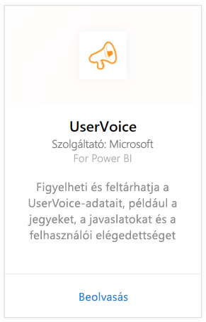
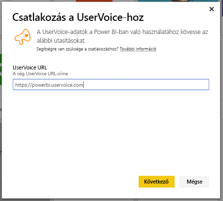
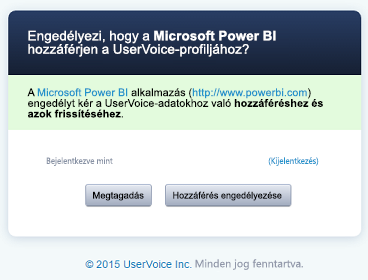
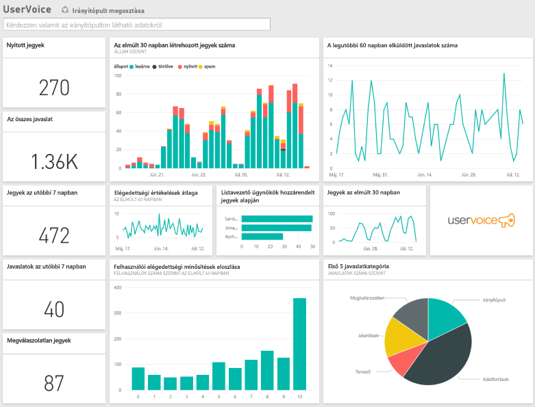

# Csatlakozás a UserVoice-hoz a Power BI-ban
A UserVoice-adatok egyszerűen nyomon követhetők és megvizsgálhatók aPower BI és a UserVoice-tartalomcsomag használatával. A Power BI beolvassa az adatokat, köztük a jegyeket, javaslatokat és elégedettségi mutatókat, majd az adatok alapján használatra kész irányítópultot és jelentéseket hoz létre.

Kapcsolódás a [UsreVoice-tartalomcsomaghoz](https://app.powerbi.com/getdata/services/uservoice) a Power BI-ban.

>[!NOTE]
>A Power BI-tartalomcsomaghoz való kapcsolódáshoz rendszergazdai fiók szükséges. A tartalomcsomag a UserVoice API-t is felhasználja és a UserVoice használati keretéhez adódik. A részleteket alább találja.

## A kapcsolódás menete
1. A bal oldali navigációs ablaktábla alján kattintson az **Adatok lekérése** elemre.
   
   
2. A **Szolgáltatások** keretben kattintson a **Beolvasás** elemre.
   
    
3. Válassza a **UserVoice**, majd a **Beolvasás** lehetőséget.
   
   
4. Amikor a rendszer kéri, adja meg UserVoice URL-címét. Az URL-címnek pontosan meg kell felelnie a következő mintának: https://fabrikam.uservoice.com (a "fabrikam" helyén a saját terméke vagy szolgáltatása nevével).
   
   >[!NOTE]
   >A cím végén nincs lezáró perjel, és a kapcsolati séma http**s**.
   
   
5. Amikor a rendszer kéri, adja meg saját UserVoice-beli hitelesítő adatait, majd haladjon végig a UserVoice hitelesítési folyamatán. Ha már bejelentkezett a UserVoice-ba a böngészőjében, akkor a rendszer nem feltétlenül kéri a hitelesítő adatait. A "Hozzáférés engedélyezése" gombra kattintva adjon a Power BI-alkalmazásnak hozzáférést az adataihoz.
   
   >[!NOTE]
   >A UserVoice-fiókja használatához rendszergazdai hitelesítő adatok szükségesek.
   
   
6. A Power BI betölti a UserVoice-adatokat, és használatra kész irányítópultot és jelentést hoz létre. A Power BI a következő adatokat tölti be: minden javaslatot, minden nyitott jegyet, az utolsó 30 nap folyamán létrehozott összes jegyet a lezártakkal együtt, és az összes ügyfél-elégedettségi mutatót.
   
   

**Hogyan tovább?**

* [Kérdéseket tehet fel a Q&A mezőben](power-bi-q-and-a.md) az irányítópult tetején.
* [Módosíthatja az irányítópult csempéit](service-dashboard-edit-tile.md).
* [Kiválaszthatja valamelyik csempét](service-dashboard-tiles.md) a mögöttes jelentés megnyitásához.
* Az adatkészlet az ütemezés szerint naponta frissül, de módosíthatja is a frissítési ütemezést, vagy igény szerint frissíthet bármikor, az **Azonnali frissítés** lehetőségre kattintva.

## Hibaelhárítás
**"Parameter validation failed, please make sure all parameters are valid"** (A paraméterek érvényesítése sikertelen, ellenőrizze az összes paraméter érvényességét)

Ha ezt a hibaüzenetet kapja a UserVoice URL-címe begépelése után, akkor győződjön meg a következő követelmények teljesüléséről:

* Az URL-cím pontosan megfelel a következő mintának: https://fabrikam.uservoice.com (a "fabrikam" helyén a saját helyes UserVoice URL-előtagjával).
* Minden betű kisbetű.
* Az URL-cím sémája 'http**s**'.
* Az URL-cím vége nincs perjellel lezárva.

**"Login failed"** (Sikertelen bejelentkezés)

Ha "Sikertelen bejelentkezés" hibaüzenetet kap a UserVoice hitelesítő adatai megadása után, akkor a használt fióknak nincs jogosultsága UserVoice-adatokat lekérni az Ön fiókjából. Ellenőrizze, hogy rendszergazdai fiókot használ-e, és próbálkozzon újra.

"**Oops something went wrong**" (Hoppá! Hiba történt.)

Ha ez a hibaüzenet jelenik meg az adatok betöltésekor, akkor ellenőrizze, hogy a UserVoice-fiókja nem lépte-e túl a havi API-használati keretét. Ha mindent rendben talál, akkor próbáljon meg újra kapcsolódni. Ha a probléma továbbra is fennáll, forduljon a Power BI támogatási oldalához: [https://community.powerbi.com](https://community.powerbi.com/).

**Egyéb**  

A Power BI UserVoice-tartalomcsomag a UserVoice API-jait használja az adatok betöltéséhez. Kísérje figyelemmel az API-használatot, hogy túl ne lépje a keretét. Ha sok adat van a UserVoice-fiókja alatt, akkor az API-használat minimalizálása érdekében ajánlott a jelenleg alapértelmezett naponta egyszeri frissítést átállítani úgy, hogy csak munkanapokon vagy csak kétnaponta történjen meg, ahogyan Önnek megfelel. Egy másik javaslat, hogy csak egy rendszergazda hozza létre a tartalomcsomagot és ossza meg a csapat többi tagjával. Ha a cég összes rendszergazdája saját tartalomcsomagot hoz létre, akkor szükségtelenül terhelik az API-kat.

## További lépések
[Első lépések a Power BI-ban](service-get-started.md)

[Adatok lekérése a Power BI-ban](service-get-data.md)

