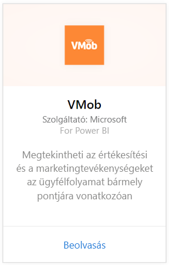
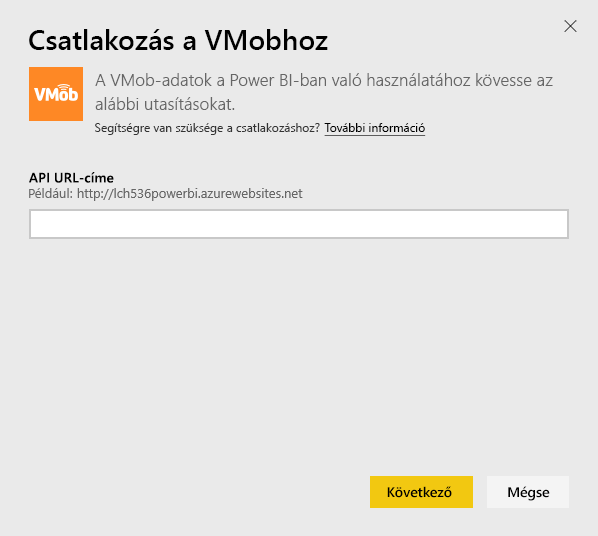
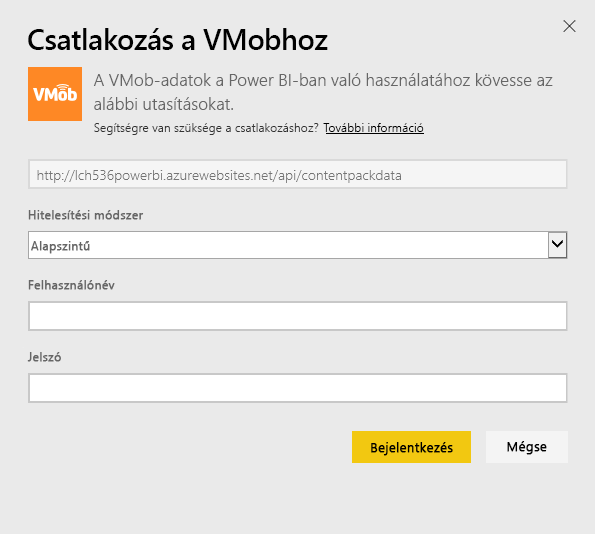
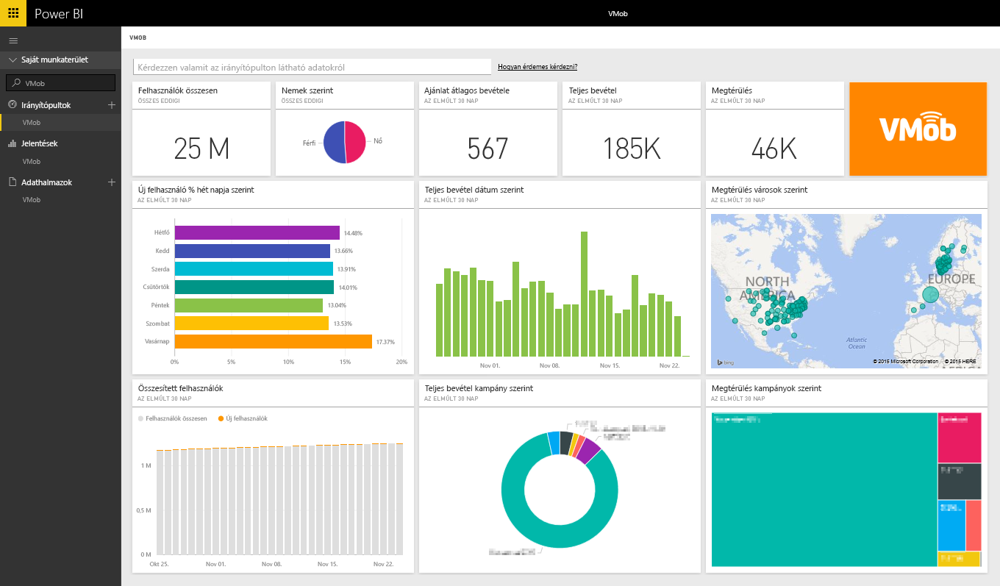

# Kapcsolódás a Power BI-ból a VMobhoz
A Power BI-hoz készült VMob-tartalomcsomaggal könnyedén nyomon követheti és feltárhatja VMob-adatait. A Power BI a következő adatokat adja vissza: felhasználói statisztika a teljes időszakban és az elmúlt 30 napban, kiskereskedelmi KPI az elmúlt 30 napban és kampányteljesítmény az elmúlt 30 napban.

Kapcsolódjon a Power BI-hoz készült [VMob-tartalomcsomaghoz](https://app.powerbi.com/getdata/services/vmob).

## A kapcsolódás menete
1. A bal oldali navigációs ablaktábla alján kattintson az **Adatok lekérése** elemre.
   
    
2. A **Szolgáltatások** mezőben válasza a **Beolvasás** elemet.
   
   
3. Válassza a **VMob** \> **Beolvasás** lehetőséget.
   
   
4. Amikor a rendszer kéri, adja meg VMob URL-címét, majd kattintson a Tovább gombra. Ezt az URL-címet a VMob külön adja meg.
   
    
5. A Hitelesítési módszer legördülő menüjében válassza az **Alapszintű** lehetőséget, adja meg a VMob-fiókja felhasználónevét és jelszavát, majd kattintson a **Bejelentkezés** gombra.
   
    
6. Az importálási folyamat ekkor automatikusan elindul, és a Power BI beolvassa a VMob-adatait, hogy létrehozzon Önnek egy használatra kész irányítópultot és jelentést.
   
   

**Hogyan tovább?**

* [Kérdéseket tehet fel a Q&A mezőben](consumer/end-user-q-and-a.md) az irányítópult tetején.
* [Módosíthatja az irányítópult csempéit](service-dashboard-edit-tile.md).
* [Kiválaszthatja valamelyik csempét](consumer/end-user-tiles.md) a mögöttes jelentés megnyitásához.
* Noha az adatkészlet napi frissítésre van ütemezve, módosíthatja a frissítési ütemezést, vagy igény szerint frissíthet az **Azonnali frissítés** gombbal.

## Következő lépések
[Első lépések a Power BI-ban](service-get-started.md)

[Adatok lekérése a Power BI-ban](service-get-data.md)

