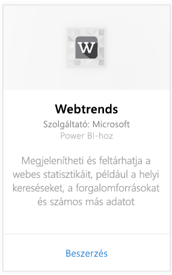
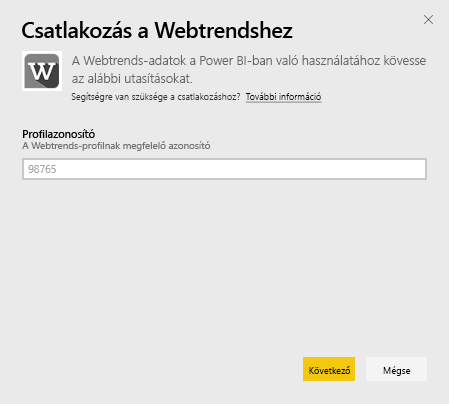
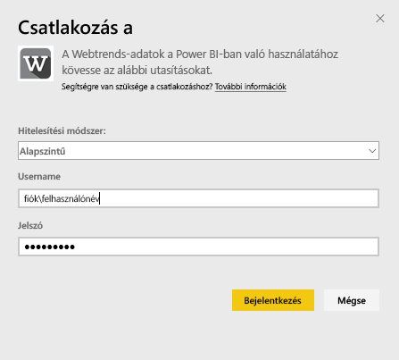
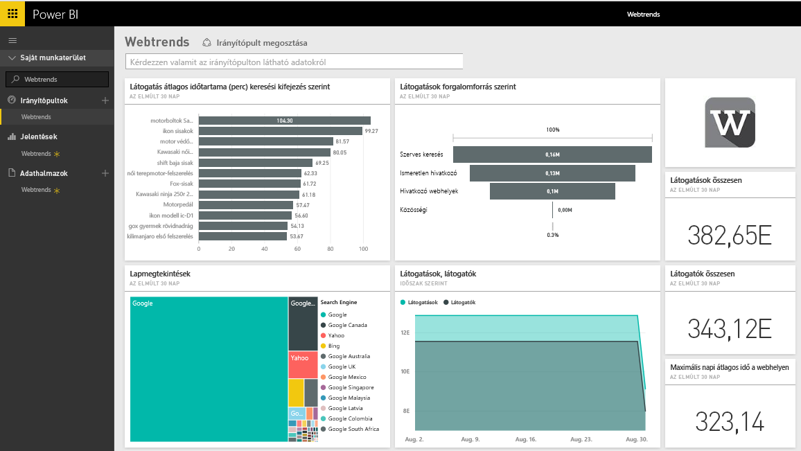
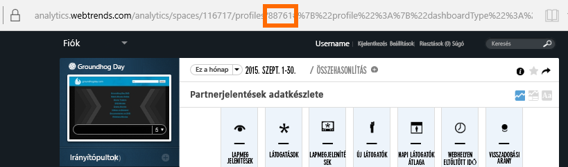
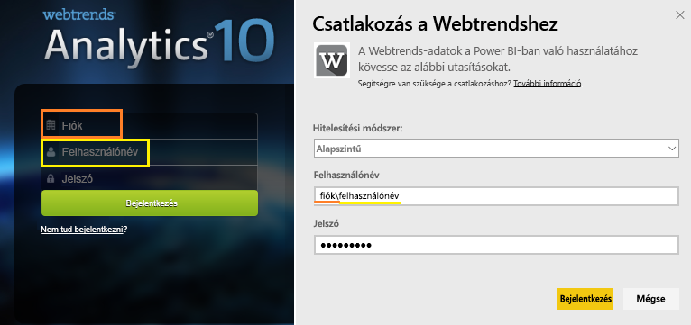

# Csatlakozás a Webtrends eszközhöz a Power BI használatával
A Power BI Webtrends-tartalomcsomagja számos azonnal használatba vehető metrikát tartalmaz, így például az összes oldalmegtekintést és az adatforgalmi forrás szerinti látogatásokat. A Webtrends-adatok Power BI-ben történő vizualizációja a Webtrends-fiókhoz való csatlakozással kezdődik. Használhatja a mellékelt irányítópultot és jelentéseket, vagy testre szabhatja őket úgy, hogy az Ön számára legfontosabb adatokat emeljék ki.  Az adatok naponta egyszer automatikusan frissülnek.

Kapcsolódjon a [Power BI Webtrends-tartalomcsomagjához](https://app.powerbi.com/getdata/services/webtrends).

## Csatlakozás
1. A bal oldali navigációs ablaktábla alján kattintson az **Adatok lekérése** elemre.
   
   
2. A **Szolgáltatások** mezőben kattintson a **Lekérés** elemre.
   
   
3. Válassza a **Webtrends** \> **Lekérés** lehetőséget.
   
   
4. A tartalomcsomag egy adott Webtrends-profilazonosítóhoz kapcsolódik. [E paraméter megkeresésének](#FindingParams) részleteit alább találja.
   
   
5. A csatlakozáshoz adja meg Webtrends hitelesítő adatait. Vegye figyelembe, hogy a felhasználónév mezőbe a fiók- és a felhasználónevet kell beírni. A [részletes információkat](#FindingParams) alább találja.
   
   
6. A jóváhagyás után automatikusan megkezdődik az importálási folyamat. Ha befejeződött, a navigációs panelen megjelenik egy új irányítópult, jelentés és modell. Válassza ki az irányítópultot az importált adatok megtekintéséhez.
   
   

**Mi a következő lépés?**

* [Kérdéseket tehet fel a Q&A mezőben](power-bi-q-and-a.md) az irányítópult tetején.
* [Módosíthatja az irányítópult csempéit](service-dashboard-edit-tile.md).
* [Kiválaszthatja valamelyik csempét](service-dashboard-tiles.md) a mögöttes jelentés megnyitásához.
* Noha az adatkészlet napi frissítésre van ütemezve, módosíthatja a frissítési ütemezést, vagy igény szerint frissíthet az **Azonnali frissítés** gombbal.

## Tartalom

A Webtrends-tartalomcsomag a következő jelentésekből kér le adatokat:  

| Jelentés neve | Jelentésazonosító |
| --- | --- |
| Fő mérőszámok | |
| Helyi keresések |34awBVEP0P6 |
| Kilépési oldalak |7FshY8eP0P6 |
| Következő oldalak |CTd5rpeP0P6 |
| Előző oldalak |aSdOeaUgnP6 |
| Webhely oldalai |oOEWQj3sUo6 |
| Helyi átkattintós hirdetések |41df19b6d9f |
| Városok |aUuHskcP0P6 |
| Országok |JHWXJNcP0P6 |
| Látogatók |xPcmTDDP0P6 |
| Látogatás időtartama |U5KAyqdP0P6 |
| Keresőkifejezések |IKYEDxIP0P6 |
| Adatforgalmi források |JmttAoIP0P6 |
| Keresőmotorok |yGz3gAGP0P6 |
| Belépési oldalak |i6LrkNVRUo6 |

>[!NOTE]
>SharePoint-profilok esetében a metrikák nevei kissé eltérhetnek a Webtrends felhasználói felületén megjelenő nevektől. A következő társítás a SharePoint és a webes profilok közötti konzisztencia megtartása érdekében történik:   

    - Munkamenetek = Látogatások  
    - Új felhasználók = Új látogatók  
    - Munkamenetenkénti megtekintések száma = Látogatásonkénti oldalmegtekintések száma  
    - Átlagos napi felhasználói időtartam = Látogatónkénti átlagos webhelyen töltött idő  

## Rendszerkövetelmények
A tartalomcsomagnak hozzáféréssel kell rendelkeznie ahhoz a Webtrends-profilhoz, amelyen a [megfelelő jelentéskészlet](#Included) engedélyezve van.

## Paraméterek helye
A Webtrends-profilazonosító a profil kiválasztása után megtalálható az URL-címben:

A hitelesítő adatok ugyanazok, mint amelyeket a Webtrendsbe történő bejelentkezéskor kell megadnia, azonban a fiók- és a felhasználónevet ugyanabba a sorba kell beírni, fordított perjellel elválasztva:

## Hibaelhárítás
A tartalomcsomag betöltése közben, a hitelesítő adatok megadása után problémát tapasztalhat. Ha betöltés közben a „Hoppá” üzenetet látja, tekintse meg az alábbi hibaelhárítási javaslatokat. Ha továbbra is problémákat tapasztal, küldjön támogatási jegyet a https://support.powerbi.com címen.

1. A megfelelő profilazonosítót használja, további részletekért lásd: [Paraméterek keresése](#FindingParams).
2. A felhasználó hozzáféréssel rendelkezik a [„Tartalom”](#Included) szakaszban felsorolt jelentésekhez

## Következő lépések
[Első lépések a Power BI-ban](service-get-started.md)

[Power BI – Alapfogalmak](service-basic-concepts.md)

