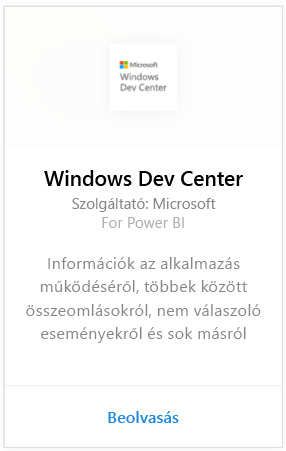
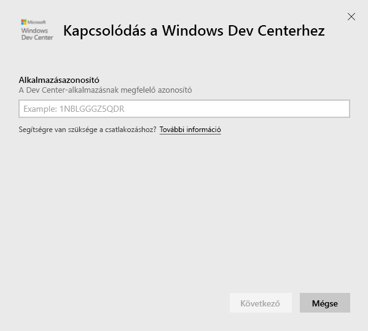
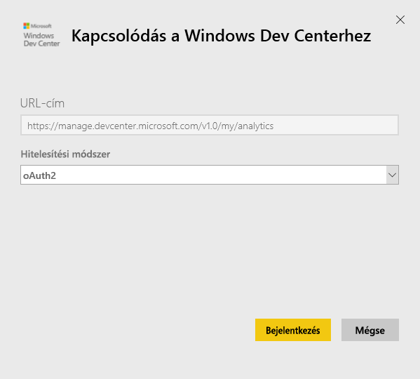
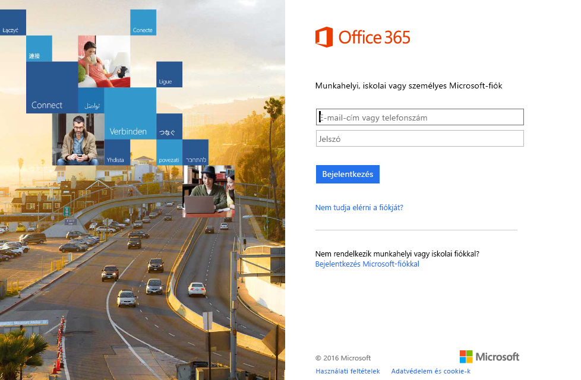
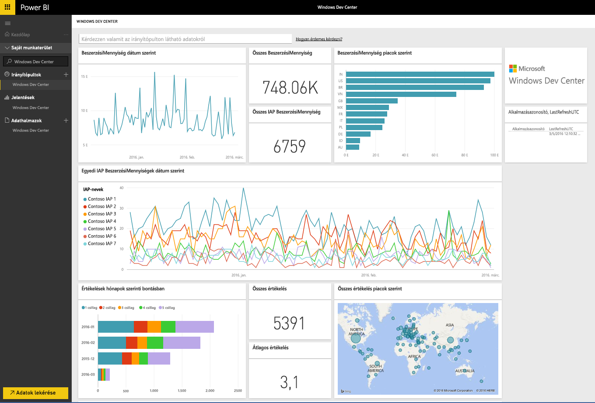
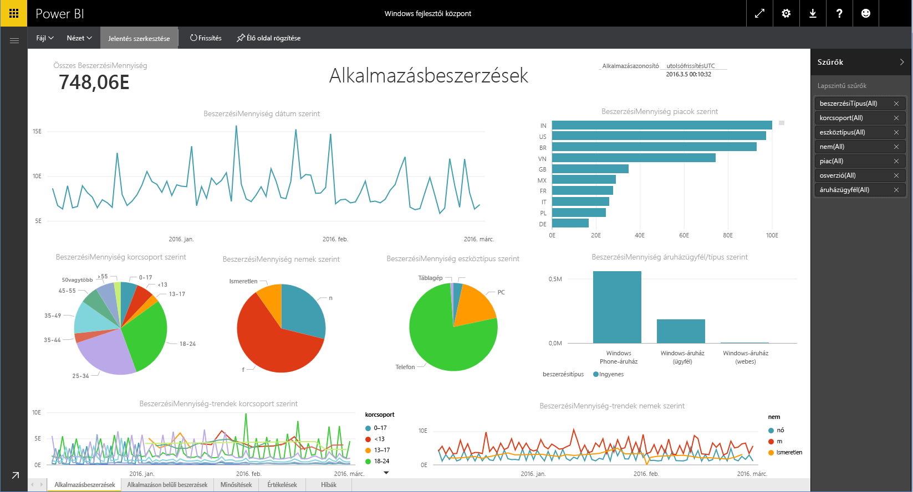

# Kapcsolódás a Windows fejlesztői központhoz a Power BI-jal
A Power BI-tartalomcsomag használatával a Power BI-ban vizsgálhatja és figyelheti a Windows fejlesztői központ alkalmazáselemzési adatait. Az adatok naponta egyszer automatikusan frissülnek.

Kapcsolódjon a [Windows fejlesztői központ Power BI-tartalomcsomagjához](https://app.powerbi.com/getdata/services/devcenter).

## A kapcsolódás menete
1. A bal oldali navigációs ablaktábla alján kattintson az **Adatok lekérése** elemre.
   
   
2. A **Szolgáltatások** mezőben válassza a **Beolvasás** elemet.
   
   
3. Válassza a **Windows fejlesztői központ** \> **Beolvasás** lehetőséget.
   
   
4. Adja meg egy, a tulajdonában lévő alkalmazás azonosítóját és kattintson a Következő gombra. A [paraméterek megkereséséről](#FindingParams) alább olvashat részletesebben.
   
   
5. A **Hitelesítési módszer** beállításnál válassza az **oAuth2** \> **Bejelentkezés** elemet. Amikor a rendszer kéri, adja meg a Windows fejlesztői központ-fiókjához tartozó Azure Active Directory-hitelesítő adatokat (további részletek a [Rendszerkövetelmények](#Requirements) között).
   
    
   
    
6. A jóváhagyás után az importálás automatikusan megkezdődik. Amikor befejeződik, új irányítópult, jelentés és modell jelenik meg a navigációs panelen. Válassza ki az irányítópultot az importált adatok megtekintéséhez, majd nyissa meg az alapul szolgáló jelentéseket egy csempe választásával.
   
    
   
    

**Hogyan tovább?**

* [Kérdéseket tehet fel a Q&A mezőben](power-bi-q-and-a.md) az irányítópult tetején.
* [Módosíthatja az irányítópult csempéit](service-dashboard-edit-tile.md).
* [Kiválaszthatja valamelyik csempét](service-dashboard-tiles.md) a mögöttes jelentés megnyitásához.
* Noha az adatkészlet napi frissítésre van ütemezve, módosíthatja a frissítési ütemezést, vagy igény szerint frissíthet az **Azonnali frissítés** gombbal.

## A csomag tartalma
A fejlesztői központ Power BI-tartalomcsomag az alkalmazása elemzési adatait és IAP-beszerzéseit, minősítéseit, értékeléseit, és az alkalmazás állapotát tartalmazza. Az adatok csak az utolsó 3 hónapra terjednek ki. Az időintervallum változik, a dátumok az adatkészlet frissítésekor módosulnak.

## Rendszerkövetelmények
Ez a tartalomcsomag megkövetel legalább egy, a Windows Áruházban közzétett alkalmazást és egy Windows fejlesztői központ-fiókot (további részletek [itt](https://msdn.microsoft.com/windows/uwp/publish/manage-account-users)).

## Paraméterek keresése
Egy alkalmazás azonosítóját az Alkalmazáskezelés alatti Alkalmazásidentitás lap megnyitásával találhatja meg.

Az alkalmazás azonosítója a Windows 10 Áruház-beli URL-cím végén található (https://www.microsoft.com/store/apps/ **{alkalmazásazonosító}**)

## További lépések
[Első lépések a Power BI-ban](service-get-started.md)

[Adatok lekérése a Power BI-ban](service-get-data.md)

