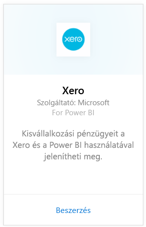
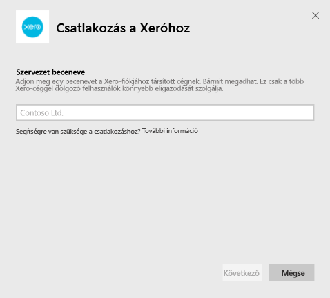
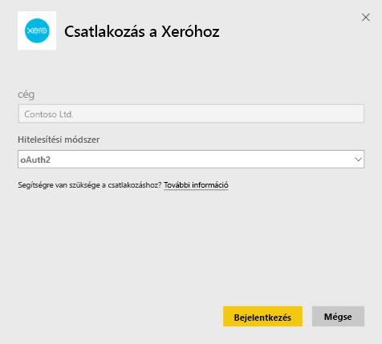
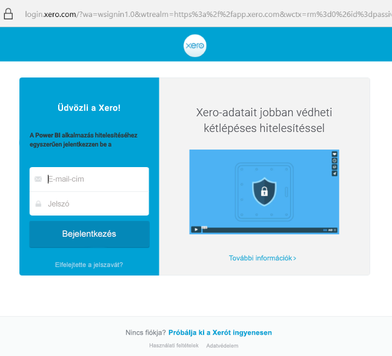
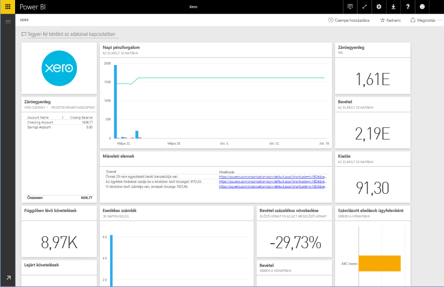

# Csatlakozás a Xerohoz a Power BI szolgáltatással
A Xero egy egyszerűen használható online számviteli program, amelyet kifejezetten kisvállalkozások számára terveztek. Ezzel a Power BI-tartalomcsomaggal lenyűgöző vizualizációkat készíthet a Xero pénzügyi adatai alapján. Az alapértelmezett irányítópulton számos kisvállalati mérőszám található, többek között a likviditás, a bevétel és kiadások, az eredménytrend, a kintlévőség-behajtási arányszám és a megtérülés.

Kapcsolódjon a Power BI [Xero-tartalomcsomagjához](https://app.powerbi.com/getdata/services/xero) vagy tudjon meg többet [a Xero és a Power BI](https://help.xero.com/Power-BI) integrációjáról.

## A kapcsolódás menete
1. Kattintson az **Adatok lekérése** elemre a bal oldalon lévő navigációs panel alján.
   
   
2. A **Szolgáltatások** keretben kattintson a **Beolvasás** elemre.
   
   
3. Válassza a **Xero** \> **Beolvasás** lehetőséget.
   
   
4. Adjon meg egy becenevet a Xero-fiókjához társított cégnek. Bármit megadhat, ez csak a több Xero-céggel dolgozó felhasználók könnyebb eligazodását szolgálja. A részleteket [alább](#FindingParams) találja.
   
   
5. A **Hitelesítési mód** mezőben adja meg az **OAuth** értéket, és amikor a rendszer kéri, jelentkezzen be a Xero-fiókjába, majd válassza ki azt a céget, amelyhez kapcsolódni szeretne. A bejelentkezés után a betöltés megkezdéséhez válassza a **Bejelentkezés** gombot.
   
    
   
    
6. A jóváhagyás után az importálás automatikusan megkezdődik. Amikor befejeződik, új irányítópult, jelentés és modell jelenik meg a navigációs panelen. Az importált adatok megtekintéséhez válassza az irányítópultot.
   
     

**Hogyan tovább?**

* Próbáljon [feltenni egy kérdést a Q&A-doboz](service-q-and-a.md) segítségével, amely az irányítópult tetején található
* [Módosítsa a csempéket](service-dashboard-edit-tile.md) az irányítópulton.
* [Kattintson egy csempére](service-dashboard-tiles.md) az alapjául szolgáló jelentés megnyitásához.
* Az adatkészlet naponta frissül, de módosíthatja is a frissítési ütemezést, vagy igény szerint frissíthet bármikor, az **Azonnali frissítés** lehetőségre kattintva.

## Mi tartozik hozzá
A tartalomcsomagban lévő irányítópulton több területet felölelő csempék és metrikák vannak, a hozzájuk tartozó, további tájékoztatást nyújtó jelentésekkel:  

| Terület | Irányítópult csempéi | Jelentés |
| --- | --- | --- |
| Pénz |Napi pénzforgalom  Bevétel  Kiadás  Számlánkénti záróegyenleg  Mai záróegyenleg |Bankszámlák |
| Ügyfél |Számlázott eladások  Számlázott eladások ügyfelenként  Számlázott eladások növekedési trendje  Esedékes számlák  Függőben lévő követelések  Lejárt követelések |Ügyfél  Leltár |
| Szállító |Számlázott beszerzések  Számlázott beszerzések szállító szerint  Számlázott beszerzések növekedési trendje   Esedékes számlák  Függőben lévő kötelezettségek  Lejárt kötelezettségek |Szállítók  Leltár |
| Leltár |Havi eladott mennyiség termékenként |Leltár |
| Eredmény |Havi eredmény  Nettó nyereség ebben a pénzügyi évben  Nettó nyereség ebben a hónapban  Legnagyobb költségszámlák |Eredmény |
| Mérleg |Eszközök összesen  Kötelezettségek összesen  Tőke |Mérleg |
| Állapot |Aktuális arány  Bruttó nyereség százalékban   Megtérülés az összes eszközön  Az összes kötelezettség és a tőke aránya |Állapot  Szószedet és technikai megjegyzések |

Az adatkészlet a következő táblákat is tartalmazza a jelentések és irányítópultok testre szabásához:  

* Címek  
* Riasztások  
* Banki kivonat napi egyenlege  
* Banki kivonatok  
* Kapcsolattartók  
* Kiadási jogcímek  
* Értékesítési számlasor-elemek  
* Számlák  
* Elemek  
* Hónap vége  
* Szervezet  
* Főkönyvi kivonat  
* Xero-fiókok

## Rendszerkövetelmények
A Xero "Standard + Reports" vagy "Advisor" tartalomcsomagjának eléréséhez a következő szerepkörök szükségesek.

## Paraméterek keresése
Adjon meg egy nevet, amelyen a cégét tudja nyomon követni a Power BI-ban. Ezáltal több különböző céghez is kapcsolódhat. Fontos, hogy nem kapcsolódhat többször ugyanahhoz a céghez, mert ez befolyással van az ütemezett frissítésre.   

## Hibaelhárítás
* A Xero-felhasználóknak a következő szerepkörökkel kell rendelkezniük a Xero "Standard + Reports" vagy "Advisor" Power BI-tartalomcsomagjának eléréséhez. A tartalomcsomag a felhasználóalapú engedélyektől függően ad hozzáférést a jelentésadatokhoz a Power BI-on keresztül.  
* Ha a rendszer egy kis ideig tölt, majd értesítést ad a sikertelenségről, akkor jegyezze meg, hogy mennyi idő után jelent meg a hibaüzenet. Fontos, hogy a Xero által kiadott hozzáférési jogkivonat csak 30 percig érvényes, ezért az ennyi idő alatt betölthetőnél több adattal dolgozó fiókoknál a betöltés nem sikerül. Folyamatosan dolgozunk a hiba elhárításán.
* A betöltés idejére az irányítópult csempéi általános betöltési állapotba kerülnek. Ez a betöltés teljes befejeződéséig várhatóan nem változik. Ha megkapja az értesítést a betöltés befejezéséről, de a csempék továbbra is töltést jeleznek, akkor próbálja meg frissíteni az irányítópult csempéit a jobb felső sarokban lévő három pont (...) használatával.
* Ha a tartalomcsomag nem frissül, akkor ellenőrizze, hogy nem kapcsolódott-e egynél többször ugyanahhoz a céghez a Power BI-ban. A Xero csak egy aktív kapcsolatot engedélyez egy cég számára, és ha egynél többször kapcsolódik ugyanahhoz, akkor megjelenhet egy hibaüzenet, amely szerint a hitelesítő adatai nem érvényesek.  
* A Xero Power BI-tartalomcsomagjainak kapcsolódásakor tapasztalt probléma, például egy hibaüzenet vagy lassú betöltés esetén először törölje a gyorsítótárat és a cookie-kat, indítsa újra a böngészőt, majd kapcsolódjon újra a Power BI-hoz.  

Más, tartósan fennálló probléma esetén jelentse be a hibát a http://support.powerbi.com oldalon.

## További lépések
[Első lépések a Power BI-ban](service-get-started.md)

[Adatok beolvasása a Power BI-ban](service-get-data.md)

