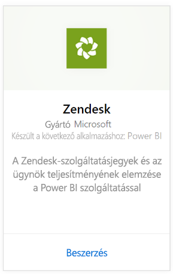
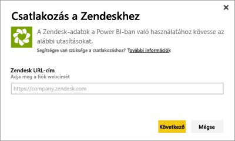
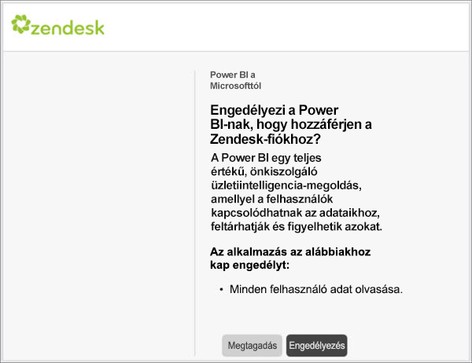
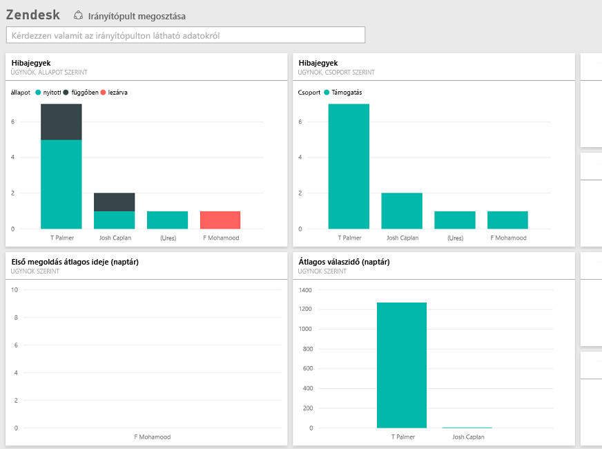

# Csatlakozás a Zendeskhez a Power BI segítségével
A Zendesk-tartalomcsomag egy Power BI-irányítópultot és néhány Power BI-jelentést kínál, amelyek hibajegyek és ügynöki teljesítmények elemzésében segítenek. Használhatja a kész irányítópultot és jelentéseket, vagy testre is szabhatja őket az Önnek legfontosabb információ kiemeléséhez.  Az adatok automatikusan frissülnek naponta egyszer. 

Csatlakozzon a [Zendesk-tartalomcsomaghoz](https://app.powerbi.com/getdata/services/zendesk), vagy olvasson még arról, hogy miképpen jön létre [a Zendesk integrációja](https://powerbi.microsoft.com/integrations/zendesk) a Power BI szolgáltatással.

>[!NOTE]
>A csatlakozáshoz Zendesk-rendszergazdai fiók szükséges. További információt a [követelményekről](#Requirements) lent talál.

## A kapcsolódás menete
1. A bal oldali navigációs ablaktábla alján kattintson az **Adatok lekérése** elemre.
   
   
2. A **Szolgáltatások** mezőben válasza a **Beolvasás** elemet.
   
    
3. Válassza a **Zendesk** \> **Letöltés most** elemet.
   
   
4. Adja meg a fiókjához társított URL-címet. Ennek formátuma **https://company.zendesk.com**. A [paraméterek megkereséséről](#FindingParams) alább olvashat részletesebben.
   
   
5. Amikor a rendszer kéri, adja meg Zendesk-fiókja hitelesítő adatait.  Válassza ki az **oAuth 2** hitelesítési mechanizmust, és kattintson a **Bejelentkezés** elemre. Kövesse a Zendesk hitelesítési folyamatát. (Ha már bejelentkezett a Zendeskbe a böngészőjében, akkor a rendszer nem feltétlenül kéri a hitelesítő adatait.)
   
   > [!NOTE]
   > Ez a tartalomcsomag megköveteli, hogy egy Zendesk-rendszergazdai fiókkal kapcsolódjon. 
   > 
   > 
   
   
6. Zendesk-adatai eléréséhez kattintson az **Engedélyezés** gombra.
   
   
7. A **Csatlakozás** gombra kattintva indíthatja el az importálási folyamatot. Miután a Power BI importálta az adatokat, a bal oldali navigációs panelen megjelenik egy új irányítópult, egy új jelentés és egy új adatkészlet. Az új elemeket sárga csillag \* jelöli.
   
   

**Hogyan tovább?**

* [Kérdéseket tehet fel a Q&A mezőben](power-bi-q-and-a.md) az irányítópult tetején.
* [Módosíthatja az irányítópult csempéit](service-dashboard-edit-tile.md).
* [Kiválaszthatja valamelyik csempét](service-dashboard-tiles.md) a mögöttes jelentés megnyitásához.
* Noha az adatkészlet napi frissítésre van ütemezve, módosíthatja a frissítési ütemezést, vagy igény szerint frissíthet az **Azonnali frissítés** gombbal.

## A csomag tartalma
A Power BI-tartalomcsomag a következőkről tartalmaz adatokat:  

* Felhasználók (végfelhasználók és ügynökök)  
* Cégek  
* Csoportok  
* Hibajegyek  

Több mérték is kiszámítódik, többek között az Átlagos várakozási idő és az Utolsó 7 napban megoldott jegyek száma. A tartalomcsomag a teljes listát tartalmazza.

## Rendszerkövetelmények
A Zendesk-tartalomcsomaghoz való kapcsolódáshoz Zendesk-rendszergazdai fiók szükséges. Ha Ön ügynök vagy végfelhasználó, és szeretné megtekinteni Zendesk-adatait, akkor írja meg javaslatát, és értékelje a [Power BI Desktop](desktop-connect-to-data.md) Zendesk-összekötőjét.

## Paraméterek keresése
A Zendesk-URL-cím megegyezik azzal, amelyet a Zendesk-fiókjába való belépéshez használ. Ha nem biztos a Zendesk-URL-címében, használhatja a Zendesk [bejelentkezési súgóját](https://www.zendesk.com/login/).

## Hibaelhárítás
Ha a kapcsolódási problémába ütközik, ellenőrizze a Zendesk-URL-címét, és győződjön meg arról, hogy Zendesk-rendszergazdai fiókot használ.

## Következő lépések
* [Mi az a Power BI?](power-bi-overview.md)
* [Adatok lekérése](service-get-data.md)

