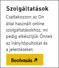
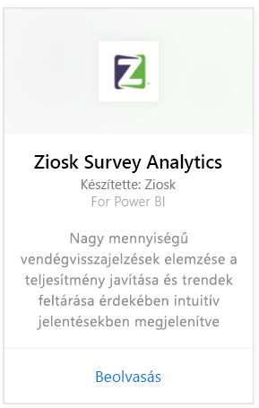
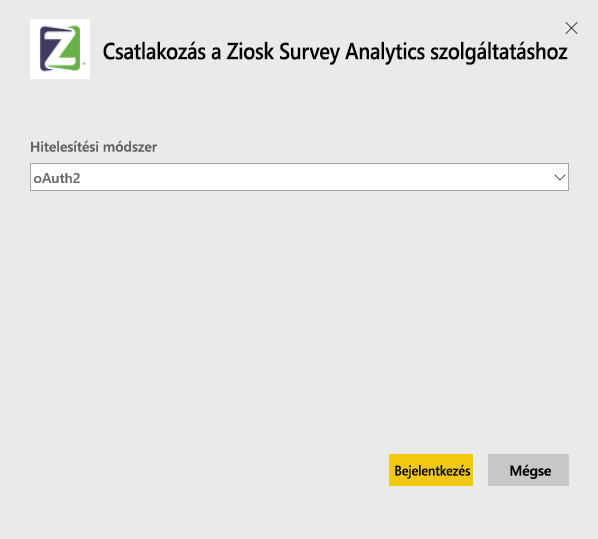
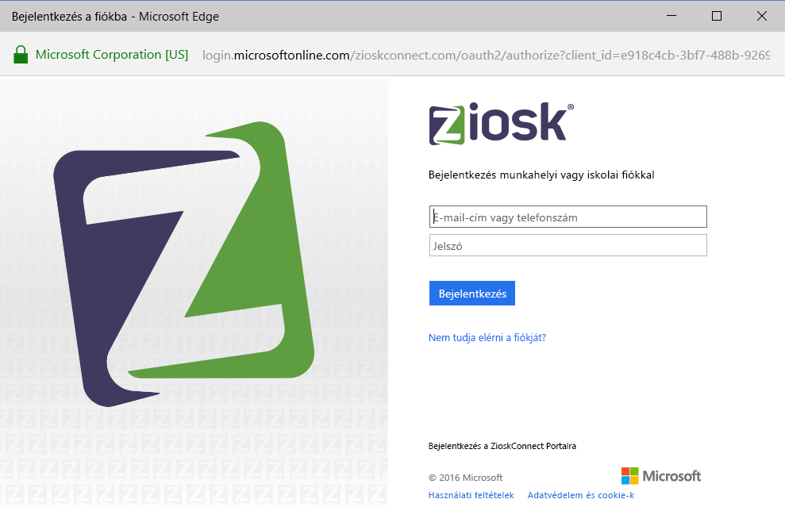
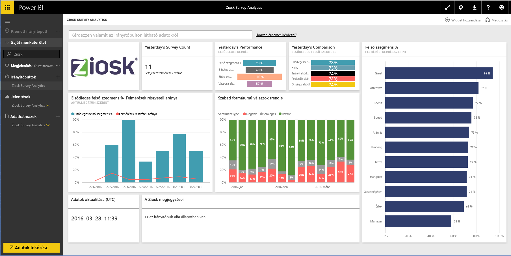

# Kapcsolódás a Ziosk Survey Analytics szolgáltatáshoz a Power BI-t használva
A Power BI-hoz készített Ziosk Survey Analytics tartalomcsomag Ziosk táblagépekkel használva egyedülálló módon tárja az éttermek elé a Ziosk felmérések adataiból felismerhető összefüggéseket, többek között nap, hely és alkalmazott szerint is szegmentálva.

Kapcsolódjon a Power BI-hoz készített [Ziosk Survey Analytics tartalomcsomaghoz](https://app.powerbi.com/getdata/services/ziosk-survey-analytics).

## A kapcsolódás menete
1. Kattintson az **Adatok lekérése** elemre a bal oldalon lévő navigációs panel alján.  
   
    
2. A **Szolgáltatások** mezőben kattintson a **Beolvasás** gombra.  
   
    
3. Kattintson a **Ziosk Survey Analytics**, majd a **Beolvasás** lehetőségre.  
   
    
4. Válassza ki az **OAuth 2**, majd a **Bejelentkezés** lehetőséget. Amikor a rendszer kéri, adja meg az Ziosk-fiókja hitelesítő adatait.
   
    
   
    
5. A kapcsolódás után automatikusan betöltődik egy irányítópult, egy jelentés és egy adatkészlet. A befejezést követően a csempék frissülni fognak az Ön Ziosk-fiókjából származó adatokkal.
   
    

**Hogyan tovább?**

* [Tegyen fel egy kérdést a Q&A-mezőben](service-q-and-a.md), amely az irányítópult tetején található
* [Módosítsa a csempéket](service-dashboard-edit-tile.md) az irányítópulton.
* [Kattintson az egyik csempére](service-dashboard-tiles.md) az alapjául szolgáló jelentés megnyitásához.
* Az adathalmaz naponta frissül, de módosíthatja is a frissítési ütemezést, vagy igény szerint frissíthet bármikor, a **Frissítés** lehetőségre kattintva

## A csomag tartalma
A tartalomcsomag a következő táblák adatait tartalmazza:  

    - Alkohol kategória  
    - Előétel kategória  
    - CommentKeywords  
    - Dátum  
    - Napszak  
    - Desszert kategória  
    - Freeform  
    - Gyerek kategória  
    - Üzenetek  
    - Prémium tartalom kategória  
    - Kérdés  
    - Áruház  
    - Felmérések  
    - Hétköznap  

## Rendszerkövetelmények
A tartalomcsomag példányának létrehozásához egy olyan Ziosk-fiók szükséges, amely rendelkezik engedélyekkel a fenti táblázatokhoz.

## További lépések
[Power BI ‒ első lépések](service-get-started.md)

[Power BI – alapfogalmak](service-basic-concepts.md)

