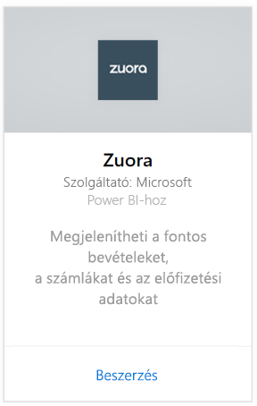
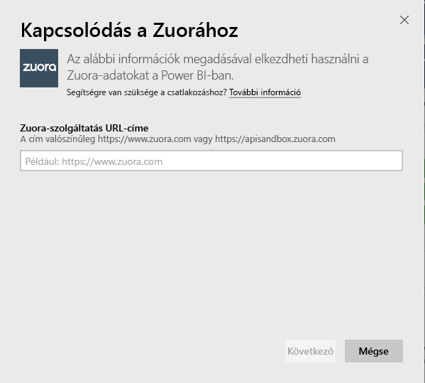
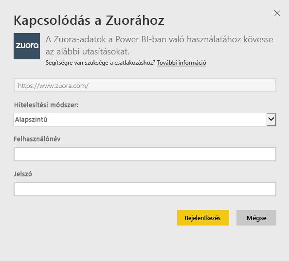
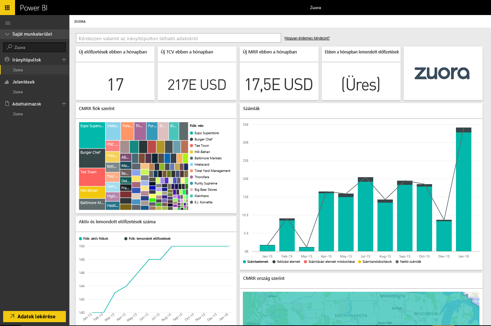

# Csatlakozás a Zuorához a Power BI-ból
A Power BI-hoz készült Zuora segítségével ábrázolhatja a bevételekkel, a számlázással és az előfizetésekkel kapcsolatos fontos adatait. Az alapértelmezett irányítópulttal és jelentésekkel elemezheti a használati trendeket, követheti a számlázási és fizetési adatokat, illetve figyelheti az ismétlődő bevételeket. Az irányítópultot és a jelentéseket testre is szabhatja az egyéni igényei kielégítéséhez.

Csatlakozzon a Power BI-hoz készült [Zuora](https://app.powerbi.com/getdata/services/Zuora) szolgáltatáshoz.

## A csatlakozás menete
1. A bal oldali navigációs ablaktábla alján kattintson az **Adatok lekérése** elemre.

   
2. A **Szolgáltatások** mezőben válasza a **Beolvasás** elemet.

   
3. Válassza a **Zuora** \> **Beolvasás** lehetőséget.

   
4. Adja meg a Zuora URL-címét. Ez általában „https://www.zuora.com”. A [paraméterek megkereséséről](#FindingParams) alább olvashat részletesebben.

   
5. **Hitelesítési módszerként** válassza az **Alapszintű** lehetőséget, adja meg a felhasználónevét és a jelszavát (figyeljen a kis- és nagybetűkre), majd kattintson a **Bejelentkezés** elemre.

    
6. A jóváhagyás után automatikusan megkezdődik az importálás. Ha befejeződött, a navigációs panelen megjelenik egy új irányítópult, jelentés és modell. Válassza ki az irányítópultot az importált adatok megtekintéséhez.

     

**Mi a következő lépés?**

* [Kérdéseket tehet fel a Q&A mezőben](power-bi-q-and-a.md) az irányítópult tetején.
* [Módosíthatja az irányítópult csempéit](service-dashboard-edit-tile.md).
* [Kiválaszthatja valamelyik csempét](service-dashboard-tiles.md) a mögöttes jelentés megnyitásához.
* Noha az adatkészlet napi frissítésre van ütemezve, módosíthatja a frissítési ütemezést, vagy igény szerint frissíthet az **Azonnali frissítés** gombbal.

## A csomag tartalma
Ez a tartalomcsomag a Zuora AQUA API segítségével olvas be adatokat az alábbi táblákból:

| Táblák |  |  |
| --- | --- | --- |
| Account |InvoiceItemAdjustment |Refund |
| AccountingCode |Payment |RevenueSchedule |
| AccountingPeriod |PaymentMethod |RevenueScheduleItem |
| BillTo |Product |Subscription |
| DateDim |ProductRatePlan |TaxationItem |
| Invoice |ProductRatePlanCharge |Usage |
| InvoiceAdjustment |RatePlan | |
| InvoiceItem |RatePlanCharge | |

Emellett az alábbi számított mértékeket is tartalmazza:

| Mérték | Leírás | Számítás |
| --- | --- | --- |
| Account: Payments |Befizetések teljes összege egy időszakban, a befizetések hatályba lépési dátuma szerint. |SUM (Payment.Amount)  WHERE Payment.EffectiveDate =< TimePeriod.EndDate AND    Payment.EffectiveDate >= TimePeriod.StartDate |
| Account: Refunds |Visszatérítések teljes összege egy időszakban, a visszatérítések hatályba lépési dátuma szerint. Ez a mennyiség negatív számként jelenik meg. |-1*SUM(Refund.Amount) WHERE Refund.RefundDate =< TimePeriod.EndDate AND    Refund.RefundDate >= TimePeriod.StartDate |
| Account: Net Payments |Fiókhoz tartozó befizetések plusz fiókhoz tartozó visszatérítések egy adott időszakban. |Account.Payments + Account.Refunds |
| Account: Active Accounts |Az adott időszakban aktív fiókok száma. Az időszak kezdő dátuma előtt (vagy azzal egy időben) induló előfizetéseket tartalmazza. |COUNT (Account.AccountNumber) WHERE     Subscription.Status != "Expired" AND    Subscription.Status != "Draft" AND    Subscription.SubscriptionStartDate <= TimePeriod.StartDate AND    (Subscription.SubscriptionEndDate > TimePeriod.StartDate OR Subscription.SubscriptionEndDate = null) –evergreen subscription |
| Account: Average Recurring Revenue |Bruttó havi ismétlődő bevétel (MRR) az adott időszakban aktív fiókokként. |Gross MRR / Account.ActiveAccounts |
| Account: Cancelled Subscriptions |Az adott időszakban előfizetést lemondó fiókok száma. |COUNT (Account.AccountNumber) WHERE Subscription.Status = "Cancelled" AND    Subscription.SubscriptionStartDate <= TimePeriod.StartDate AND    Subscription.CancelledDate >= TimePeriod.StartDate |
| Account: Payment Errors |A befizetési hibák összesített értéke. |SUM (Payment.Amount) WHERE Payment.Status = "Error" |
| Revenue Schedule Item: Recognized Revenue |Az adott számviteli időszakban érvényes összbevétel. |SUM (RevenueScheduleItem.Amount) WHERE AccountingPeriod.StartDate = TimePeriod.StartDate |
| Subscription: New Subscriptions |Az új előfizetések száma egy adott időszakban. |COUNT (Subscription.ID) WHERE Subscription.Version = "1" AND    Subscription.CreatedDate <= TimePeriod.EndDate AND    Subscription.CreatedDate >= TimePeriod.StartDate |
| Invoice: Invoice Items |Számlatételek díjának összértéke egy adott időszakban. |SUM (InvoiceItem.ChargeAmount) WHERE     Invoice.Status = "Posted" AND    Invoice.InvoiceDate <= TimePeriod.EndDate AND    Invoice.InvoiceDate >= TimePeriod.StartDate |
| Invoice: Taxation Items |Adózási tételek összértéke egy adott időszakban. |SUM (TaxationItem.TaxAmount) WHERE Invoice.Status = "Posted" AND    Invoice.InvoiceDate <= TimePeriod.EndDate AND    Invoice.InvoiceDate >= TimePeriod.StartDate |
| Invoice: Invoice Item Adjustments |Számlatételek korrekciójának összértéke egy adott időszakban. |SUM (InvoiceItemAdjustment.Amount)  WHERE     Invoice.Status = "Posted" AND    InvoiceItemAdjustment.AdjustmentDate <= TimePeriod.EndDate AND    InvoiceItemAdjustment.AdjustmentDate >= TimePeriod.StartDate |
| Invoice: Invoice Adjustments |Számlák korrekciójának összértéke egy adott időszakban. |SUM (InvoiceAdjustment.Amount)  WHERE     Invoice.Status = "Posted" AND    InvoiceAdjustment.AdjustmentDate <= TimePeriod.EndDate AND    InvoiceAdjustment.AdjustmentDate >= TimePeriod.StartDate |
| Invoice: Net Billings |A számlatételeknek, az adózási tételeknek, a számlatételek korrekcióinak és a számlák korrekcióinak összértéke egy adott időszakban. |Invoice.InvoiceItems + Invoice.TaxationItems + Invoice.InvoiceItemAdjustments + Invoice.InvoiceAdjustments |
| Invoice: Invoice Aging Balance |Elküldött számlaegyenlegek összege. |SUM (Invoice.Balance)  WHERE     Invoice.Status = "Posted" |
| Invoice: Gross Billings |Számlatételek díjának összege az elküldött számlákra vonatkozóan egy adott időszakban. |SUM (InvoiceItem.ChargeAmount)  WHERE     Invoice.Status = "Posted" AND    Invoice.InvoiceDate <= TimePeriod.EndDate AND    Invoice.InvoiceDate >= TimePeriod.StartDate |
| Invoice: Total Adjustments |Az elküldött számlákhoz tartozó feldolgozott számlakorrekciók és számlatétel-korrekciók összege. |SUM (InvoiceAdjustment.Amount)  WHERE     Invoice.Status = "Posted" AND    InvoiceAdjustment.Status = "Processed" + SUM (InvoiceItemAdjustment.Amount)  WHERE     Invoice.Status = "Posted" AND    invoiceItemAdjustment.Status = "Processed" |
| Rate Plan Charge: Gross MRR |Előfizetésekből származó havi ismétlődő bevétel összege egy adott időszakban. |SUM (RatePlanCharge.MRR)  WHERE     Subscription.Status != "Expired" AND    Subscription.Status != "Draft" AND    RatePlanCharge.EffectiveStartDate <= TimePeriod.StartDate AND        RatePlanCharge.EffectiveEndDate > TimePeriod.StartDate     OR    RatePlanCharge.EffectiveEndDate = null --evergreen subscription |

## Rendszerkövetelmények
Hozzáféréssel kell rendelkeznie a Zuora API-hoz.

## Paraméterek keresése
Adja meg azt az URL-címet, amellyel be szokott jelentkezni a Zuora-adatai eléréshez. Az érvényes lehetőségek a következők:  

* https://www.zuora.com  
* https://www.apisandbox.zuora.com  
* A használt szolgáltatáspéldány által meghatározott URL-cím  

## Hibaelhárítás
A Zuora-tartalomcsomag a Zuora-fiókjához tartozó adatok széles körét beolvassa. Ha nem használ bizonyos funkciókat, akkor előfordulhat, hogy a vonatkozó csempék vagy jelentések üresek lesznek. Ha problémát tapasztal a betöltés során, lépjen kapcsolatba a Power BI támogatási szolgálatával.

## Következő lépések
[Első lépések a Power BI-ban](service-get-started.md)

[Adatok lekérése a Power BI-ban](service-get-data.md)
