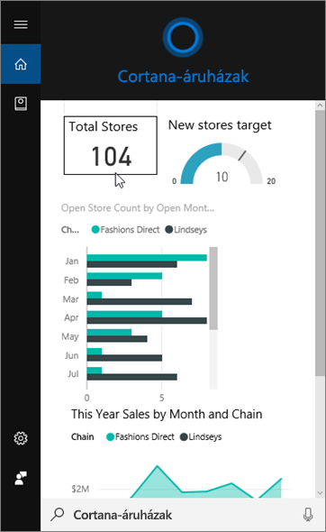
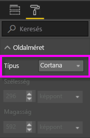
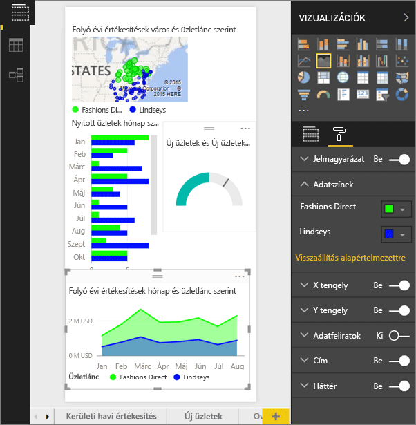
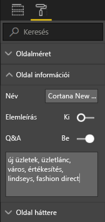
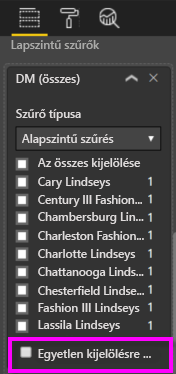

# A Power BI szolgáltatás vagy a Power BI Desktop használata egyéni válaszoldal létrehozására Cortanához
A Power BI teljes funkcionalitásának használata *Cortana-válaszoldalaknak* (vagy néha *Cortana-válaszkártyáknak*) nevezett, kifejezetten a Cortana-kérdések megválaszolására tervezett, különleges jelentésoldalak létrehozására.

> [!IMPORTANT]
> Ha a Cortana és a Power BI-**irányítópult** előzetes verzióját próbálja ki, akkor ennek a cikknek a további részeit kihagyhatja. Az, hogy a Cortana keresni tudjon a Power BI-irányítópultokon, nem igényel előzetes beállításokat.
> 
> 

## Előkészületek
Négy dokumentum nyújt útmutatást a Power BI-hoz használt Cortana beállításához és használatához. Ha még nem tette meg, javasoljuk, hogy kezdje az első cikk elolvasásával. A második cikk pedig különösen fontos, mert ismertet néhány lépést, amelyet követnie kell, mielőtt használhatná a Cortana-válaszoldalakat.

**1. cikk**: [Cortana és a Power BI együttműködése](service-cortana-intro.md)

**2. cikk**: [Power BI-jelentések keresése: Cortana, a Power BI és a Windows integrációjának engedélyezése](service-cortana-enable.md)

**3. cikk**: Ez a cikk

**4. cikk**: [Hibaelhárítással kapcsolatos kérdések](service-cortana-troubleshoot.md)

## Kifejezetten Cortanához tervezett Cortana-válaszoldal létrehozása
A jelentésekben a *Cortana-válaszoldal* Cortanára van méretezve, hogy megjeleníthesse a képernyőn a kérdésekre adott válaszul. Válaszoldal létrehozása Cortanához:

1. Javasoljuk, hogy egy [üres jelentésoldallal](power-bi-report-add-page.md) kezdje.
2. A **Vizualizációk** ablaktáblán kattintson a festőhenger ikonra, és válassza az **Oldalméret** > **Típus** > **Cortana** lehetőséget.
   
    
3. Hozzon létre egy vizualizációt vagy egy vizualizációkészletet, amelyet szeretne megjeleníteni Cortanában egy meghatározott kérdésre (vagy kérdéssorra) adott válaszként.

> [!NOTE]
> Jelenleg Cortana válaszoldala nem támogatja a statikus képeket megjelenítő képeket. Megadhat az adatok URL-címe alapján dinamikus adatkiszolgálással beolvasott mátrixvizualizációkat vagy képeket táblákban. 
> 
> 

4. Győződjön meg róla, hogy minden vizualizáció elfér az oldalszegélyeken belül. Módosíthatja a megjelenítési beállításokat, adatcímkéket, színeket és háttereket is.  
   
    
5. Nevezze el az oldalt, és vegyen fel alternatív neveket. Cortana ezeket a neveket használja eredmények keresésére. A **Visualizations** (Vizualizációk) ablaktáblán kattintson az ecset ikonra, és válassza a **Page Information** (Oldaladatok) lehetőséget. Engedélyezze a Q&A-t ehhez a vizualizációhoz a csúszka **On** (Be) állásba kapcsolásával.
   
    
   
   > [!TIP]
   > A pontosabb eredmények érdekében kerülje az olyan szavak használatát, amelyek egyben oszlopnevek is.
   > 
   > 
6. Ha a jelentés rendelkezik oldalszintű szűrőkkel, nem kötelező, de érdemes megadnia az **Egyetlen kijelölésre van szükség** beállítást. Cortana ezt a jelentést csak akkor jeleníti meg válaszként, ha a szűrőelemek közül egy (és csak egy) meg van határozva a kérdésben. Az **Egyetlen kijelölésre van szükség** beállítás a **Szűrők** ablaktábla alján található.
   
   > [!NOTE]
   > Nem kell megadnia a **Require single selection** (Egyetlen kijelölésre van szükség) beállítást ahhoz, hogy Cortana oldalszintű szűrőkkel jelenítse meg a jelentést. Például a „show sales for Charlotte Lindseys” (értékesítés megjelenítése a Charlotte Lindseyshez) megjeleníti a válaszoldalt az Egyetlen kijelölésre van szükség beállításától függetlenül.
   > 
   > 
   
     
   
      Ha például arra kéri Cortanát, hogy:
   
   * „show sales by store name” (jelenítse meg az értékesítést áruháznév alapján), ez a válaszoldal nem fog megjelenni, mert a kötelező oldalszintű szűrő elemeinek egyikét sem adta meg,
   * „show sales for Cary Lindseys and Charlotte Lindseys” (jelenítse meg az értékesítést Cary Lindseyshez és Charlotte Lindseyshez), ez a válaszoldal nem fog megjelenni, mert egynél többet adott meg a kötelező oldalszintű szűrők közül,
   * „show sales for Charlotte Lindseys” (jelenítse meg az értékesítést Charlotte Lindseyshez), ez a válaszoldal meg fog jelenni,
     
     = „show sales” (jelenítése meg az értékesítést), ez a válaszoldal nem fog megjelenni, mert a kötelező oldalszintű szűrő elemeinek egyikét sem adta meg.

> [!IMPORTANT]
> Ahhoz, hogy a Cortana-válaszoldala elérhető legyen Cortana számára [engedélyeznie kell az adatkészletet Cortanának](service-cortana-enable.md).
> 
> 

## Milyen sorrendbe állítja Cortana az eredményeket?
Cortana oldalán a magas pontszámú válaszok (például egy meghatározott oldalnévre talált teljes egyezés) jelennek meg először *legjobb találatként*. Ha a Power BI-ban több Cortana-válaszoldal van, több legjobb találat is megjelenhet. A közepes vagy alacsonyabb pontszámú válaszok, például azok, amelyek nem egy válaszoldal nevén alapulnak, vagy azok a kérdések, amelyek a Power BI által nem értett szavakat tartalmaznak, Cortana oldalán hivatkozásokként jelennek meg a legjobb találatok alatt.

> [!NOTE]
> Amikor egy új adathalmazt vagy egyéni Cortana-válaszoldalt vesznek fel a Power BI-ba, és engedélyezik annak használatát Cortana számára, akár 30 percig is eltarthat, amíg az eredmények megjelennek Cortana oldalán. A Windows 10-be való be- és kijelentkezéssel, illetve Cortana folyamatának a Windows 10-ben más módon való újraindításával elérhető, hogy az új tartalom azonnal megjelenjen.
> 
> 

## Következő lépések
[Cortana használata a Power BI-jal](service-cortana-intro.md)

Továbbra sem tudja a Power BI-jal használni Cortanát?  Próbálkozzon [Cortana hibaelhárító eszközével](service-cortana-troubleshoot.md).

További kérdései vannak? [Kérdezze meg a Power BI közösségét](http://community.powerbi.com/)

