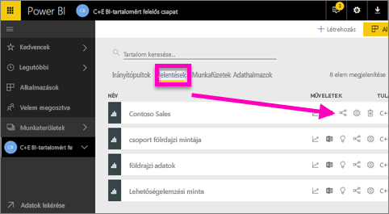
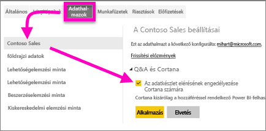
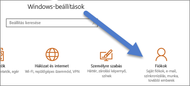
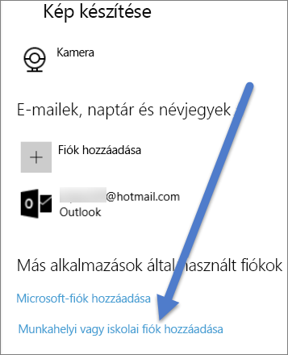

# Power BI-jelentések (és az alapjukul szolgáló adatkészletek) elérésének engedélyezése a Cortana számára
Már olvasta az [A Cortana és a Power BI ismertetése](service-cortana-intro.md) című cikket (ha nem, akkor ajánlott előbb elolvasni, és azután visszatérni ide). Most saját maga is kipróbálja.  Mielőtt természetes nyelvű kérdéseket tenne fel a Cortanában és válaszokat kapna rájuk a Power BI-***jelentésekben*** tárolt adatok alapján, ismerjen meg néhány előfeltételt. Egészen pontosan a következőket kell megtennie.

> [!NOTE]
> Ha a Cortana és a Power BI-***irányítópult*** előzetes verzióját próbálja ki, akkor ennek a cikknek a további részeit kihagyhatja. Az, hogy a Cortana keresni tudjon a Power BI-irányítópultokon, nem igényel előzetes beállításokat.
> 
> 

A Power BI szolgáltatásban

* engedélyezze egy vagy több adatkészlet elérését a Cortana számára (a jelentések adatkészletekre épülnek, ezért a Cortanának hozzá kell férnie ezekhez az adatkészletekhez)

A Microsoft Windowsban

* A Windows 10 1511-es vagy annál újabb verzióját kell használnia
* Ellenőrizze, hogy a Power BI és a Windows kommunikálni tudnak-e egymással. Ez azt jelenti, hogy a fiókját a Windowshoz kell kapcsolnia.

## Power BI-jelentésoldalak elérésének engedélyezése a Cortana számára a Power BI szolgáltatás használatával
A Power BI-jelentések elérése egyszerű eljárással engedélyezhető a Cortana számára.  Valójában csak annyit kell tennie, hogy hozzáférést ad a jelentés alapjául szolgáló adatkészlethez az “Adatkészlet elérésének engedélyezése a Cortana számára” lehetőség választásával. Ezt követően minden felhasználó, aki a hagyományos Power BI-beli megosztáson, alkalmazásokon vagy tartalomcsomag-funkciókon keresztül hozzáfér a Power BI-adatkészlethez, válaszokat kaphat a jelentésből a Windows 10-en futó Cortanával.

A Power BI szolgáltatásba (nem a Power BI Desktopba) bejelentkezve meg kell ismételnie ezeket a lépéseket minden olyan adatkészleten, amelyhez hozzáférést kíván adni a Cortanának.

1. Döntse el, hogy mely adatkészlet(ek)hez ad hozzáférést. Jelölje ki a Cortana számára hozzáférhetővé tenni kívánt jelentést a jelentések tartalomlistájában, majd válassza a **Kapcsolódók megtekintése** ikont .
   
    
2. Ehhez a jelentéshez a **Contoso Sales** című jelentés van társítva.
   
    
3. Válassza a fogaskerék ikont a Power BI szolgáltatás jobb felső sarkában, majd a **Beállítások** lehetőséget.
   
    
4. Válassza az **Adatkészletek** fület, majd jelölje ki a Cortana számára elérhetővé tenni kívánt adatkészletet a bal oldali listából.
5. Válassza a **Q&A és Cortana** > **Adatkészlet elérésének engedélyezése a Cortana számára** > **Alkalmaz** lehetőséget.
   
   
   
   Ebben a példában a Cortana a Contoso Sales adatkészlethez kap hozzáférést.
   
   > [!NOTE]
   > Amikor egy új adatkészletet vagy Cortana-válaszkártyát vesznek fel a Power BI-ba, és engedélyezik annak használatát a Cortana számára, akár 30 percig is eltarthat, amíg az eredmények megjelennek. A Windows 10-be való be- és kijelentkezéssel, illetve a Cortana folyamatának a Windows 10-ben más módon való újraindításával elérhető, hogy az új tartalom azonnal megjelenjen.
   > 
   > Ha hozzáférést ad egy adatkészlethez a Cortanának, az adatkészlet pedig egy saját tartalomcsomagjának vagy alkalmazásának a része, akkor azt újra közzé kell tennie, hogy a munkatársai is használni tudják a Cortanával.
   > 
   > 

## Power BI-hitelesítő adatok hozzáadása a Windowshoz
Ehhez a Windows 10 1511-es vagy újabb verzióját kell használnia.

1. Állapítsa meg, hogy a Windows 10 melyik verzióját használja. Nyissa meg a **Beállítások** > **Rendszer** > **Névjegy** elemet.
   
   * Ha a Windows 10 legalább 1511-es (2015. november 10-ei Windows 10-frissítés) de a 1607-esnél korábbi verziójával rendelkezik, akkor adja hozzá munkahelyi vagy iskolai fiókját és Microsoft-fiókját (hajtsa végre az alábbi 2. és 3. lépést).
   * Ha a Windows 10 1607-es (2016. július 10-ei Windows 10-frissítés) vagy újabb verziójával rendelkezik, akkor adja hozzá munkahelyi vagy iskolai fiókját (csak az alábbi 2. lépést hajtsa végre).
2. Adja hozzá munkahelyi vagy iskolai fiókját a Cortanához.
   
   * Nyissa meg a **Beállítások** > **Fiókok** elemet.
     
       
   * Görgessen a panel aljára, és válassza a **Munkahelyi vagy iskolai fiók hozzáadása** lehetőséget.
     
     

A Cortana az Ön munkahelyi vagy iskolai fiókjának használatával keres választ a Power BI-ban az Ön által a Cortanában feltett kérdésekre.

## További lépések
[Cortana *válaszkártyák* létrehozása a Power BI-ban](service-cortana-answer-cards.md)

[A Cortana és a Power BI közötti integráció hibáinak elhárítása](service-cortana-troubleshoot.md)

További kérdései vannak? [Felteheti őket a Power BI-közösségnek](http://community.powerbi.com/)

