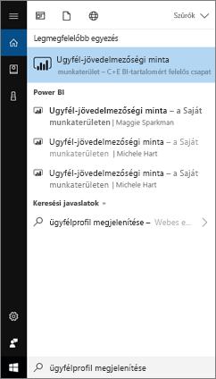
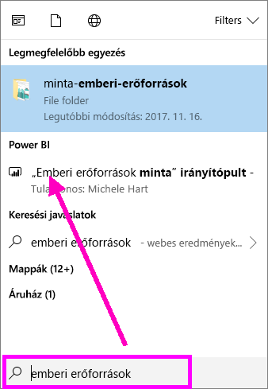
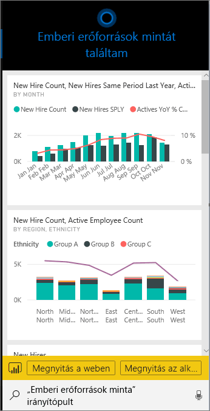
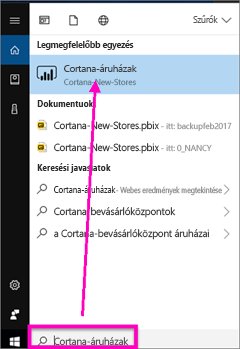
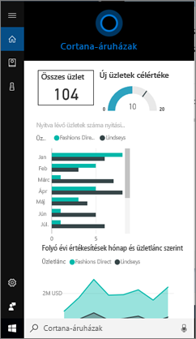
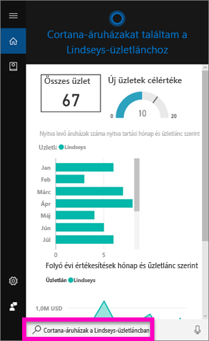
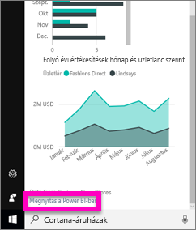
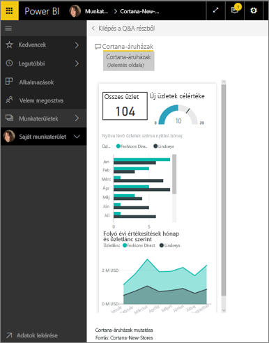

# Power BI-adatok gyors keresése a Power BI-hoz használt Cortana segítségével
Használja a Cortanát Windows 10-eszközein, ha azonnali választ szeretne kapni fontos üzleti kérdéseire. A Power BI-jal való integráció által a Cortana képes közvetlenül a Power BI-irányítópultokból és -jelentésekből kinyerni a lényeges információkat. Nem kell hozzá más, csak a Windows 10 2015. november 10-einél nem korábbi verziója, a Cortana, a Power BI és hozzáférés legalább egy adatkészlethez.

## A Cortana Windows 10 rendszerre készült új *irányítópult*-kereső felületének előzetes verziója
Már egy ideje lehetőség van [a Cortana használatára bizonyos típusú jelentésoldalak lekéréséhez](service-cortana-answer-cards.md). Most **új funkcióval** bővítettük – irányítópultokat is lekérhet vele. Próbálja ki, és [küldje el visszajelzését](mailto:pbicortanasg@microsoft.com). Az *új funkció* tovább bővül, és a Cortana jelentések között is képes lesz keresni.  Az új funkció egyik fő előnye, hogy a beállítása nem igényel különösebb előkészületet – nem kell engedélyezni a Cortanát vagy konfigurálni a Windows 10-et – egyszerűen csak működik.

> [!NOTE]
> Ha mégsem működne azonnal, akkor a [hibaelhárításról szóló cikkben](service-cortana-troubleshoot.md) talál segítséget.
> 
> 

A funkció hátterében a [Microsoft Azure Search szolgáltatást]() használó technológia áll. Ez a keresési szolgáltatás olyan további képességeket biztosít, mint az intelligens rangsorolás, a hibajavítás és az automatikus kiegészítés.

A két Cortana-változat egymás mellett fog működni.

## A Power BI-hoz használt Cortana dokumentációja
4 dokumentum nyújt útmutatást a Cortana a Power BI-hoz való beállításához és használatához. Ez a cikksorozat lépésenként tárgyalja a következőket:

**1. cikk** (ez a cikk): A Cortana és a Power BI együttműködésének ismertetése

**2. cikk**: [Power BI-jelentések keresése: a Cortana, a Power BI és a Windows integrációjának engedélyezése](service-cortana-enable.md)

**3. cikk**: [Power BI-jelentések keresése: speciális *Cortana-válaszkártyák* létrehozása](service-cortana-answer-cards.md)

**4. cikk**: [Hibaelhárítással kapcsolatos kérdések](service-cortana-troubleshoot.md)

## Hogyan működik együtt a Cortana és a Power BI?
Amikor Ön kérdést tesz fel a Cortanának, akkor az többek között a Power BI-ban keresi a választ. A Power BI-ban a Cortana bőséges adatokon alapuló válaszokat találhat a Power BI-jelentésekben (amelyek egy különleges jelentésoldalt, úgynevezett *Cortana-válaszkártyát* tartalmaznak) és a Power BI-irányítópultokban.

Ha a Cortana egyezést talál, akkor közvetlenül az Ön Cortana-képernyőjén jeleníti meg az irányítópult vagy jelentésoldal nevét. Az irányítópult vagy jelentésoldal a Power BI-ban megnyitható. A jelentésoldalak közvetlenül a Cortanában is vizsgálhatók – interaktívak.

### A Cortana és az irányítópultok (az *új funkció*)
A Cortana az Ön tulajdonában lévő és az Önnel megosztott irányítópultokon is keresi a válaszokat. A Cortanának feltett kérdésekben használhat címeket, kulcsszavakat, tulajdonosok neveit, munkaterületek neveit, alkalmazások neveit és sok mást is.

Ahhoz, hogy a Cortana választ találjon, a kérdésnek legalább 2 szóból kell állnia. Ha olyan irányítópulton keres, amelynek egyszavas neve van (Marketing), akkor fűzze hozzá a "show", "Power BI" vagy "<owner name>" szavakat a kérdéshez, például: "show Marketing" (mutasd a Marketinget) vagy "michele hart sample" (michele hart minta). 

Ha az irányítópult címe egynél több szóból áll, a Cortana csak akkor találja meg az irányítópultot, ha legalább két szó megfelel a keresésnek, vagy ha az irányítópult egyik szava és a tulajdonos neve egyezik. Angol nyelvű példák egy "Customer Profitability Sample" nevű irányítópulttal: 

* A "show me customer" kifejezés *nem* ad vissza Power BI-irányítópult eredményt.   
* A "show me customer profitability", "customer p", "customer s", "profitability sample", "michele hart sample", "show customer profitability sample", és "show me customer p" kifejezések *fognak* visszaadni Power BI-beli eredményt.
* A „powerbi” kifejezés beszúrása a 2 szükséges szó egyikének számít, így a „powerbi sample” („powerbi minta”) kifejezés *fog* visszaadni Power BI-beli eredményt. 
  
    

### A Cortana és a jelentések
 A Cortana olyan jelentésekben talál válaszokat, amelyeknek [kimondottan a Cortanával való megjelenítéshez tervezett oldalai vannak](service-cortana-answer-cards.md). Elég olyan kérdéseket feltennie, amelyekben ennek a különleges jelentésoldalnak a címe vagy egyik kulcsszava szerepel.  

A jelentések keresésének hátterében a [Microsoft Power BI Q&A-t](power-bi-q-and-a.md) használó technológia áll.

Amikor Ön feltesz egy kérdést a Cortanában, a Power BI ad választ a kimondottan a Cortanához tervezett jelentésoldalak alapján. A válaszlehetőségeket a Cortana menet közben határozza meg közvetlenül a Power BI-ban már létrehozott Cortana-*válaszkártyákból*.  Egy válasz további vizsgálatához egyszerűen nyissa meg az eredményt a Power BI-ban.

> [!NOTE]
> Ahhoz, hogy a Cortana válaszokat kereshessen Power BI-jelentéseiben, először [engedélyeznie kell ezt a funkciót a Power BI szolgáltatásban, és be kell állítania a Windowst, hogy kommunikáljon a Power BI-jal](service-cortana-enable.md).  
> 
> 

## Válaszkeresés a Power BI-ban a Cortana használatával
1. Kezdje a Cortanában. A Cortana többféleképpen is *megnyitható*: válassza a Cortana-ikont a tálcán (ábra alább), használjon hangparancsokat vagy koppintson Windows-mobileszköze keresés ikonjára.
   
     
2. Ha a Cortana készen áll, gépelje vagy diktálja be kérdését a Cortana keresőmezőbe. A Cortana megjeleníti a rendelkezésre álló válaszokat. Ha van a kérdésnek megfelelő Power BI-irányítópult, akkor az a **Legjobb egyezés** vagy a **Power BI** alatt jelenik meg.
   
     
   
   > [!NOTE]
   > Jelenleg csak az angol nyelv támogatott.
   > 
   > 
3. Válassza ki az irányítópultot a Cortanával való megnyitásához.

    

    Az [irányítópult *telefonos nézetének* szerkesztésével](service-create-dashboard-mobile-phone-view.md) módosíthatja az elrendezést. 

1. Cortanával is megvan a lehetősége arra, hogy a Power BI szolgáltatásban vagy a Power Bi Mobile-ban nyissa meg az irányítópultot. A **Megnyitás a weben** lehetőséget választva nyissa meg az irányítópultot a Power BI szolgáltatásban. 
   
      
4. Most használja a Cortanát egy jelentések közötti kereséshez. Tudnia kell egy olyan [jelentésről, amelynek van egy Cortana-válaszkártyát tartalmazó oldala](service-cortana-answer-cards.md). Ebben a példában egy "Cortana-New-Stores" nevű jelentésnek van egy "cortana stores" nevű Cortana-válaszkártya oldala.  
   
     Gépelje vagy diktálja be kérdését a Cortana keresőmezőjébe. A Cortana megjeleníti a rendelkezésre álló válaszokat. Ha van a kérdésnek megfelelő Power BI-jelentésoldal, akkor az a **Legjobb egyezés** vagy a **Power BI** alatt jelenik meg. Ebben a példában a válaszkártya létrehozásához használt .pbix-fájl (és annak biztonsági másolata) is megjelenik – a **Dokumentumok** alatt.
   
      
5. Jelölje ki a **Cortana stores** jelentésoldalt, hogy megjelenjen a Cortana ablakában.
   
       
   
    Ne feledje, hogy a *válaszkártyák* az adatkészlet tulajdonosa által létrehozott különleges Power BI-jelentésoldalak.  További információ: [Cortana-válaszkártya létrehozása](service-cortana-answer-cards.md).
6. Ám ez még nem minden. A válaszkártya vizualizációi ugyanúgy használhatók, mint a Power BI-ban.
   
   * Kijelölheti például egy vizualizáció egy elemét a válaszkártya többi vizualizációján megjelenő keresztszűréshez és kiemeléshez.
     
     
   * Dönthet úgy is, hogy természetes nyelvű szűrést alkalmaz az eredményeken.  Felteheti például a "Cortana stores for Lindseys" (Cortana Lindseys-üzletek) kérdést, és a kártyán csak a Lindseys üzletlánc adatai fognak látszani.
     
     
7. Folytassa az ismerkedést. Görgessen a Cortana ablakának aljára, és válassza a **Megnyitás a Power BI-ban** lehetőséget.
   
     
8. A jelentésoldal megnyílik a Power BI-ban.    
     

## Megfontolandó szempontok és hibaelhárítás
* A Cortana nem fér hozzá azokhoz a Cortana-kártyákhoz, amelyek nincsenek [engedélyezve a Power BI-hoz](service-cortana-enable.md).
* Továbbra sem tudja a Power BI-jal használni a Cortanát?  Próbálkozzon a [Cortana hibaelhárító eszközével](service-cortana-troubleshoot.md).
* A Power BI-hoz használt Cortana jelenleg csak angol nyelven érhető el.
* A Power BI-hoz használt Cortana csak Windows rendszerű mobileszközökön érhető el.

További kérdései vannak? [Kérdezze meg a Power BI közösségét](http://community.powerbi.com/)

## További lépések
[A Cortana, a Power BI és a Windows integrációjának engedélyezése jelentésekhez](service-cortana-enable.md)

