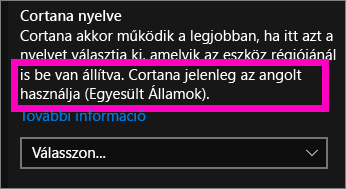
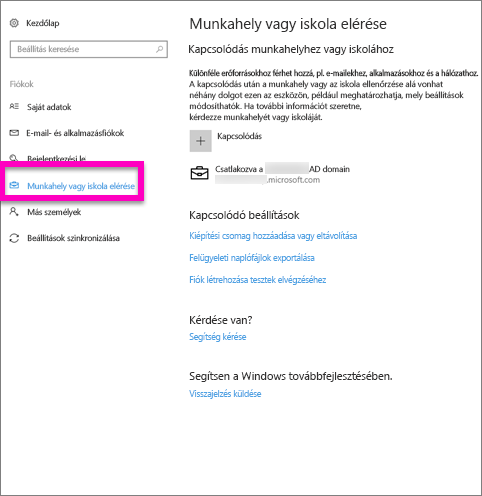
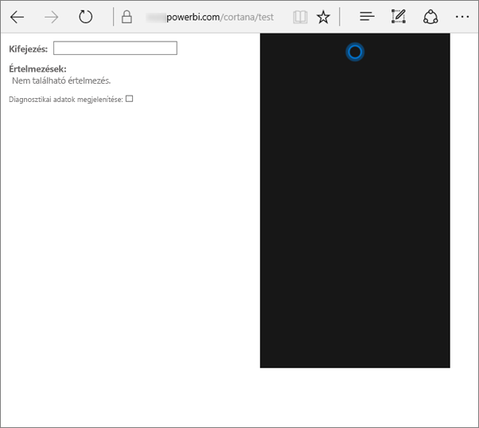
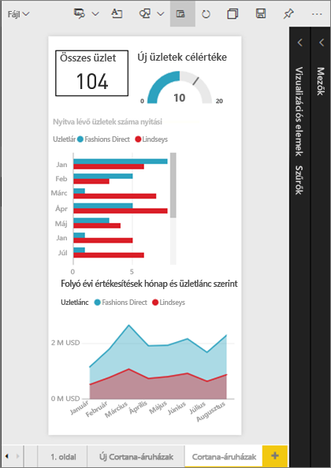
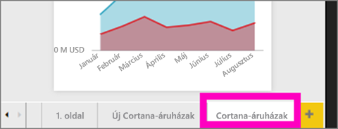
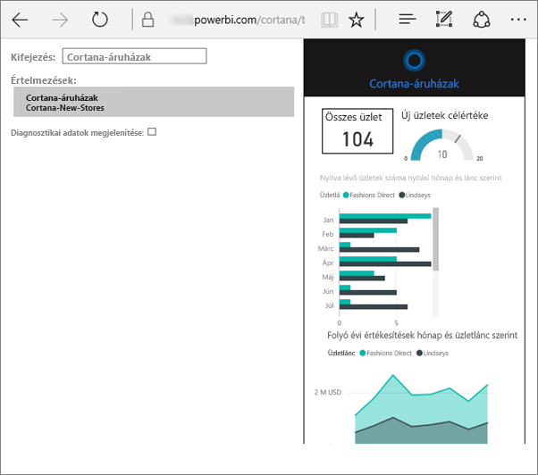
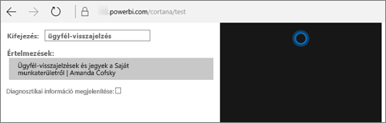

# A Power BI-hoz használt Cortana hibaelhárítása
Ez a cikk egy sorozat része. Ha még nem tette meg, javasoljuk, hogy olvassa el az alábbi cikkeket.

**1. cikk**: [A Cortana és a Power BI Power BI-irányítópultok és -jelentések kereséséhez való együttműködésének ismertetése](service-cortana-intro.md)

**2. cikk**: [Jelentések keresése: Cortana, a Power BI és a Windows integrációjának engedélyezése](service-cortana-enable.md)

**3. cikk**: [Jelentések keresése: speciális *Cortana-válaszkártyák* létrehozása](service-cortana-answer-cards.md)

Ha továbbra is problémákba ütközik Cortana a Power BI szolgáltatással való integrálása során, akkor jó helyen jár. Az alábbi lépésekkel diagnosztizálhatja és megoldhatja a problémát.

## Miért nem talál Cortana válaszokat a Power BI-jelentésekben és irányítópultokon?
1. Van Power BI-fiókja?  Ha nincs, [ingyenesen feliratkozhat](service-self-service-signup-for-power-bi.md).
2. Cortana működik?  Látható Cortana ikonja a tálcán?

    

    Amikor kiválasztja, megnyílik Cortana egy szövegbeviteli mezővel?
3. Legalább 2 szót használt a kereséshez? Cortana legalább 2 szóból álló kifejezéseket igényel ahhoz, hogy válaszokat találjon a Power BI-ban. Próbálja meg beszúrni a „show” („mutasd meg”) kifejezést a kérdése elejére.
4. Ha az irányítópult címe egynél több szóból áll, Cortana csak az irányítópultot fogja visszaadni, ha legalább két szó megfelel a keresésnek. Egy „Sales FY16” („2016-os pénzügyi évi értékesítés”) nevű irányítópult esetében:

   * a „show sales” („mutasd az értékesítést”) kifejezés *nem* fog Power BI-beli eredményt visszaadni.   
   * a „show me sales fy16”, a „sales fy16”, a „show sales fy16” és a „show me sales f” kifejezés *fog* visszaadni Power BI-beli eredményt.    
   * A „powerbi” kifejezés beszúrása a 2 szükséges szó egyikének számít, így a „powerbi sales” („powerbi értékesítés”) kifejezés *fog* visszaadni Power BI-beli eredményt.
5. Van hozzáférési vagy szerkesztési engedélye bármelyik jelentésre vagy irányítópultra vonatkozóan? A jelentések esetében győződjön meg arról, hogy tartozik [válaszkártya](service-cortana-answer-cards.md) ahhoz a tartalomhoz, melyre keresni szeretne.  Az irányítópultok esetében, győződjön meg arról, hogy a keresni kívánt tartalom a **Velem megosztva** területen, egy alkalmazás munkaterületén vagy a **Saját munkaterületen** található. [A Hibaelhárító eszköz használatával](#try-the-cortana-troubleshooting-tool) azonosíthatja a problémát.
6. Mobileszközt használ?  A Power BI és Cortana integrációja jelenleg csak a Windows rendszerű mobileszközökön támogatott.
7. Cortana az angol nyelvre van beállítva?  Cortana és a Power BI jelenlegi integrációja csak az angol nyelvet támogatja. Nyissa meg Cortanát, majd válassza a fogaskerék ikont a Beállítások megjelenítéséhez. Görgessen le a **Cortana nyelve** beállításhoz, és ellenőrizze, hogy az az egyik angol nyelvű lehetőségre van-e beállítva.

   
8. 100-nál több jelentés használata van engedélyezve Cortana számára?  Cortana csak legfeljebb összesen 100-ban keres.  Annak biztosításához, hogy a jelentés szerepeljen ezek között, másolja vagy helyezze át azt a **Saját munkaterületre**, mert Cortana először ott keres.
9. Előfordulhat, hogy csak egy kis időt kell adnia neki. Amikor először ír be egy lekérdezést, lehetséges, hogy a modell *még nem melegedett be*. Várjon néhány másodpercet, hogy a rendszer be tudja tölteni az adatokat a memóriába, majd próbálkozzon újra.
10. Az irányítópultok esetében akár 24 óráig is eltarthat, mire azok hozzáférhetővé válnak Cortana számára.    
11. A jelentések esetében, amikor egy új adathalmazt vagy egyéni válaszkártyát vesznek fel a Power BI-ba, és engedélyezik annak használatát Cortana számára, akár 30 percig is eltarthat, amíg az eredmények megjelennek Cortanában. A Windows 10-be való be- és kijelentkezéssel, illetve Cortana folyamatának a Windows 10-ben más módon való újraindításával elérhető, hogy a jelentések tartalma azonnal megjelenjen.  
12. A Power BI rendszergazdája „elutasíthatja” a funkció használatát. Kérdezze meg a rendszergazdától, ha ez-e a helyzet.

## Csak jelentések esetében: Miért nem talál Cortana válaszokat a Power BI-jelentésekben?
1. Ha jelentésekben keres válaszokat, vannak Cortana-**válaszkártyákkal** rendelkező jelentései? Cortana kizárólag válaszkártyák használatával tud válaszokat keresni a Power BI-jelentésekben.  A [Cortana-válaszkártyák létrehozása a Power BI szolgáltatásban és a Power BI Desktop alkalmazásban](service-cortana-answer-cards.md) című témakörből megtudhatja, hogyan hozhat létre válaszkártyákat.
2. A Windows 1511-es vagy újabb verzióját használja?  Ezt úgy tudhatja meg, hogy megnyitja a Windows Gépházat, majd a **Rendszer > Névjegy** lehetőséget választja. Ha nem, frissítse a Windows-verziót.
3. Össze van kapcsolva a Windows- és a Power BI-fiókja? Ez zavaros lehet. Kövesse a [Cortana a Power BI-hoz való használatának engedélyezése](service-cortana-enable.md#add-your-power-bi-credentials-to-windows) című témakör utasításait.
4. A mögöttes adathalmazok használata engedélyezve van Cortana számára? Lehetséges, hogy egy munkatárs egy olyan adathalmazt osztott meg, melynek használatát már engedélyezte Cortana számára. Ha viszont nem, [megtudhatja, hogyan engedélyezheti maga az adathalmazok használatát Cortana számára](service-cortana-enable.md). Ezt gyorsan és egyszerűen elvégezheti.

## Csak irányítópultok esetében: Miért nem talál Cortana válaszokat a Power BI-irányítópultokon?
1. Győződjön meg arról, hogy kapcsolódik a munkahelyi fiókjához. A Power BI-nak szüksége van erre a kapcsolatra ahhoz, hogy hitelesíteni tudja az adatokhoz való hozzáférési engedélyeit. Annak ellenőrzéséhez, hogy kapcsolódik-e, a munkahelyi fiókjához való kapcsolódáshoz nyissa meg a Csatlakozás munkahelyi vagy iskolai rendszerhez lapot.  

    
2. Rendelkezik Cortanához való hozzáféréssel? Válassza a Windows keresőmezőjét, és biztosítson Cortana számára hozzáférési engedélyeket az adataira vonatkozóan.

## Cortana hibaelhárító eszközének használata
Továbbra is hibákat tapasztal?  Ideje futtatnia Cortana hibaelhárító eszközét, és leszűkítenie a lehetséges problémák körét.

### Problémákat tapasztal a válaszok egy jelentésből való beolvasásakor?
1. A jelentések esetében a hibaelhárító eszköz futtatása előtt mindenképpen állítsa a Cortana-válaszkártyák **Lapszintű** szűrőit az **Egyetlen kijelölésre van szükség** lehetőségre. Ehhez a [Cortana-válaszkártyák létrehozása](service-cortana-answer-cards.md) című témakörben találhat segítséget.
2. Nyissa meg a hibaelhárító eszközt úgy, hogy beszúrja a „/cortana/test” kifejezést a Power BI szolgáltatás URL-címének végére. Az URL-címnek az alábbihoz hasonlóan kell kinéznie:

   app.powerbi.com/cortana/test

   
3. A jelentésekkel kapcsolatos hibák elhárításához az **Utterance** (Kifejezés) mezőben adja meg a Cortana-válaszkártyát ***pontosan úgy, ahogy az a Power BI lapon megjelenik***.

   

    

   
4. Egyes esetekben amikor először ír be valamit az **Utterance** (Kifejezés) mezőbe, semmi nem történik. Tekintsen erre úgy, mint a rendszer betanítására; ezzel azt adja a hibaelhárító eszköz tudtára, hogy ideje bekapcsolni. Vágja ki és illessze be, vagy pedig újból írja be az értéket a **Utterance** (Kifejezés) mezőbe. Ebben a példában a válaszkártya neve **Cortana stores** (Cortana tárolói). Ha beilleszti vagy beírja a **Cortana stores** (Cortana tárolói) kifejezést az eszközben, az egyetlen, az **Interpretations** (Értelmezések) mezőben megjelenő eredményt ad vissza. Kattintson rá a válaszkártya Cortana ablakában való megjelenítéséhez – ebben az esetben ez a **Cortana stores** (Cortana tárolói).

   

   Mivel kaptunk egy eredményt, most már tudjuk, hogy Cortana használata **engedélyezve van** a Power BI-ban. Ez úgy szűkíti le a problémát, hogy az a Windows oldalán merülhet fel, vagy pedig a Cortana nyelvi beállítása, vagy az okozhatja, hogy Cortana számára 100-nál több adathalmaz használata van engedélyezve.

### Problémákat tapasztal a válaszok egy irányítópultról való beolvasásakor?
Egy Önnel megosztott irányítópultot keres?  Nyissa meg a Power BI > **Velem megosztva** lapot, majd keresse meg az irányítópult nevét.  Ezután adja meg a nevet az **Utterances** (Kifejezések) mezőben.

#### A hibaelhárító eszköz ismert problémái
* Ha az eszköz először nem olvas be eredményeket, a lekérdezést inkább illessze be az Utterance (Kifejezés) szövegmezőbe.
* A lekérdezésnek a rendszer kialakításából fakadóan 2 vagy több szóból kell állnia.  Ha a lekérdezés túl rövid, egészítse ki a „show” („mutasd meg”) kifejezéssel.
* Előfordulhat, hogy néhány elöljárószavakat tartalmazó lekérdezési sztring nem működik (példa: sales by item (értékesítés árucikk szerint)). Próbáljon meg más lekérdezési kifejezéseket használni, melyekben nem szerepelnek elöljárószavak, és értelmesek/egyediek.

További kérdései vannak? [Kérdezze meg a Power BI közösségét](http://community.powerbi.com/)
