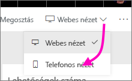
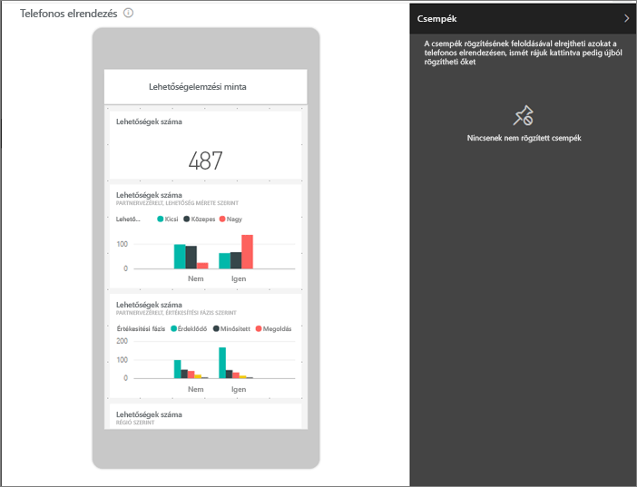
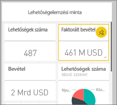
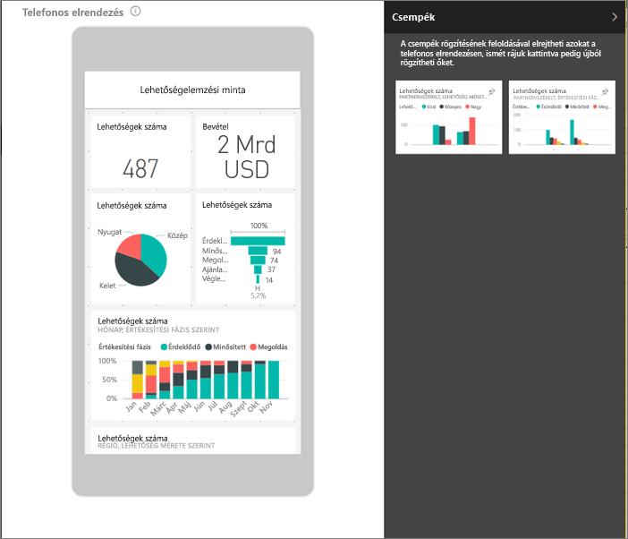
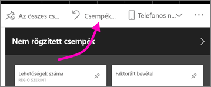

# Power BI-irányítópult mobiltelefonra optimalizált nézetének létrehozása
Amikor a telefonján irányítópultokat tekint a Power BI-mobilalkalmazásban, észreveheti, hogy az irányítópult-csempék egymás után sorakoznak, egyforma méretben. A Power BI szolgáltatásban bármely saját tulajdonú irányítópultnak létrehozható az egyéni, telefonos nézete.

A telefont oldalra fordítva az irányítópult elrendezése olyan lesz, mint a szolgáltatásban, nem pedig ahogyan a telefonhoz tervezte.

> [!NOTE]
> A telefonos nézet szerkesztése közben azok, akik telefonon tekintik meg az irányítópultot, valós időben látják a módosításokat. Ha például az összes csempe rögzítését feloldja az irányítópult telefonos nézetében, akkor az irányítópultról a telefonon hirtelen minden csempe eltűnik. 
> 
> 

## Irányítópult telefonos nézetének létrehozása
1. Nyisson meg egy irányítópultot a Power BI szolgáltatásban.
2. Válassza a **Webes nézet** melletti nyilat a jobb felső sarokban, majd a **Telefonos nézet** lehetőséget.

    

    Ha nem Ön az irányítópult tulajdonosa, akkor ezt a lehetőséget nem látja.

    

    Megnyílik a telefonos irányítópult szerkesztő nézete. Itt feloldhatja, átméretezheti és átrendezheti a csempéket a telefonos nézethez. Az irányítópult webes nézete nem változik.

1. Jelöljön ki egy csempét mozgatáshoz, átméretezéshez vagy a rögzítése feloldásához. Megfigyelheti, hogy a többi csempe kitér a húzással mozgatott csempe útjából.
   
    
   
    A feloldott rögzítésű csempék a Nem rögzített csempék panelre kerülnek, és ott is maradnak, amíg vissza nem helyezi őket.
   
    
2. Ha meggondolja magát, a **Csempék  alaphelyzetbe állítása** lehetőséget választva visszaállíthatja őket az eredeti méretükre és sorrendjükbe.
   
    
   
    A telefonos szerkesztőnézet megnyitása kis mértékben önmagában is megváltoztatja a csempék méretét és alakját a telefonon. Az indítópultot a **Csempék alaphelyzetbe állítása** lehetőséget választva tudja visszaállítani pontosan olyanra, amilyen a telefonos szerkesztőnézet megnyitása előtt volt.
3. Amikor elégedett a telefonos irányítópult elrendezésével, válassza a **Telefonos nézet** melletti nyilat a jobb felső sarokban, majd a **Webes nézet** lehetőséget.
   
    A Power BI automatikusan menti a telefonos elrendezést.

## További lépések
* [A Power BI-hoz készült telefonos alkalmazásokra optimalizált jelentések létrehozása](desktop-create-phone-report.md)
* [Tetszőleges méretre optimalizált, rugalmas vizualizációk létrehozása](desktop-create-responsive-visuals.md)
* További kérdései vannak? [Kérdezze meg a Power BI közösségét](http://community.powerbi.com/)

