# Irányítópultokból és jelentésekből álló alkalmazások létrehozása és közzététele a Power BI-ban

A Power BI-ban létrehozhat az irányítópultokat és jelentéseket egy helyen összefűző *alkalmazásokat*, majd közzéteheti azokat a vállalatban nagy csoportok számára elérhetően. Csatlakozhat a [külső szolgáltatásokhoz készült Power BI alkalmazásokhoz](service-connect-to-services.md) is, például a Google Analytics és a Microsoft Dynamics CRM szolgáltatáshoz.

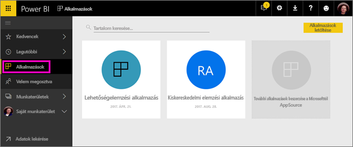

Üzleti felhasználóinak gyakran lehet szükségük több Power BI-irányítópultra vagy -jelentésre az üzletvitelükhöz. Az alkalmazásokban összefűzheti ezeket az elemeket, így nem kell észben tartaniuk az összes irányítópult nevét és helyét.  

A jelenleg előzetes verzióban elérhető Power BI alkalmazásokkal irányítópult- és jelentésgyűjteményeket hozhat létre, majd közzéteheti az alkalmazásokat a teljes vállalat, vagy egy adott személy vagy csoport számára. A jelentés készítője vagy a rendszergazda számára az alkalmazásoknak köszönhetően egyszerűbbé válik az irányítópult-gyűjteményekre vonatkozó engedélyek kezelése.

Az üzleti felhasználók különböző módokon férhetnek hozzá az alkalmazásokhoz. Ha a Power BI rendszergazda engedélyezi, telepítheti őket egyenesen a munkatársai Power BI-fiókjába. Ha nem, telepíthetik az alkalmazást a Microsoft AppSource-ból, vagy küldhet nekik egy közvetlen hivatkozást. Könnyen megtalálhatják újra a tartalmat, mert egy helyen érhető el minden. A rendszer automatikusan frissíti az alkalmazásokat, és szabályozható, milyen gyakran frissüljenek az adatok. További információk az [üzleti felhasználóknak elérhető alkalmazásélményről](service-install-use-apps.md).

### Licencek alkalmazásokhoz
Alkalmazás létrehozójaként Power BI Pro licencre lesz szüksége. Az alkalmazás felhasználói esetében két lehetőség van.

* 1. lehetőség: Minden üzleti felhasználónak **Power BI Pro** licencre van szüksége az alkalmazás megtekintéséhez. 
* 2. lehetőség: A vállalat ingyenes felhasználói megtekinthetik az alkalmazás tartalmát, ha az alkalmazás belefér a Power BI Premium kapacitásába. Részletek: [Mi a Power BI Premium?](service-premium.md).

### Alkalmazások és vállalati tartalomcsomagok
Az alkalmazások a vállalati tartalomcsomagokból fejlődtek ki. Ha már vannak vállalati tartalomcsomagjai, azok továbbra is működnek az alkalmazásokkal párhuzamosan.

Most, hogy áttekintettük az alkalmazásokat, beszéljünk az *alkalmazás-munkaterületekről*, ahol létrehozhatja az alkalmazásokat. 

## Videó: Alkalmazások és alkalmazás-munkaterületek
<iframe width="640" height="360" src="https://www.youtube.com/embed/Ey5pyrr7Lk8?showinfo=0" frameborder="0" allowfullscreen></iframe>

## Alkalmazás munkaterületei
Az *alkalmazás-munkaterületek* azok a területek, ahol létrehozhatja az alkalmazásokat, így egy alkalmazás létrehozása előtt létre kell hozni az alkalmazás-munkaterületet. Ha használt már csoportos munkaterületet a Power BI-ban, az alkalmazás-munkaterületek is ismerősek lesznek. Ezek a csoportos munkaterületekből fejlődtek ki – az alkalmazás tartalmához használt átmeneti területekből és tárolókból állnak. 

A kollégákat hozzáadhatja tagként vagy rendszergazdaként ezekhez a munkaterületekhez. Az alkalmazás-munkaterület összes tagjának és rendszergazdájának Power BI Pro licenccel kell rendelkeznie. A munkaterületen együttműködhetnek az irányítópultokon, jelentéseken és más tartalmakon, amelyeket a szélesebb közönség vagy akár a teljes vállalat elé szeretne tárni. 

Ha a tartalom elkészült, kiválaszthatja a közzétenni kívánt irányítópultokat, majd az alkalmazást is közzéteheti. Küldhet közvetlen hivatkozást a szélesebb közönségnek, vagy a **További alkalmazások AppSource-ból való letöltése és felderítése** területre lépve megkereshetik az alkalmazást az Alkalmazások lapon. Ezek a személyek nem módosíthatják az alkalmazás tartalmát, de használhatják a Power BI szolgáltatásban vagy valamelyik mobilalkalmazásban is – maguk is szűrhetik, kiemelhetik és rendezhetik az adatokat. 

## Alkalmazás munkaterületének létrehozása
[!INCLUDE [powerbi-service-create-app-workspace](./includes/powerbi-service-create-app-workspace.md)]

Üres, tehát most tartalmat kell hozzáadnia. Vegye figyelembe, hogy az első létrehozáskor akár egy órát is kell várnia, hogy a rendszer propagálja a munkaterületet az Office 365 szolgáltatásba. 

A tartalom hozzáadása úgy zajlik, mintha a Saját munkaterülethez adna hozzá tartalmat, azzal az eltéréssel, hogy mások is látják a munkaterületet, és használhatják is. A nagy különbség az, hogy amikor kész van, közzéteheti a tartalmakat alkalmazásként. Amíg az alkalmazás-munkaterületen van, feltölthet tartalmat vagy csatlakozhat fájlokhoz, illetve csatlakozhat külső felek szolgáltatásaihoz, pont mintha a Saját munkaterületén lenne. Például:

* [Csatlakozás szolgáltatásokhoz](service-connect-to-services.md), például a Microsoft Dynamics CRM-hez, a Salesforce-hoz vagy a Google Analyticshez.
* [Adatok lekérése fájlokból](service-get-data-from-files.md), például Excel-, CSV- vagy Power BI Desktop (PBIX-) fájlokból.

Ha alkalmazás munkaterületén jelenít meg tartalmat, a tulajdonos az alkalmazás-munkaterület neveként lesz feltüntetve.

## Kép felvétele az alkalmazáshoz (opcionális)
A Power BI alapértelmezés szerint egy kis színes kört hoz létre az alkalmazáshoz, benne az alkalmazás kezdőbetűivel. Ha szeretné, ezt testreszabhatja egy képpel. A kép felvételéhez Exchange Online-licenc szükséges.

1. Válassza a **Munkaterületek** elemet, a három pontot (...) a munkaterület neve mellett, majd a **Tagok** lehetőséget. 
   
     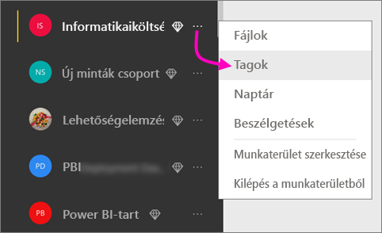
   
    Megnyílik a munkaterülethez tartozó Office 365 Outlook-fiók egy új böngészőablakban.
2. Ha a mutatót a bal felső területen lévő színes kör fölé viszi, az ceruza ikonná változik. Válassza ki.
   
     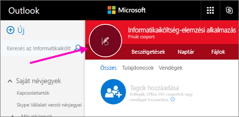
3. Válassza ki újra a ceruzát, és keresse meg a használni kívánt képet.
   
     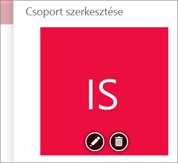
4. Kattintson a **Mentés** gombra.
   
     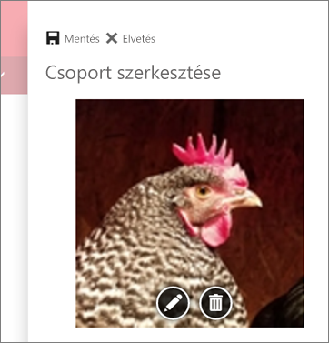
   
    A kép az Office 365 Outlook ablakban szereplő színes kör helyére kerül. 
   
     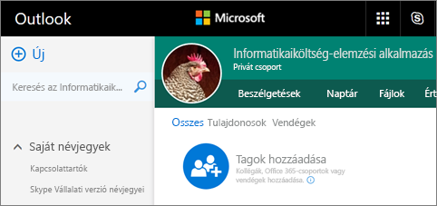
   
    Néhány percen belül megjelenik az alkalmazásban is a Power BI-ban.
   
     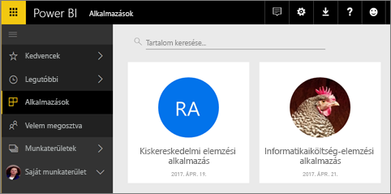

## Az alkalmazás közzététele
Ha az alkalmazás munkaterületén lévő irányítópultok és jelentések elkészültek, közzéteheti őket alkalmazásként. Ne feledje, hogy nem kell a munkaterületen szereplő minden jelentést és irányítópultot közzétennie. Megteheti, hogy csak azokat teszi közzé, amelyek elkészültek.

1. A munkaterület listanézetében határozhatja meg, mely irányítópultokat és jelentéseket szeretné felvenni az alkalmazásba.

     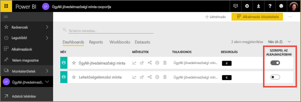

     Ha úgy dönt, hogy nem tesz közzé egy jelentést, megjelenik egy figyelmeztetés a jelentés és a kapcsolódó irányítópult mellett. Az alkalmazást így is közzéteheti, a kapcsolódó irányítópultról azonban hiányozni fognak az adott jelentés csempéi.

     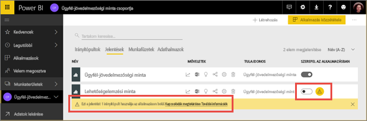

2. Az adott munkaterületen található összes tartalom megosztási folyamatának indításához válassza a jobb felső részen található **Alkalmazás közzététele** gombot.
   
     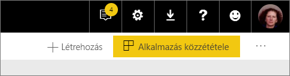

3. A **Részletek** területen töltse ki a leírást, hogy mások megtalálják az alkalmazást. Beállíthat egy háttérszínt a személyre szabásához.
   
     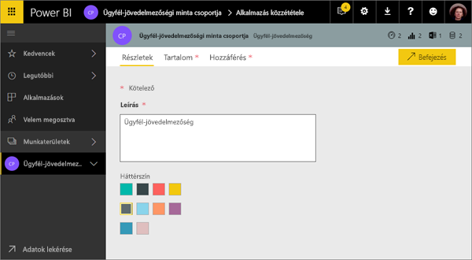

4. A **Tartalom** lapon láthatja a tartalmat, amelyet az alkalmazás részeként közzé fog tenni – azaz mindent, amit azon a munkaterületen választ ki. Beállíthatja az alkalmazás kezdőlapját is, vagyis azt az irányítópultot vagy jelentést, amelyet az alkalmazást használók elsőként meglátnak. Választhatja az **Egyik sem** lehetőséget. Ekkor az alkalmazásban szereplő összes tartalom listája fog megjelenni számukra. 
   
     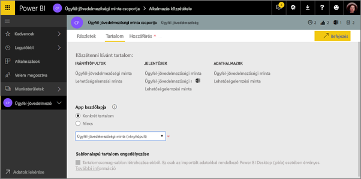

5. A **Hozzáférés** területen meghatározhatja, hogy ki férhet hozzá az alkalmazáshoz: a vállalat összes tagja, vagy adott személyek vagy Active Directory-csoportok. Ha rendelkezik a megfelelő engedélyekkel, dönthet úgy, hogy automatikusan telepíti az alkalmazást a címzetteknél. Ezt a beállítást a [Power BI felügyeleti portálon](#how-to-enable-pushing-apps) engedélyezheti. Ismerje meg az [alkalmazások leküldésének](#how-to-enable-pushing-apps) további megfontolásait.

    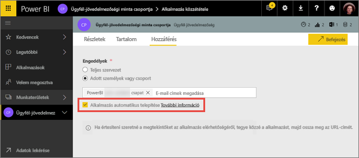

6. Amikor a **Befejezés** lehetőséget választja, a rendszer egy üzenetben kéri, hogy erősítse meg, hogy tényleg készen áll-e a közzétételre. A sikerességet jelölő párbeszédpanelről kimásolhatja az alkalmazásra mutató közvetlen hivatkozást, és elküldheti azoknak, akikkel megosztja az alkalmazást.
   
     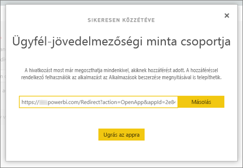

Az üzleti felhasználók, akik számára közzétette az alkalmazást, több módon is megtalálhatják azt. Ha tudta automatikusan telepíteni, megjelenik a Power BI-fiókjukban az Alkalmazások alatt. Küldhet nekik egy közvetlenül az alkalmazásra mutató hivatkozást, vagy megkereshetik a Microsoft AppSource-ban, ahol minden alkalmazás megjelenik, amelyet jogosultak használni. Függetlenül attól, hogy hogyan szerezték be, onnantól kezdve az Alkalmazások területen mindig szerepelni fog ez az alkalmazás a listájukban.

További információk az [üzleti felhasználóknak elérhető alkalmazásélményről](service-install-use-apps.md).

## A közzétett alkalmazás módosítása
Előfordulhat, hogy módosítani vagy frissíteni szeretné az alkalmazást a közzététel után. A frissítés egyszerű, ha rendszergazda vagy tag az alkalmazás-munkaterületen. 

1. Nyissa meg azt az alkalmazás-munkaterületet, amely megfelel az alkalmazásnak. 
   
     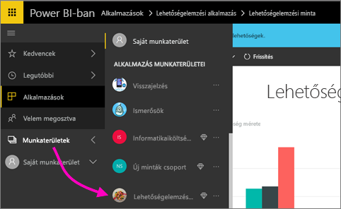
2. Nyissa meg az irányítópultot vagy a jelentést. Láthatja, hogy elvégezheti a kívánt módosításokat.
   
     Az alkalmazás-munkaterület a tervezési terület, tehát a módosításokat a rendszer nem küldi le élőben az alkalmazásba, amíg közzé nem teszi azokat. Ez lehetővé anélkül teszi lehetővé a módosításokat, hogy azok a közzétett alkalmazásokat érintenék.  
 
3. Térjen vissza az alkalmazás-munkaterület tartalomjegyzékéhez, és válassza az **App frissítése** lehetőséget.
   
     

4. Frissítse a **Részleteket**, a **Tartalmat** és a **Hozzáférést**, ha szükséges, majd válassza az **App frissítése** lehetőséget.
   
     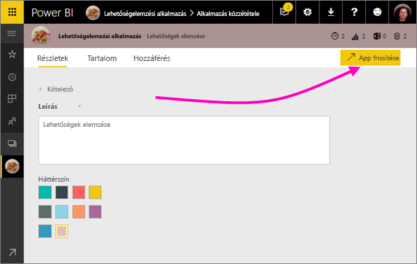

Azok, akikkel megosztotta az alkalmazást, automatikusan az alkalmazás frissített verzióját látják. 

# Alkalmazások automatikus telepítése a végfelhasználók számára
A végfelhasználók számára automatikusan telepíthet alkalmazásokat, így könnyebben eljuttathatja a megfelelő alkalmazásokat a megfelelő embereknek vagy csoportoknak.

Az alkalmazásokkal eljuttathatja a végfelhasználók munkájához szükséges adatokat. Az alkalmazástartalmak listájából mostantól automatikusan telepítheti ezeket az alkalmazásokat, így nem kell megkeresnie őket a Microsoft AppSource-ban vagy egy telepítési hivatkozást követve. Ennek köszönhetően könnyebben vezethet be szabványos Power BI-tartalmakat a felhasználók számára.

## Alkalmazás automatikus telepítése a végfelhasználók számára
Ha a rendszergazda engedélyezte a funkciót, az alkalmazások közzétevői **automatikusan telepíthetik az alkalmazást**. Ha a négyzet ***be van jelölve*** és az alkalmazás közzétevője a **Befejezés** (vagy meglévő alkalmazások esetén az **Alkalmazás frissítése**) lehetőséget választja, az alkalmazás el lesz küldve a **Hozzáférés** lap **Engedélyek** szakaszában meghatározott csoportoknak.

## A küldött alkalmazások felhasználói használatba vétele
Egy alkalmazás leküldéses továbbítása után az automatikusan megjelenik az alkalmazások listájában. Az alkalmazásokat úgy válogathatja, hogy csak az egy felhasználó vagy szervezeti szerepkör számára szükségesek jelenjenek meg.

### Alkalmazások automatikus telepítése – megfontolandó szempontok
Az alkalmazások leküldéses továbbítása során az alábbiakra érdemes ügyelni:

* Az alkalmazások automatikus telepítése a felhasználók számára időbe telik. A legtöbb alkalmazás azonnal települ, a leküldött alkalmazások azonban több időt vehetnek igénybe.  Ez az alkalmazás elemeinek és a hozzáféréssel rendelkező személyek számától függ. Azt javasoljuk, hogy az alkalmazásleküldést munkaidőn kívül, jóval azelőtt végezze el, hogy a felhasználóknak szükségük lenne az alkalmazásokra. Egyeztessen több felhasználóval, mielőtt mindenkinek bejelentené az alkalmazás elérhetőségét.

* Frissítse a böngészőjét. Előfordulhat, hogy a felhasználóknak frissíteniük kell vagy újból meg kell nyitniuk a böngészőjüket.

* Ha az alkalmazás nem jelenik meg azonnal az alkalmazáslistában, a felhasználók frissítsék vagy nyissák meg újra a böngészőt.

* Lehetőleg ne terhelje túl a felhasználókat. Ne küldjön egyszerre túl sok alkalmazást, hogy a felhasználók az előtelepített alkalmazásokat is hasznosnak érezhessék. Célszerű megszabni, hogy ki küldhet alkalmazásokat a végfelhasználóknak, és együttműködni ennek időzítésében. A szervezeti alkalmazások a végfelhasználóknak való leküldéséhez létrehozhat egy kapcsolatfelvételi pontot.

* Azoknál a vendég felhasználóknál, akik nem fogadták el a meghívást, az alkalmazások nem lesznek automatikusan telepítve.  

## Alkalmazás közzétételének visszavonása
Egy alkalmazás-munkaterület bármely tagja visszavonhatja az alkalmazás közzétételét.

* Az alkalmazás-munkaterületen válassza a jobb felső sarokban a három pontot (**...**) > az **App közzétételének visszavonása** lehetőséget.
  
     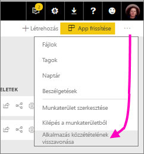

Ez a művelet törli az alkalmazás telepítését mindenkitől, akivel megosztotta, és ezután nem fognak hozzáférni. Nem törli azonban az alkalmazás-munkaterületet vagy a tartalmát.

## Power BI alkalmazások – gyakori kérdések
### Miben különböznek az alkalmazás-munkaterületek a csoportos munkaterületektől?
Ebben a kiadásban az összes csoportos munkaterületet átneveztük alkalmazás-munkaterületnek. Bármelyik ilyen munkaterületről közzétehet alkalmazásokat. A működésük nagyjából megegyezik a csoportos munkaterületek működésével. A következő pár hónap során a következő fejlesztéseket tervezzük az alkalmazás-munkaterületek vonatkozásában: 

* Az alkalmazás-munkaterületek létrehozása nem fog megfelelő entitásokat létrehozni az Office 365-ben, mint ahogy eddig a csoportos munkaterületek esetében történt. Így létrehozhat bármennyi alkalmazás-munkaterületet anélkül, hogy aggódnia kellene, hogy a háttérben különböző Office 365-csoportok jönnek létre (az Office 365-csoport OneDrive Vállalati verzióját továbbra is használhatja a fájlok tárolására). 
* Most még csak egyéneket vehet fel a tagok és rendszergazdák listájára. Az egyszerűbb kezelhetőség érdekében hamarosan több AD biztonsági csoportot vagy modern csoportot is felvehet.  

### Miben különböznek az alkalmazások a vállalati tartalomcsomagoktól?
Az alkalmazások a tartalomcsomagokból fejlődtek ki, egyszerűsödtek le, de van köztük néhány komoly különbség. 

* Miután az üzleti felhasználók telepítenek egy tartalomcsomagot, az elveszíti a csoportosított identitását: csupán más irányítópultokkal és jelentésekkel összekeveredett irányítópultok és jelentések listája. Az alkalmazások ezzel szemben telepítés után is megtartják a csoportosításukat és az identitásukat. Így az üzleti felhasználók egyszerűbben navigálhatnak közöttük az idők során.
* Létrehozhat több tartalomcsomagot is egy munkaterületről, az alkalmazás azonban egy-az-egyhez kapcsolatban áll a munkaterületével. Hiszünk abban, hogy ezt hosszú távon egyszerűbb átlátni és fenntartani. Arról, hogy hogyan tervezzük fejleszteni ezt a területet, a Power BI blogon találhat további információkat. 
* Terveink szerint a vállalati tartalomcsomagok idővel elavulttá válnak, ezért javasoljuk, hogy mostantól alkalmazásokat hozzon létre.  

### Mi a helyzet a csoportok csak olvasási jogosultsággal rendelkező tagjaival?
A csoportokban hozzáadhat csak olvasási jogosultságokkal rendelkező tagokat, akik csak a tartalom megtekintésére jogosultak. Ezzel a megközelítéssel az volt a fő probléma, hogy nem lehetett biztonsági csoportokat tagként hozzáadni. 

Az alkalmazások esetében az alkalmazás-munkaterület egy csak olvasható verzióját teheti közzé a nagyközönség (beleértve a biztonsági csoportokat) számára. Az alkalmazásban az irányítópultokon és jelentéseken úgy végezheti el a módosításokat, hogy az ne érintse a felhasználókat. Javasoljuk, hogy a jövőben így használja az alkalmazásokat. Hosszú távon szerepel a terveink között a munkaterületek csak olvasási joggal rendelkező tagjainak elavulttá tétele is.  

## Következő lépések
* [Alkalmazások telepítése és használata a Power BI-ban](service-install-use-apps.md)
* [Power BI alkalmazások külső szolgáltatásokhoz](service-connect-to-services.md)
* [Power BI Felügyeleti portál](https://docs.microsoft.com/en-us/power-bi/service-admin-portal)
* Kérdése van? [Kérdezze meg a Power BI közösségét](http://community.powerbi.com/)
