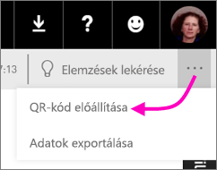
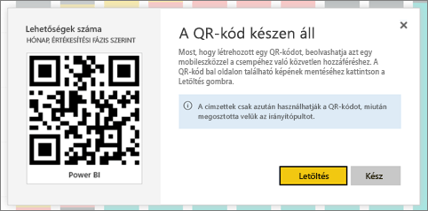

# QR-kód létrehozása egy Power BI-csempéhez mobilalkalmazásokban történő használathoz
A Power BI-ban a QR-kódok a való világból bármit képesek közvetlenül a hozzájuk kapcsolódó BI-információkhoz kapcsolni – nincs szükség keresésre vagy navigálásra.

A Power BI szolgáltatásban bármelyik irányítópult csempéjéhez létrehozhat egy QR-kódot, még akkor is, ha magát az irányítópultot nem szerkesztheti. Ezután elhelyezheti a QR-kódot egy kulcsfontosságú helyen. Beillesztheti például egy e-mailbe, vagy kinyomtathatja és elhelyezheti egy adott helyen. 

Azok a munkatársak, akikkel megosztotta az irányítópultját, [közvetlenül a mobileszközeikről beolvashatják a csempe hozzáféréséhez készült QR-kódot](mobile-apps-qr-code.md). Ezt megtehetik a Power BI alkalmazásban található QR-kód leolvasóval, vagy bármilyen más QR-kód leolvasóval, amely telepítve van az eszközeiken. .

## QR-kód létrehozása csempéhez
1. Nyisson meg egy irányítópultot a Power BI szolgáltatásban.
2. Válassza a csempe jobb felső sarkában található három pontot (...), majd a **Megnyitás fókusz módban**  lehetőséget.
3. Válassza a jobb felső sarokban található három pontot (...), majd a **QR-kód előállítása** lehetőséget. 
   
    
4. Ekkor megjelenik egy párbeszédpanel a QR-kóddal. 
   
    
5. Innen beolvashatja a QR-kódot, vagy letöltheti és mentheti, hogy: 
   
   * hozzáadhassa egy e-mailhez vagy más dokumentumhoz, vagy 
   * kinyomtathassa és elhelyezhesse egy adott helyen. 

## QR-kód nyomtatása
A Power BI a QR-kódot egy nyomtatásra kész JPG-fájlként hozza létre. 

1. Válassza a **Letöltés** lehetőséget, majd nyissa meg a JPG-fájlt egy olyan számítógépen, amelyhez csatlakozik nyomtató.  
   
   > [!TIP]
   > A JPG-fájl neve megegyezik a csempe nevével. Például „Opportunity Count - by Month, Sales Stage.jpg”.
   > 
   > 
2. A fájlt 100%-os vagy tényleges méretben nyomtassa ki.  
3. Vágja ki a QR-kódot, majd ragassza egy olyan helyre, amely kapcsolódik a csempéhez. 

## Következő lépések
* [Kapcsolódás Power BI-adatokhoz a való világból](mobile-apps-data-in-real-world-context.md) mobilalkalmazásokkal
* [Power BI QR-kódjának beolvasása mobileszközről](mobile-apps-qr-code.md)
* [QR-kód létrehozása jelentéshez](service-create-qr-code-for-report.md)
* Kérdése van? [Kérdezze a Power BI-közösséget!](http://community.powerbi.com/)

