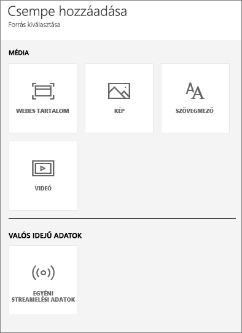
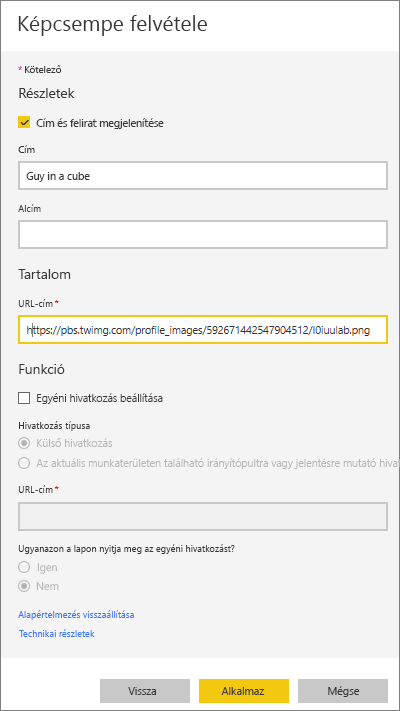
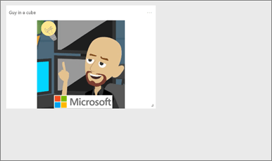
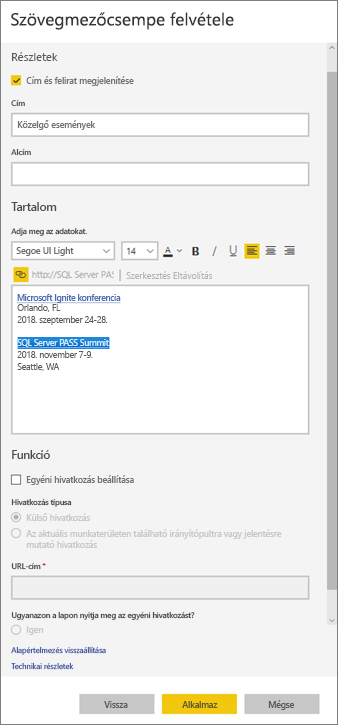
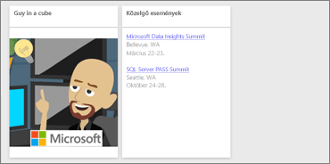
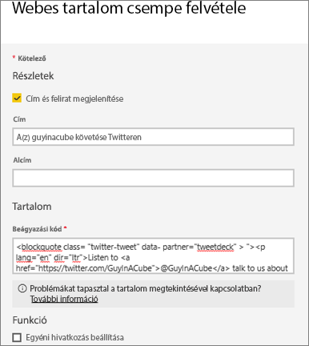
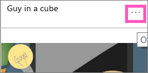

# <a name="add-image-text-video-and-more-to-your-dashboard"></a>Kép, szöveg, videó és egyéb elemek hozzáadása az irányítópulthoz
<iframe width="560" height="315" src="https://www.youtube.com/embed/e2PD8m1Q0vU" frameborder="0" allowfullscreen></iframe>


## <a name="add-tile"></a>Csempe hozzáadása
A **Csempe hozzáadása** vezérlő használatával közvetlenül az irányítópulthoz adhatja hozzá a képeket, a szövegdobozokat, a videókat, a streamelési adatokat és a webes kódokat.

1. A felső menüsávon válassza ki a **Csempe hozzáadása** elemet. A rendelkezésre álló helytől függően előfordulhat, hogy csak a pluszjelet   látja.
   
    
2. Válassza ki a hozzáadni kívánt csempe típusát: **Kép**, **Szövegdoboz**, **Videó**, **Webes tartalom**, vagy **Egyéni streamelési adatok**.
   
    

## <a name="add-an-image"></a>Kép hozzáadása
Tegyük fel, hogy az irányítópulton el kívánja helyezni a cége emblémáját vagy más képet. Ehhez a képfájlt online állapotban mentenie kell, és létre kell hoznia egy rámutató hivatkozást. Bizonyosodjon meg róla, hogy a képfájl eléréséhez nincs szükség speciális hitelesítő adatokra. A OneDrive és a SharePoint például hitelesítő adatokat kér, ezért az ott tárolt képeket nem lehet ezen a módon hozzáadni az irányítópulthoz.  

1. Kattintson a **Kép** > **Tovább** lehetőségre.
2. Adja meg a kép adatait a **Képcsempe felvétele** ablakban.
   
    
   
   * Ha azt szeretné, hogy cím jelenjen meg a kép fölött, válassza a *Cím és alcím megjelenítése* lehetőséget, majd írjon be egy címet és/vagy alcímet.
   * Adja meg a kép URL-címét.
   * Ha hivatkozássá alakítaná a csempét, jelölje be az **Egyéni hivatkozás beállítása** jelölőnégyzetet, és adja meg az URL-címet.  Amikor a munkatársai a csempére vagy a címre kattintanak, a rendszer erre az URL-címre irányítja őket.
   * Kattintson az **Alkalmaz** elemre.  Az irányítópulton igény szerint áthelyezheti a képet, és módosíthatja a méretét.
     
     

## <a name="add-a-text-box-or-dashboard-heading"></a>Szövegdoboz vagy irányítópult-címsor hozzáadása
1. Kattintson a **Szövegdoboz > Tovább** elemre.
   
   > **FIGYELEM**: Ha az irányítópult címsorát kívánja megadni, írja be a címsort a szövegdobozba, és válasszon nagyobb betűméretet.
   > 
2. A szövegdoboz formázása:
   
   * Ha azt szeretné, hogy cím jelenjen meg a szövegdoboz fölött, válassza a **Cím és alcím megjelenítése** lehetőséget, majd írjon be egy címet és/vagy alcímet.
   * Írja be és formázza a szövegdoboz tartalmát.  
   * Igény szerint egyéni hivatkozást is beállíthat a címhez. Az egyéni hivatkozások lehetnek külső helyek, vagy a munkaterületen található irányítópultok vagy jelentések. Ugyanakkor mivel ebben a példában magában a szövegdobozban adtuk meg a hivatkozásokat, üresen kell hagyni az **Egyéni hivatkozás beállítása** jelölőnégyzetet.

     
   
3. Kattintson az **Alkalmaz** elemre.  Az irányítópulton igény szerint áthelyezheti a szövegdobozt, és módosíthatja a méretét.
   
   

## <a name="add-a-video"></a>Videó hozzáadása
Ha YouTube- vagy Vimeo-videócsempét ad hozzá az irányítópulthoz, a lejátszó közvetlenül az irányítópulton fog elindulni.

1. Válassza a **Videó > Tovább** elemet.
2. Adja meg a videó adatait a **Videócsempe felvétele** ablaktáblán.
   
    
   
   * Ha azt szeretné, hogy cím jelenjen meg a videó csempe fölött, válassza a *Cím és alcím megjelenítése* lehetőséget, majd írjon be egy címet és/vagy alcímet. Ebben a példában egy alcímet adunk meg, majd hivatkozást készítünk belőle, amely visszamutat a YouTube teljes lejátszási listájára.
   * Adja meg a videó URL-címét
   * Adjon meg egy hivatkozást a címhez és az alcímhez.  Miután a munkatársai megtekintették a beágyazott videót, talán szívesen a figyelmükbe ajánlaná a YouTube teljes lejátszási listáját – itt megadhatja a lejátszási listára mutató hivatkozást.
   * Kattintson az **Alkalmaz** elemre.  Az irányítópulton igény szerint áthelyezheti a videó csempét, és módosíthatja a méretét.
     
      
3. A videó lejátszásához kattintson a videó csempére.
4. A YouTube lejátszási listájának felkereséséhez kattintson az alcímre.

## <a name="add-streaming-data"></a>Streamelési adatok hozzáadása
<iframe width="560" height="315" src="https://www.youtube.com/embed/kOuINwgkEkQ" frameborder="0" allowfullscreen></iframe>

## <a name="add-web-content"></a>Webes tartalom hozzáadása
Illesszen vagy írjon be egy tetszőleges HTML-tartalmat.  A Power BI ezt a tartalmat csempe formájában adja hozzá az irányítópulthoz. Adja meg manuálisan, vagy másolja és illessze be a Twitter, YouTube, embed.ly, stb. által megadott beágyazási kódot.

1. Kattintson a **Webtartalom > Tovább** elemre.
2. Adja meg az adatokat a **Webtartalom-csempe hozzáadása** ablaktáblán.
   
    
   
   * Ha azt szeretné, hogy cím jelenjen meg a csempe fölött, válassza a *Cím és alcím megjelenítése* lehetőséget, majd írjon be egy címet és/vagy alcímet.
   * Adja meg a beágyazási kódot. Ebben a példában egy Twitter-hírcsatornát másolunk és illesztünk be.
3. Kattintson az **Alkalmaz** elemre.  Az irányítópulton igény szerint áthelyezheti a webes tartalom csempéjét, és módosíthatja a méretét.
     
      

## <a name="tips-for-embedding-web-content"></a>Tippek a webes tartalom beágyazására
* iFrame-tartalmak esetén használjon biztonságos forrást. Ha az iFrame-alapú beágyazási kód megadásakor üres csempét kap, ellenőrizze, hogy nem a **http** előtagot használja-e az iFrame-forráshoz.  Ha igen, módosítsa **https**-re.
  
  ```
  <iframe src="https://xyz.com">
  ```
* Szerkessze meg a szélesség- és magasságadatokat. Ez a beágyazási kód beágyazza a videót, és 560 x 315 pixelre állítja be a videólejátszót.  A méret nem változik a csempe méretének módosítása esetén.
  
  ```
  <iframe width="560" height="315"
  src="https://www.youtube.com/embed/Cle_rKBpZ28" frameborder="0"
   allowfullscreen></iframe>
  ```
  
  Ha a videólejátszót a csempe méretéhez szeretné igazítani, állítsa 100 %-ra a szélességet és a magasságot.
  
  ```
  <iframe width="100%" height="100%"
  src="https://www.youtube.com/embed/Cle_rKBpZ28" frameborder="0"
   allowfullscreen></iframe>
  ```
* Ez a kód beágyazza a tweetet, és az irányítópulton külön megtartja a következő helyekre mutató hivatkozásokat: **AFK** podcast, **@GuyInACube Twitter-oldala**, **Követés**, **#statisztikák**, **válaszol**, **továbbtweetel**, és **kedvelés**.  Ha a felhasználó a csempére kattint, a Twitter-beli podcast nyílik meg.
  
  ```
  <blockquote class="twitter-tweet" data-partner="tweetdeck">
  <p lang="en" dir="ltr">Listen to
  <a href="https://twitter.com/GuyInACube">@GuyInACube</a> talk to
  us about making videos about Microsoft Business Intelligence
  platform
  <a href="https://t.co/TmRgalz7tv">https://t.co/TmRgalz7tv </a>
  <a href="https://twitter.com/hashtag/analytics?src=hash">
  #analytics</a></p>&mdash; AFTK Podcast (@aftkpodcast) <a
  href="https://twitter.com/aftkpodcast/status/693465456531771392">
  January 30, 2016</a></blockquote> <script async src="//platform.twitter.com/widgets.js" charset="utf-8"></script>
  ```

## <a name="edit-a-tile"></a>Csempe szerkesztése
A csempe módosításához...

1. Mutasson a csempe jobb felső sarkára, és kattintson a három pontra.
   
    
2. A Szerkesztés ikonra kattintva nyissa meg a **Csempe részletei** ablaktáblát, és hajtsa végre a módosításokat.
   
    

## <a name="considerations-and-troubleshooting"></a>Megfontolandó szempontok és hibaelhárítás
* Könnyebben helyezheti át a csempét az irányítópulton, ha címet és/vagy alcímet ad hozzá.
* Ha egy webhelyről tartalmat ágyazna be, de a webhely nem kínál fel másolható és beilleszthető beágyazási kódot, keresse fel az embed.ly oldalt a beágyazási kód létrehozásához.

## <a name="next-steps"></a>Következő lépések
[Az irányítópult csempéi](service-dashboard-tiles.md)

Több kérdése van? [Kérdezze meg a Power BI közösségét](http://community.powerbi.com/).

