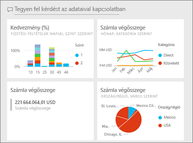
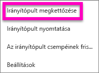
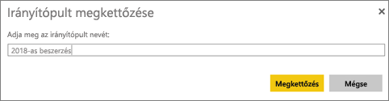
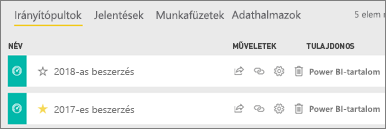

# Power BI-irányítópult másolatának létrehozása

Számos különféle oka lehet másolat készítésére egy saját irányítópultról. A másolatot a rendszer az aktív (azonos) munkaterületre menti. Lehet, hogy módosításokat szeretne végrehajtani, és tesztelni a teljesítményt az eredetivel összevetve, vagy kismértékben eltérő változatokat készíteni az egyes munkatársak, régiók vagy csoportok számára. Lehet, hogy egy munkatársa kedveli az Ön irányítópult-kialakítását, és használni szeretné saját feletteseinek készítendő jelentéseihez. Egy másik ok lehet, ha új adatbázissal rendelkezik, ugyanazzal az adatszerkezettel és adattípusokkal, és újra szeretné használni a már létrehozott irányítópultot – ez is megtehető, de a Power BI Desktopban némi munkát igényelne. 

Az Önnel alkalmazásként megosztott irányítópultok nem duplikálhatók.

1. Nyissa meg az irányítópultot.
2. A jobb felső sarokban kattintson a folytatást jelző pontokra (...), és válassza az **Irányítópult megkettőzése** parancsot.
   
   
3. Adjon egy nevet az irányítópultnak, és válassza a **Másolat készítése** parancsot. 
   
   
4. Az új irányítópult ugyanazon a munkaterületen található, mint az eredeti kerül. 
   
   

## Következő lépések
* [Csempék szerkesztése, átméretezése és áthelyezése](service-dashboard-edit-tile.md) 
* [Tippek színvonalas irányítópult tervezéséhez](service-dashboards-design-tips.md) 

További kérdései vannak? [Felteheti őket a Power BI-közösségnek](http://community.powerbi.com/)

