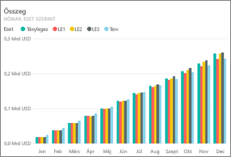
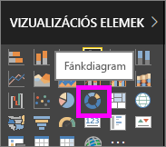
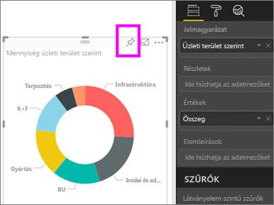
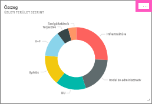
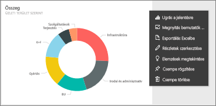
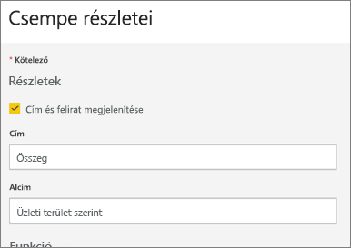
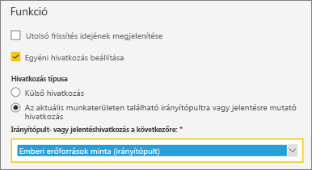
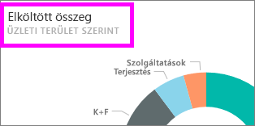

# Irányítópult-csempék szerkesztése és eltávolítása

## Az irányítópult *tulajdonosai* és *felhasználói* közötti különbségek
Ha Ön az irányítópult létrehozója vagy tulajdonosa, számos lehetőség áll rendelkezésére az irányítópulton lévő csempék megjelenésének és alapértelmezett viselkedésének a módosítására. Az alábbi beállítások és eljárások használatával testre szabhatja az irányítópultot a *felhasználók* számára.  Meghatározhatja például, hogy ha kiválasztanak egy csempét, akkor az alapjául szolgáló jelentés, egy egyéni URL-cím vagy egy másik irányítópult nyíljon-e meg. Dönthet úgy, hogy [hozzáad egy olyan csempét, amely videót vagy streamelési adatot jelenít meg](service-dashboard-add-widget.md). Sőt, akár olyan csempét is [létrehozhat, amely interaktív szeletelőket tartalmaz](service-dashboard-pin-live-tile-from-report.md). *Létrehozóként* tehát nagyon sok lehetősége van. 

<iframe width="560" height="315" src="https://www.youtube.com/embed/lJKgWnvl6bQ" frameborder="0" allowfullscreen></iframe>

Ez a cikk az alábbiakat ismerteti.

* [Vizualizáció létrehozása és rögzítése az irányítópulton](#create)
* [Csempe áthelyezése](#move)
* [ Csempe átméretezése](#resize)
* [ Csempe átnevezése](#rename)
* [Hivatkozás hozzáadása egy csempéhez](#hyperlink)
* [Csempe rögzítése egy másik irányítópulton](#different)
* [Csempe törlése](#delete)
  
 > [!TIP]
 > Ha magán a csempén látható vizualizációt szeretné módosítani, törölje a csempét, és vegyen fel egy új [irányítópult-csempét](service-dashboard-tiles.md).
 > 

 ### Előfeltételek
 1. A bemutatott lépések követéséhez nyissa meg a Power BI szolgáltatást (nem a Power BI Desktopot), és [töltse le az Informatikaköltség-elemzési mintát](sample-it-spend.md). Amikor megkapja az értesítést a sikeres műveletről, válassza az **Ugrás az irányítópultra** lehetőséget.

- - -

## Új vizualizáció létrehozása és rögzítése az irányítópulton
1. Az Informatikaköltség-elemzési minta irányítópultján válassza az „Amount” (Mennyiség) csempét, ezzel megnyitja a jelentést.

    

2. Nyissa meg a jelentést szerkesztési nézetben a felső menüsávon a **Jelentés szerkesztése** lehetőséget választva.

3. A jelentés aljánál lévő plusz (+) jelet választva adhat hozzá egy új jelentésoldalt.

    

4. A MEZŐK panelen válassza a **Fact > Amount** és a **Business Area > Business Area** lehetőséget.
 
5. Ahhoz, hogy a vizualizációt fánkdiagrammá alakítsa át, a VIZUALIZÁCIÓK panelen válassza ki a fánkdiagram ikont.

    

5. Válassza a rögzítés ikont, és rögzítse a fánkdiagramot az Informatikaköltség-elemzési minta irányítópultjára.

   

6. Amikor megkapja az értesítést a sikeres műveletről, válassza az **Ugrás az irányítópultra** lehetőséget. A rendszer felszólítja, hogy mentse a változásokat. Kattintson a **Mentés** gombra.

- - -

## A csempe áthelyezése
Keresse meg az új csempét az irányítópulton. A csempe kiválasztásával és lenyomva tartásával húzhatja azt át az új helyre az irányítópult vásznán.

- - -

## A csempe átméretezése
Különböző méretekre állíthatja a csempéket – az 1x1-es elrendezéstől akár az 5x5-ös elrendezésig. A fogópont (a jobb alsó sarokban) kiválasztásával és húzásával méretezheti át a csempét.

- - -
## A három pont (...) menü

1. Válassza a csempe jobb felső sarkában található három pontot (...). 
   
   

2. Mozgassa az egérmutatót az „Account” csempe fölé, és a három pontot kiválasztva jelenítse meg a beállításokat. Az elérhető lehetőségek a csempe típusától függően változhatnak.  Egy élő csempe esetén például másféle lehetőségek jelennek meg, mint egy hagyományos vizualizációs csempe esetén. Ezen kívül ha az irányítópultot megosztották Önnel (azaz nem Ön a tulajdonosa), akkor kevesebb lehetőség áll rendelkezésére.

   

3. A „Csempe részletei” ablak megnyitásához válassza a **Részletek szerkesztése** lehetőséget. 

    Változtassa meg a csempe címét és alapértelmezett viselkedését.  Például dönthet úgy, hogy amikor a *felhasználó* kiválasztja a csempét, akkor a csempe létrehozásához használt jelentés megnyitása helyett inkább egy új irányítópult jelenjen meg.  
   

### A csempe átnevezése
A „Csempe részletei” ablak felső részén változtassa meg a **Cím** (Title) mező értékét **Elköltött összeg** szövegre.

### Az alapértelmezett hivatkozás módosítása
Alapértelmezés szerint egy csempe kiválasztásával megnyílik az jelentés, amelyet a csempe létrehozásához használtak, vagy a Q&A (ha a csempe a Q&A-ben lett létrehozva). Egy weblap, egy másik irányítópult vagy jelentés (ugyanazon a munkaterületen), egy SSRS-jelentés vagy egyéb online tartalom hivatkozásához vegyen fel egyéni hivatkozást.

1. A Funkció címsor alatt válassza az **Egyéni hivatkozás beállítása** lehetőséget.

2. Válassza **Az aktuális munkaterületen található irányítópultra vagy jelentésre mutató hivatkozás** lehetőséget, majd válasszon a legördülő listából.  Ebben a példában az Emberi erőforrások minta irányítópultot választottuk ki. Ha ez a minta még nem található meg az Ön munkaterületén, először adja hozzá, majd térjen vissza ehhez a lépéshez, vagy pedig választhat egy másik irányítópultot is. 

    

3. Kattintson az **Alkalmaz** elemre.

4. Az új cím megjelenik a csempén.  Amikor pedig kiválasztja a csempét, a Power BI megnyitja az Emberi erőforrások irányítópultot. 

    

### Csempe rögzítése egy másik irányítópulton
1. A legördülő lista menüjében válassza a **Csempe rögzítése**  elemet.
2. Döntse el, hogy egy meglévő vagy egy új irányítópulton rögzíti-e a csempe másolatát. 
   
   
3. Válassza a **Rögzítés** lehetőséget.

### A csempe törlése
1. Ha az irányítópultról véglegesen el szeretné távolítani a csempét, a legördülő menüben válassza a **Csempe törlése**  lehetőséget. 

2. A csempe törlésével nem törli az alapul szolgáló vizualizációt. Nyissa meg az alapul szolgáló jelentést az „Amount” csempe kiválasztásával. Nyissa meg a jelentés utolsó oldalát, és látni fogja, hogy az eredeti vizualizáció nem lett törölve a jelentésből. 

- - -
## Következő lépések
[Irányítópult-csempék a Power BI-ban](service-dashboard-tiles.md)

[Irányítópultok a Power BI-ban](service-dashboards.md)

[Power BI – Alapfogalmak](service-basic-concepts.md)

További kérdései vannak? [Kérdezze meg a Power BI közösségét](http://community.powerbi.com/)

