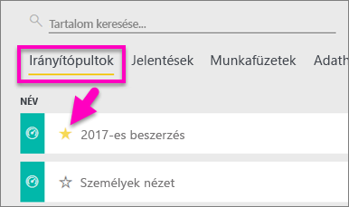
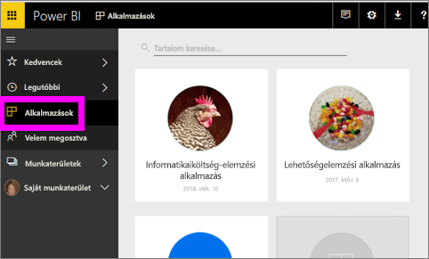
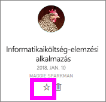
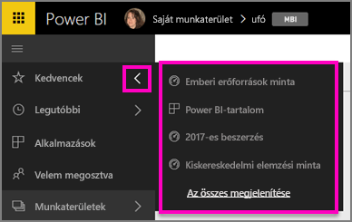
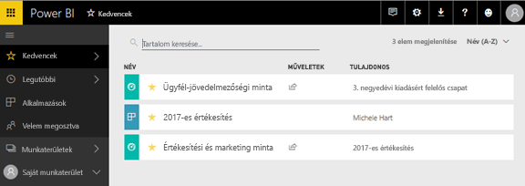
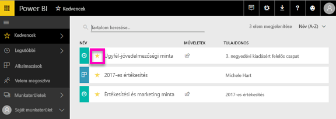

# Kedvenc irányítópultok, jelentések és alkalmazások a Power BI szolgáltatásban
Ha egy tartalmat hozzáad a *Kedvencekhez*, akkor azt minden munkaterületéről elérheti.  A kedvencek azok a helyek, amelyeket általában a leggyakrabban látogat.

> [!NOTE]
> Ez a témakör csak a Power BI szolgáltatásra vonatkozik, a Power BI Desktopra nem.
> 
> 

A Power BI szolgáltatásban arra is lehetősége van, hogy egyetlen irányítópultot [Kiemelt irányítópultként](service-dashboard-featured.md) jelöljön meg.

## Irányítópult vagy jelentés hozzáadása a *kedvencekhez*
Tekintse meg, hogy Amanda miképpen adja hozzá a kedvenceket egy munkaterülethez, majd kövesse a részletes utasításokat a videó alatt.

<iframe width="560" height="315" src="https://www.youtube.com/embed/G26dr2PsEpk" frameborder="0" allowfullscreen></iframe>

1. Nyisson meg egy gyakran használt irányítópultot vagy jelentést. Olyan tartalmak is lehetnek *kedvencek*, amelyeket mások osztottak meg Önnel.
2. A Power BI szolgáltatás jobb felső sarkában kattintson a **Kedvenc** elemre, vagy a csillag  ikonra.
   
   
   
   Az irányítópultot vagy jelentést a munkaterület **Irányítópultok** vagy **Jelentések** lapján is hozzáadhatja a kedvencekhez.
   
   

## Alkalmazás felvétele a *kedvencek* közé

1. A bal oldali navigációs panelen válassza az **Alkalmazások** lehetőséget.

  

2. További információk megjelenítéséhez vigye a kurzort az alkalmazás fölé.  A kedvencnek jelöléshez válassza a csillag  ikont.
   
   

## A *kedvencek* kezelése
1. A bármely munkaterülethez tartozó kedvencek eléréséhez kattintson az úszó panel nyilára a **Kedvencek** elem mellett jobbra.  Innen kiválaszthatja a megnyitni kívánt kedvenc tartalmat. A listán csak öt kedvenc szerepel (betűrendben). Ha ötnél több kedvence van, az **Összes megtekintése** lehetőséget választva megnyithatja a kedvencek képernyőjét (lásd alább a 2. ábrát). 
   
   
2. A kedvencként hozzáadott **összes** tartalom megtekintéséhez kattintson a **Kedvencek** elemre vagy a Kedvencek  ikonra a bal oldali navigációs ablaktáblán.  
   
    
   
   Innen a következő műveleteket végezheti el: megnyitás, tulajdonos azonosítása, de akár munkatársakkal való megosztás is.

## Eltávolítás a kedvencek közül
Már nem használja olyan gyakran a tartalmat?  Eltávolíthatja a kedvencek közül. Ha egy tartalmat eltávolít a kedvencek közül, az eltűnik a Kedvencek listájából, de a Power BI-ban továbbra is elérhető marad.

1. A **Kedvencek** képernyő megnyitásához kattintson a **Kedvencek** elemre a bal oldali navigációs ablaktáblán.
   
   
2. A kedvencnek jelölés visszavonásához kattintson a tartalom melletti sárga csillagra.

> **FIGYELEM**: Irányítópult, jelentés vagy alkalmazás kedvencnek jelölése is visszavonható. Ehhez egyszerűen nyissa meg a tartalmat, és szüntesse meg a sárga ikon bejelölését.   
> 
> 

## Következő lépések
[Első lépések a Power BI-ban](service-get-started.md)

[Power BI – Alapfogalmak](service-basic-concepts.md)

További kérdései vannak? [Kérdezze meg a Power BI közösségét](http://community.powerbi.com/)

