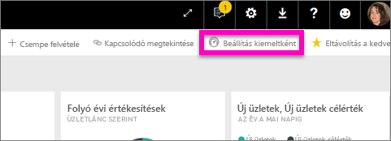
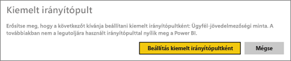
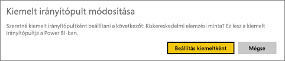
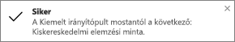
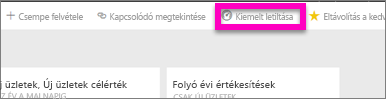

# Kiemelt irányítópultok a Power BI-ban
## Kiemelt irányítópult létrehozása
A legtöbb felhasználó rendelkezik egy olyan irányítópulttal, amelyet gyakrabban használ a többinél.  Lehet, hogy ezzel az irányítópulttal képes elvégezni a feladatait, vagy számos irányítópult és jelentés csempéit gyűjti egy helyre.

Amikor *kiemeltté* tesz egy irányítópultot, a Power BI szolgáltatás megnyitásakor mindig ez az irányítópult jelenik meg.  

> **MEGJEGYZÉS:** Több irányítópultot is kiválaszthat, ha *kedvencként* jelöli meg őket. Lásd a [kedvenc irányítópultokat](service-dashboard-favorite.md) ismertető témakört.
> 
> 

Ha még nem állított be kiemelt irányítópultot, a Power BI a legutóbb használt irányítópultot nyitja meg.  

### **Kiemelt** irányítópult beállítása
Nézze meg, ahogy Amanda létrehoz egy kiemelt irányítópultot, majd a videó alatt látható utasításokat követve próbálja ki mindezt saját maga is.

<iframe width="560" height="315" src="https://www.youtube.com/embed/G26dr2PsEpk" frameborder="0" allowfullscreen></iframe>

1. Nyissa meg azt az irányítópultot, amelyiket *kiemeltté* kíván tenni. 
2. A felső navigációs sávon találja a **Beállítás kiemeltként** parancsot vagy a Kiemelt  ikont. Kattintson valamelyikre.
   
    
3. Erősítse meg a választását.
   
    

## Kiemelt irányítópult módosítása
Természetesen a későbbiekben kiválaszthat egy másik irányítópultot is kiemelt irányítópultként.

1. Végezze el ismét a fenti 1. és 2. lépést.
   
    
2. Kattintson a **Beállítás kiemeltként** parancsra. Az irányítópult kiemelt állapotának eltávolításával nem távolítja el azt a munkaterületről.  
   
    

## Kiemelt irányítópult eltávolítása
Ha úgy dönt, hogy egyáltalán nincs szüksége kiemelt irányítópultra, az alábbiak szerint szüntetheti meg az irányítópult kiemelt állapotát.

1. Nyissa meg az aktuálisan kiemelt irányítópultot.
2. A felső menüsoron kattintson a **Kiemelt letiltása** parancsra.
   
    

## Következő lépések
[Irányítópult megjelölése kedvencként](service-dashboard-favorite.md)

További kérdései vannak? [Forduljon a Power BI közösségéhez](http://community.powerbi.com/)

