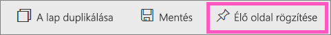
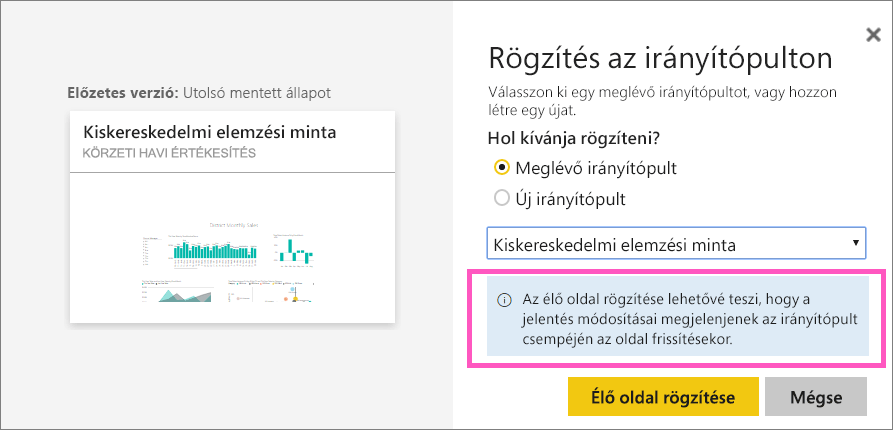

# Teljes jelentésoldal rögzítése Power BI-irányítópultra élő csempeként
Új [irányítópult-csempe](service-dashboard-tiles.md) hozzáadásának egy másik módja egy teljes jelentésoldal rögzítése. Így egyszerűen rögzíthető egyszerre több vizualizáció.  Ezen felül teljes oldal rögzítésekor a csempék *élők* lesznek, és közvetlenül az irányítópulton kezelhetők. A vizualizációk jelentésszerkesztőben végrehajtott módosítása, például egy szűrő hozzáadása vagy a diagramon használt mezők megváltoztatása is megjelenik az irányítópulton lévő csempén.  

Jelentések csempéinek rögzítése az irányítópultokon csak a Power BI szolgáltatásban (app.powerbi.com) lehetséges.

> [!NOTE]
> Az Önnel megosztott jelentésekből nem rögzíthet csempéket.
> 
> 

## Jelentésoldal rögzítése
Nézze meg, hogyan rögzít Amanda élő jelentésoldalt egy irányítópulton, majd a videó alatti részletes útmutatást követve próbálja ki Ön is.

<iframe width="560" height="315" src="https://www.youtube.com/embed/EzhfBpPboPA" frameborder="0" allowfullscreen></iframe>

1. Nyisson meg egy [jelentést Szerkesztési nézetben](service-interact-with-a-report-in-editing-view.md).
2. Vizualizáció kijelölése nélkül válassza a menüsáv **Élő oldal rögzítése** elemét.
   
    
3. A csempét egy meglévő vagy egy új irányítópultra is rögzítheti. Figyelje meg a kiemelt szöveget: *Ha élő oldalt rögzít, akkor a jelentés módosításai az irányítópulton is megjelennek az oldal frissítésekor.*
   
   * Meglévő irányítópult: válassza ki az irányítópult nevét a legördülő listából. Az Önnel megosztott irányítópultok nem jelennek meg a legördülő listában.
   * Új irányítópult: írja be az új irányítópult nevét.
     
     
4. Válassza az **Élő rögzítés** lehetőséget. Miután sikeresen hozzáadta az oldalt csempeként az irányítópulthoz, a jobb felső sarokban megjelenik egy üzenet, amely tudatja Önt erről.

## Irányítópult megnyitása a rögzített élő csempe megtekintéséhez
1. Jelölje ki az új élő csempét tartalmazó irányítópultot a navigációs panelen. A rögzített jelentésoldalt itt [átnevezheti, átméretezheti, és áthelyezheti, vagy hivatkozást hozhat létre hozzá](service-dashboard-edit-tile.md).  
2. Vegye használatba az élő csempét.  Az alábbi képernyőképen az oszlopdiagram egy oszlopának kijelölése a csempe többi vizualizációján is a megfelelő adatok szűrését és kiemelését idézte elő.
   
    

## Következő lépések
[Irányítópultok a Power BI-ban](service-dashboards.md)

További kérdései vannak? [Kérdezze meg a Power BI közösségét](http://community.powerbi.com/)

