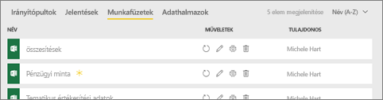
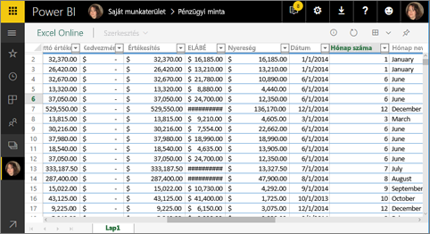
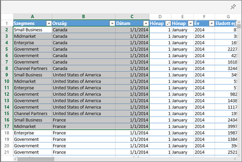
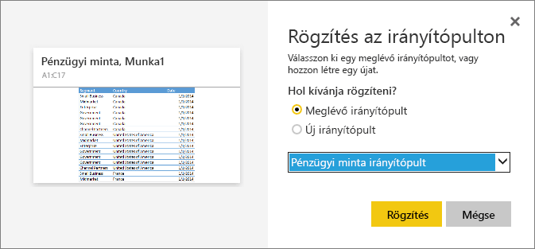

# Csempe rögzítése Power BI-irányítópultra Excelből
Mielőtt egy Excel-munkafüzet csempéjét rögzítené, csatlakoztatnia kell a munkafüzetet a Power BI szolgáltatáshoz (app.powerbi.com). A munkafüzet csatlakoztatásával lényegében a munkafüzet egy csak olvasható példányát nyitja meg a Power BI szolgáltatásban, így tartományokat rögzíthet az irányítópultokon. Akár egy teljes munkalapot is rögzíthet az irányítópulton.  
Ha megosztottak Önnel egy munkafüzetet, megtekintheti a tulajdonos által rögzített csempéket, saját csempéket azonban nem hozhat létre az irányítópulton. 

Részletes információ az Excel és a Power BI együttműködéséről: [Adatok lekérdezése Excel-munkafüzetből](http://go.microsoft.com/fwlink/?LinkID=521962).

Will bemutatja az Excel-munkafüzetekből való adatimportálás és a munkafüzetekhez való csatlakozás módjait.

<iframe width="560" height="315" src="https://www.youtube.com/embed/l8JoB7w0zJA" frameborder="0" allowfullscreen></iframe>

## Excel-munkafüzet csatlakoztatása a Power BI-hoz a OneDrive Vállalati verzióból
A **Csatlakozás** lehetőséget választva a munkafüzet megjelenik a Power BI felületén, ahogyan az megjelenne az Excel Online-ban. Az Excel Online-tól eltérően azonban itt nagyszerű funkciók segítenek a munkalap elemeinek az irányítópultokra való kitűzésében.

A munkafüzetet nem szerkesztheti a Power BI-ban. Azonban ha néhány módosítást szeretne elvégezni, válassza a ceruza ikont a munkaterület **Munkafüzetek** lapján, majd szerkessze a munkafüzetet az Excel Online-ban, vagy nyissa meg a számtógépén az Excelben. A módosításait menti a program a OneDrive-on található munkafüzetben.

1. Töltse fel a munkafüzetet a OneDrive Vállalati verzióba.
2. A Power BI-ból [csatlakozzon a munkafüzethez](service-excel-workbook-files.md).
3. A Power BI felületén a munkafüzet a munkaterület **Munkafüzetek** lapján jelenik meg.  Az  ikon azt jelzi, hogy ez egy Excel-munkafüzet, a sárga csillag pedig arra utal, hogy új.
   
    A munkafüzeten a Power BI-ban végzett módosításokat nem menti a rendszer, és nem jelennek meg OneDrive Vállalati verziós eredeti munkafüzetben. Ha rendszerezi, szűri vagy módosítja az adatokat a Power BI felületén, a módosításokat nem mentheti és nem rögzítheti. A munkafüzet frissítéséhez kattintson a ceruza ikonra. Ekkor megnyílik a munkafüzet az Excel Online-ban. A munkafüzeten az Excel Online-ban végzett módosítások néhány percen belül megjelennek a csempéken.     
   
   
4. Nyissa meg a munkafüzetet a Power BI-ban. Ehhez kattintson a munkafüzet nevére.
   
   

## Cellatartomány rögzítése egy irányítópulton
Ha egy új [irányítópult-csempét](service-dashboard-tiles.md) szeretne hozzáadni, egyik módszerként ezt megteheti egy Power BI-ban megnyitott Excel-munkafüzetből. Tartományokat olyan Excel-munkafüzetekből rögzíthet, amelyeket a OneDrive Vállalati verzióban vagy más, csoportmegosztású dokumentumtárban mentett. A tartományok tartalmazhatnak adatokat, diagramokat, táblázatokat, kimutatásokat, kimutatásdiagramokat és egyéb Excel-elemeket.

1. Jelölje ki a rögzíteni kívánt cellákat.
   
    
2. Kattintson a rajzszög  ikonra. 
3. Rögzítse a csempét egy meglévő vagy egy új irányítópulton. 
   
   * Meglévő irányítópult: válassza ki az irányítópult nevét a legördülő listából.
   * Új irányítópult: írja be az új irányítópult nevét.
   
   
4. Válassza a **Rögzítés** lehetőséget. Miután sikeresen hozzáadta a tartományt csempeként az irányítópulthoz, a jobb felső sarokban megjelenik egy üzenet, amely tudatja Önt erről. 
   
    
5. Válassza az **Ugrás az irányítópultra** lehetőséget. Itt [átnevezheti, átméretezheti, csatlakoztathatja és áthelyezheti](service-dashboard-edit-tile.md) a rögzített vizualizációt. Alapértelmezés szerint a rögzített csempe a Power BI-ban nyitja meg a munkafüzetet.

## Teljes táblázat vagy kimutatásdiagram rögzítése egy irányítópulton
Kövesse a fenti lépéseket, azonban a cellatartomány helyett jelölje ki a teljes táblázatot vagy kimutatást.

Egy táblázat rögzítéséhez jelölje ki annak teljes tartományát, és ügyeljen rá, hogy a fejlécek sem maradjanak ki.  Kimutatás rögzítésénél annak minden látható elemét jelölje ki, beleértve az esetleges szűrőket is.

 

A táblázatokból vagy kimutatásokból létrehozott csempék a teljes táblázatot megjelenítik.  Ha az eredeti munkafüzetben hozzáad, eltávolít vagy szűr egyes sorokat vagy oszlopokat, azokat a csempéhez is hozzáadja, illetve onnan is eltávolítja vagy szűri.

## A csempéhez csatolt munkafüzet megtekintése
Ha egy munkafüzet csempéjére kattint, a csatolt munkafüzet a Power BI-ban nyílik meg. Mivel a munkafüzet a tulajdonos OneDrive Vállalati verziójában található, annak megtekintéséhez olvasási engedéllyel kell rendelkeznie. Ha nincs engedélye, hibaüzenet jelenik meg.  

## Szempontok és hibaelhárítás
Nem támogatott funkciók: a Power BI az Excel Services szolgáltatással kéri le a munkafüzet csempéit. Ennek következtében, mivel az Excel néhány funkciója nem támogatott az Excel Services REST API-ban, ezek a funkciók nem jelennek meg a Power BI-csempéken. Ilyen funkciók például az értékgörbék, az ikonkészletek feltételes formázása és az időszeletelők. A nem támogatott funkciók teljes listája: [Az Excel Services REST API nem támogatott funkciói](http://msdn.microsoft.com/library/office/ff394477.aspx)

## Következő lépések
[Egy Excel-munkafüzethez csatolt irányítópult megosztása](service-share-dashboard-that-links-to-excel-onedrive.md)

[Adatok lekérdezése Excel-munkafüzetekből](service-excel-workbook-files.md)

[A Power BI irányítópultjai](service-dashboards.md)

További kérdései vannak? [Felteheti őket a Power BI-közösségnek](http://community.powerbi.com/)

