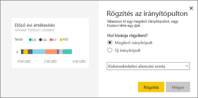
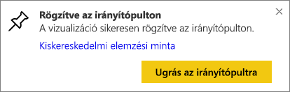
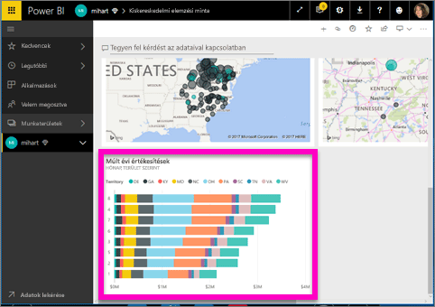
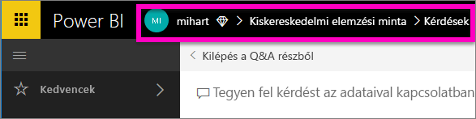

# Csempe rögzítése az irányítópultra a Q&A kérdésmezőből
## Hogyan rögzíthet csempét a Q&A kérdésmezőből
A Q&A-rendszer a Power BI alkalmi jelentéskészítő eszköze. Konkrét elemzésre van szüksége? Ha feltesz egy kérdést az adatairól, vizualizáció formájában kapja meg a választ.

Ebben az útmutatóban a Power BI szolgáltatást (app.powerbi.com) fogjuk használni arra, hogy megnyissunk egy irányítópultot, hogy természetes nyelvi kérdésfeltevéssel hozzunk létre egy vizualizációt, és hogy ezt a vizualizációt az irányítópulton rögzítsük. Az irányítópultok a Power BI Desktopban nem érhetők el. A Q&A más Power BI-eszközökkel és -tartalmakkal való használatáról a [Power BI Q&A áttekintése](power-bi-q-and-a.md) című témakör ad további tájékoztatást. 

Annak érdekében, hogy követni tudja a lépéseket, nyissa meg a [Kiskereskedelmi elemzési minta irányítópultját](sample-retail-analysis.md).

1. Nyisson meg egy [irányítópultot](service-dashboards.md), amelyen már rögzítve van legalább egy csempe valamelyik jelentésből. A kérdés begépelésekor a Power BI minden olyan adatkészletben választ keres, amelyhez az irányítópulton csempe tartozik.  További tudnivalókért lásd: [Adatok beolvasása](service-get-data.md).
2. Az irányítópult tetején látható kérdésmezőbe kezdje beleírni (angolul), hogy mire kíváncsi az adatokkal kapcsolatban.  
   
3. Például ha ezt írja: „last year sales by month and territory" (tavalyi eladások hónapok és területek szerint)...  
   

   akkor a kérdésmező javaslatokat kínál fel.
4. Ha csempe formájában kívánja rögzíteni a grafikont az irányítópultra, kattintson a gombostű  ikonra a vászon jobb felső sarkában. Ha az irányítópultot megosztották Önnel, akkor nem fog tudni vizualizációkat rögzíteni.

5. A csempét egy meglévő vagy egy új irányítópultra is rögzítheti.

   

   * Meglévő irányítópult: válassza ki az irányítópult nevét a legördülő listából. Csak az aktuális munkaterületeken lévő irányítópultok közül választhat.
   * Új irányítópult: írja be az új irányítópult nevét, és az létrejön a munkaterületen.

6. Kattintson a **Rögzítés** elemre.

   A jobb felső sarokban megjelenik a sikert jelző üzenet, amely tájékoztatja, hogy a vizualizáció csempeként hozzá lett adva az irányítópulthoz.  

   
7. Az új csempe megtekintéséhez kattintson az **Ugrás az irányítópultra** lehetőségre. Itt [többek között átnevezheti, átméretezheti és áthelyezheti a csempét az irányítópulton, és hivatkozást adhat hozzá](service-dashboard-edit-tile.md).

   

## Megfontolandó szempontok és hibaelhárítás
* Amikor elkezdi beírni a kérdést, a Q&A-rendszer máris keresni kezdi a legjobb választ az aktuális irányítópulttal társított adatkészletekben.  Az „aktuális irányítópult” neve a felső navigációs sávon látható. Ezt a kérdést például a **mihart** alkalmazás-munkaterülethez tartozó **Kiskereskedelmi elemzési minta** irányítópulton tették fel.

  
* **Honnan tudja a Q&A-rendszer, hogy mely adatkészleteket kell felhasználnia**?  A Q&A minden adatkészlethez hozzáfér, amelynek legalább egy rögzített vizualizációja van az irányítópulton.

* **Nem jelenik meg a kérdés mező**? Lépjen kapcsolatba a Power BI rendszergazdájával. A rendszergazdának lehetősége van a Q&A-t letiltani.

## Következő lépések
[Csempe átnevezése, átméretezése, áthelyezése, hivatkozás hozzáadása, stb.](service-dashboard-edit-tile.md)    
[Irányítópult csempéjének megjelenítése Fókusz módban](service-focus-mode.md)     
[Vissza a Q&A a Power BI-ban című témakörhöz](power-bi-q-and-a.md)  
Több kérdése van? [Kérdezze meg a Power BI közösségét](http://community.powerbi.com/)
