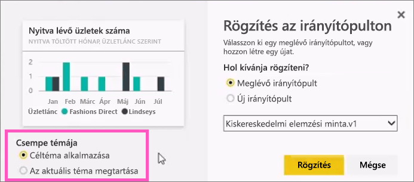

# Csempe rögzítése Power BI-irányítópultra jelentésből
## Csempék rögzítése jelentésből
Új [irányítópult-csempét](service-dashboard-tiles.md)egyrészt [Power BI-jelentésből](service-reports.md) vehet fel. Egy jelentésből sok új csempét felvehet.  Ezek a csempék az eredeti jelentésre mutató hivatkozások.

Teljes jelentésoldalak is rögzíthetők egy irányítópulton.  Ezt nevezik *élő* csempe rögzítésének.  Az *élő* elnevezést az indokolja, hogy az irányítópulton lévő csempe használható, és hogy az egyéni vizualizációs csempéktől eltérően a jelentésben végrehajtott módosítások az irányítópulttal is szinkronizálódnak. Erről az alábbiakban további információt talál.

Az Önnel megosztott jelentésekből és a Power BI Desktopról nem rögzíthet csempéket. 

> **TIPP**: Egyes vizualizációk háttérképet is használnak. Ha a háttérkép túl nagy, akkor előfordulhat, hogy a rögzítés nem lehetséges.  Próbálkozzon a kép méretének csökkentésével vagy a kép tömörítésével.  
> 
> 

## Csempe rögzítése jelentésből
Figyelje meg, hogyan hoz létre Amanda egy irányítópultot Power BI-jelentésből származó vizualizációk és képek rögzítésével.

<iframe width="560" height="315" src="https://www.youtube.com/embed/lJKgWnvl6bQ" frameborder="0" allowfullscreen></iframe>

Most készítse el saját irányítópultját a Power BI-jelentésminták egyikének felhasználásával.

1. Vigye a kurzort a rögzíteni kívánt vizualizáció fölé, és kattintson a rajzszög  ikonra. A Power BI megnyitja a **Rögzítés az irányítópulton** képernyőt.
   
     
2. Döntse el, hogy meglévő vagy új irányítópulton kíván rögzíteni.
   
   * Meglévő irányítópult: válassza ki az irányítópult nevét a legördülő listából. Az Önnel megosztott irányítópultok nem jelennek meg a legördülő listában.
   * Új irányítópult: írja be az új irányítópult nevét.
3. Bizonyos esetekben megtörténhet, hogy az éppen rögzített elemen már alkalmazva van egy *téma*.  Ilyen lehet például egy Excel-munkafüzetből rögzített vizualizáció. Ilyen esetben válassza ki a csempére alkalmazandó témát.
4. Válassza a **Rögzítés** lehetőséget.
   
   Megjelenik egy üzenet (a jobb felső sarok közelében), amely értesíti, hogy sikeresen hozzáadta a vizualizációt az irányítópultjához csempeként.
   
   
5. Jelölje ki az új csempét tartalmazó irányítópultot a navigációs panelen. A csempére kattintva térhet vissza a jelentésre. Vagy [módosítsa a csempe megjelenését és viselkedését](service-dashboard-edit-tile.md).

## Teljes jelentésoldal rögzítése
Egy másik lehetőség, hogy egy teljes jelentésoldalt rögzít egy irányítópulton. Így egyszerűen rögzíthet egyszerre több vizualizációt.  Ezen felül teljes oldal rögzítésekor a csempék *élők* lesznek, és közvetlenül az irányítópulton kezelhetők. A vizualizációk jelentésszerkesztőben végrehajtott módosítása, például egy szűrő hozzáadása vagy a diagramon használt mezők megváltoztatása is megjelenik az irányítópulton lévő csempén.  

További információk: [Teljes jelentésoldal rögzítése](service-dashboard-pin-live-tile-from-report.md)

## További lépések
[Irányítópultok a Power BI-ban](service-dashboards.md)

[Irányítópult-csempék a Power BI-ban](service-dashboard-tiles.md)

[Jelentések a Power BI-ban](service-reports.md)

[Adatfrissítés a Power BI-ban](refresh-data.md)

[A Power BI alapvető fogalmai](service-basic-concepts.md)

További kérdései vannak? [Felteheti azokat a Power BI-közösségnek](http://community.powerbi.com/)

