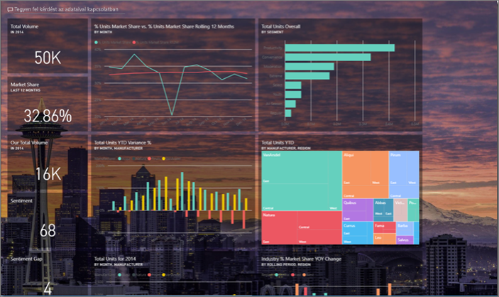
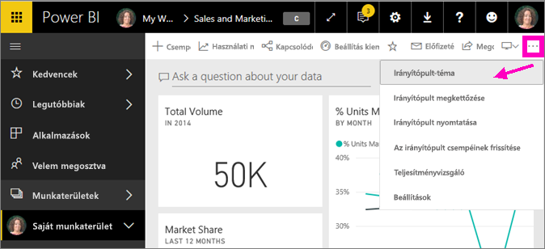
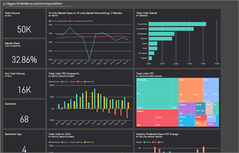
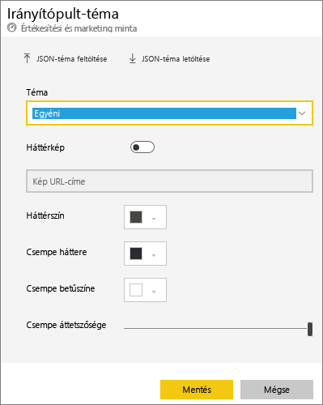
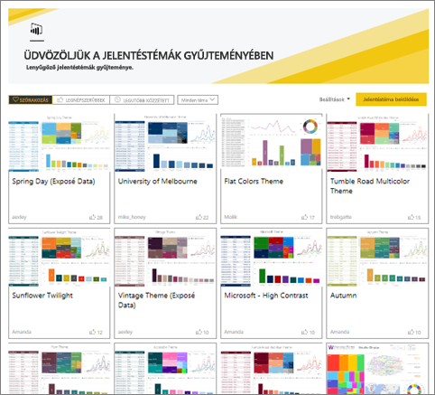
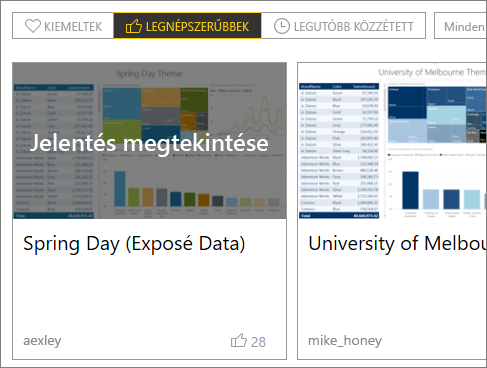
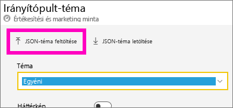
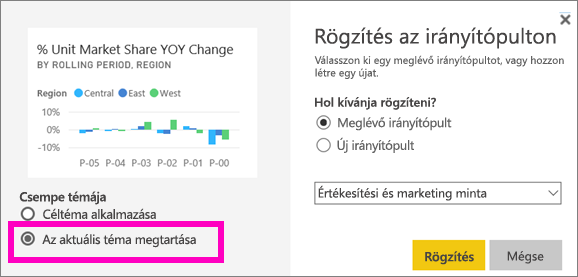
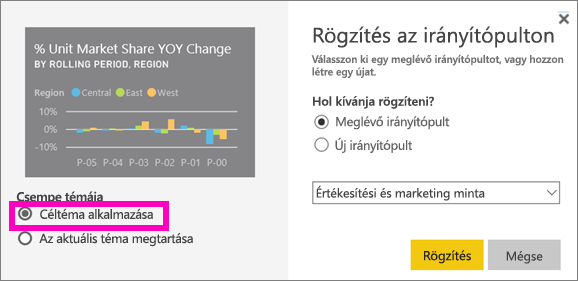

# Irányítópult-témák használata a Power BI szolgáltatásban
Az **Irányítópult-témák** használatával egységes színtémát alkalmazhat az egész irányítópultra, például a cég színeit, az évszaknak megfelelő színeket vagy bármely más színtémát, amit csak szeretne. **Irányítópult-témák** alkalmazásakor az irányítópulton szereplő összes vizualizáció a kiválasztott téma színeit fogja használni (ez alól van néhány kivétel, amelyeket a cikk későbbi részében mutatunk be).

Az irányítópulton lévő jelentésvizualizációk színének megváltoztatása nem befolyásolja a jelentésben szereplő vizualizációkat. Ha olyan jelentésből rögzít csempéket, amelyhez már [hozzá van rendelve egy jelentéstéma](/desktop-report-themes.md), választhat, hogy meg szeretné-e tartani a jelenlegi témát, vagy inkább az irányítópult-témát szeretné használni.

## Előfeltételek
* Annak érdekében, hogy követni tudja a lépéseket, nyissa meg az [Értékesítési és marketing minta irányítópultját](sample-datasets.md).

## Az irányítópult-témák használata
Először nyisson meg egy olyan irányítópultot, amelyet Ön hozott létre (vagy amelyhez szerkesztési jogosultsága van), és amelyet testre kíván szabni. Válassza a három pontot (…), majd az **Irányítópult-téma** lehetőséget. 

A megjelenő irányítópult panelen válasszon az elérhető beépített témák közül.  Az alábbi példában a **Sötét** témát választottuk.

## Egyéni téma létrehozása

A Power BI irányítópultjainál az alapértelmezés szerinti téma a **Világos**. Ha módosítani szeretné a színeket vagy ha saját témát szeretne létrehozni, a legördülő listában válassza az **Egyéni** lehetőséget. 

Saját irányítópult-téma létrehozásához használja az egyéni lehetőségeket. Ha háttérképet szeretne hozzáadni, javasoljuk, hogy legalább 1920x1080 felbontású képet használjon.  

### JSON-témák használata
Egyéni témát úgy is létrehozhat, ha feltölt egy olyan JSON-fájlt, amely tartalmazza az összes beállítást az irányítópulton használni kívánt összes színhez. A Power BI Desktopban a jelentéskészítők JSON-fájlokat használnak a [jelentések témáinak létrehozásához](desktop-report-themes.md). Ugyanezek a JSON-fájlok az irányítópultokhoz is feltölthetőek, de kereshet feltölthető JSON-fájlokat a Power BI közösség [Tématárában](https://community.powerbi.com/t5/Themes-Gallery/bd-p/ThemesGallery) is 

Egyéni témáit elmentheti JSON-fájlként, és megoszthatja őket más irányítópult-készítőkkel. 

### Téma használata a Tématárból

A beépített és az egyéni témákhoz hasonlóan a színek ezeknek a témáknak a feltöltésénél is automatikusan alkalmazva lesznek az irányítópult összes csempéjére. 

1. Mutasson rá egy témára, és válassza a **Jelentés megtekintése** lehetőséget.

    

2. Görgessen le, és keresse meg a JSON-fájlra mutató hivatkozást.  Válassza a letöltés ikont, és mentse a fájlt.

    

3. Ha visszatért a Power BI szolgáltatásba, az Egyéni irányítópult-témák ablakban válassza a **JSON-téma feltöltése** lehetőséget.

    

4. Keresse meg azt a helyet, ahová a JSON-téma fájlját mentette, és válassza a **Megnyitás** lehetőséget.

5. Az Irányítópult-téma oldalon válassza a **Mentés** lehetőséget. Az új téma alkalmazva lesz az irányítópultra.

    

## Megfontolandó szempontok és korlátozások

* Ha a jelentés egy, az irányítópult témájától eltérő témát használ, megadhatja, hogy a vizualizáció megtartsa-e az aktuális témát, vagy az irányítópult-témát használja a különböző forrásokból származó vizualizációkkal megtartott következetesség érdekében. Ha csempe irányítópulton való rögzítésénél meg szeretné tartani a jelentéstémát, válassza az **Aktuális téma megtartása** lehetőséget. Az irányítópulton lévő vizualizáció meg fogja tartani a jelentéstémát, beleértve az átlátszósági beállításokat is. 

    A **Csempetémák használatának** lehetőségei csakis akkor jelennek meg, ha létrehozott egy jelentést a Power BI Desktopban, ehhez [hozzáadott egy jelentéstémát](desktop-report-themes.md), majd a jelentést a Power BI szolgáltatásban közzétette. 

    

    Próbálja meg újra rögzíteni a csempét, majd válassza az **Irányítópult-téma használata** lehetőséget.

    

* Az irányítópult-témák jelenleg nincsenek támogatva a REST API használatával beágyazott irányítópultok megtekintésénél, mobileszközökön, vagy ha azokat külső felhasználók tekintik meg.    
* Az irányítópult-témák nem alkalmazhatók rögzített élő jelentésoldalakon, iframe-csempéken, SSRS-csempéken, munkafüzet-csempéken és képeken.
* Az irányítópult-témák megtekinthetők mobileszközökön is, de irányítópult-csempét csak a Power BI szolgáltatásban hozhat létre. 
* Az egyéni irányítópult-témák csak a jelentésekből rögzített csempékkel működnek. 

