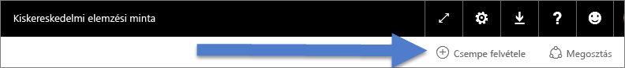
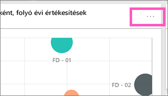
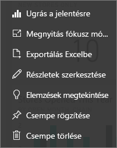

# Irányítópult-csempék a Power BI-ban
Az irányítópultok és az irányítópulton található csempék nem a Power BI Desktophoz, hanem a Power BI szolgáltatáshoz tartozó funkciók. A Power BI mobilalkalmazásban nem hozhatók létre és nem tűzhetők ki irányítópult-csempék, de [megtekinthetők és megoszthatók](mobile-tiles-in-the-mobile-apps.md) abból. Ezenkívül a Power BI mobilalkalmazásban [képeket vehet fel az irányítópulthoz az iPhone-alkalmazással](mobile-iphone-app-get-started.md).

## Irányítópult-csempék

A csempék az adatokról készített és az irányítópultra kitűzött pillanatfelvételek. Csempe létrehozható jelentésből, Q&A mezőből, Excelből, SQL Server Reporting Services-ből (SSRS-ből), és sok minden másból.  Ezen a képernyőfelvételen több irányítópultra tűzött csempe látható.

A kitűzés mellett, önmagukban álló csempék is kitűzhetők közvetlenül az irányítópultra a [Csempe hozzáadása](service-dashboard-add-widget.md) lehetőséget használva. Önmagukban álló csempék lehetnek többek között szövegmezők, képek, videók, streaming-adatok, webtartalmak.

További segítségre van szüksége annak megértéséhez, hogy milyen elemekből épül fel a Power BI?  Tekintse meg a [Power BI alapfogalmait](service-basic-concepts.md) ismertető cikket.

> [!NOTE]
> A csempe létrehozásához használt vizualizációs elem változásakor a csempe nem változik.  Például ha kitűz egy sávdiagramot egy jelentésből, majd a sávdiagramot oszlopdiagramra cseréli, az irányítópulton megjelenő csempén továbbra is sávdiagram lesz látható. Az adatok frissülni fognak, de a diagram típusa nem.
> 
> 

## Csempe kitűzése
Az irányítópultokra többféleképpen lehet felvenni (kitűzni) csempét. Csempék kitűzhetők:

* [Power BI Q&A-ből](service-dashboard-pin-tile-from-q-and-a.md)
* [jelentésből](service-dashboard-pin-tile-from-report.md)
* [másik irányítópultról](service-pin-tile-to-another-dashboard.md)
* [OneDrive vállalati verzión található Excel-munkafüzetből](service-dashboard-pin-tile-from-excel.md)
* [az Excelhez készült Power BI Publisherből](publisher-for-excel.md)
* [gyors elemzésekből](service-insights.md)
* [SSRS-ből](https://msdn.microsoft.com/library/mt604784.aspx)

A képek, szövegdobozok, videók, streamelési adatok és webtartalmak különálló csempéi közvetlenül az irányítópulton is létrehozhatók a [Csempe hozzáadása](service-dashboard-add-widget.md) lehetőséget használva.

  

## Az irányítópulton levő csempék használata
### Csempék mozgatása és átméretezése
Fogja meg az egyik csempét, és [mozgassa körbe az irányítópulton](service-dashboard-edit-tile.md). A csempe átméretezéséhez kattintson a csempe fogópontjára .

### Csempék megjelenésének és működésének módosítása a csempére pozicionálva
1. A három pont megjelenítéséhez álljon a csempe fölé.
   
    
2. A három pontra kattintva nyissa meg a csempeműveletek menüjét.
   
    
   
    Ebből a menüből:
   
   * [Megnyithatja a csempe létrehozásához használt jelentést](service-reports.md)   
   
   * [Megnyithatja a csempe létrehozásához használt munkafüzetet](service-reports.md)   
     
     * [Megnyithatja a csempét fókusz módban](service-focus-mode.md)   
     * [Exportálhatja a csempéhez használt adatokat](power-bi-visualization-export-data.md) 
     * [Szerkesztheti a címet és az alcímet, felvehet egy hivatkozást, és megjelenítheti az utolsó frissítés idejét](service-dashboard-edit-tile.md) 
     * [Elemzéseket futtathat ](service-insights.md) 
     * [Kitűzheti a csempét egy másik irányítópultra](service-pin-tile-to-another-dashboard.md)
       
     * [Eltávolíthatja a csempét](service-dashboard-edit-tile.md)
     
3. A művelet menü bezárásához kattintson egy üres területre a vásznon.

### Csempék kiválasztása
Az, hogy mi történik, amikor rákattint valamelyik csempére, attól függ, hogyan lett létrehozva a csempe, és hogy tartozik-e hozzá [egyedi hivatkozás](service-dashboard-edit-tile.md). Ha tartozik hozzá egyedi hivatkozás, a csempe kiválasztásakor a rendszer a hivatkozott oldalra lépteti. Más esetben a csempére kattintáskor a létrehozásához használt helyszíni jelentéshez, Excel-munkafüzethez, SSRS-jelentéshez vagy Q&A-kérdéshez irányítja a rendszer.

> [!NOTE]
> Ez alól csak a közvetlenül az irányítópulton a **Csempe hozzáadása** funkcióval létrehozott videócsempék képeznek kivételt. Amikor egy így létrehozott videócsempére kattint, a rendszer közvetlenül az irányítópulton játssza le a videót.   
> 
> 

## Megfontolandó szempontok és hibaelhárítás
* Ha a vizualizáció létrehozásához használt jelentés nem lett mentve, akkor nem történik semmi a csempére kattintáskor.
* Ha a csempe Excel Online-munkafüzetből lett létrehozva, és a felhasználónak ahhoz nincs legalább Olvasási jogosultsága, a csempe kiválasztásakor nem fog megnyílni az Excel Online-munkafüzet.
* Olyan csempe esetén, melyet a **Csempe létrehozása** funkcióval közvetlenül az irányítópulton hozott létre a felhasználó, és beállított hozzá egy egyedi hiperhivatkozást, a csempe címére, alcímére vagy magára a csempére kattintáskor a rendszer megnyitja az adott URL-címet.  Más esetben a közvetlenül az irányítópulton kép, webkód vagy szövegdoboz részére létrehozott csempe kiválasztása nem indít el semmilyen műveletet.
* Ha az SSRS-en nem jogosult egy jelentés használatára, az SSRS alapján létrehozott csempék kiválasztásakor a rendszer megjelenít egy oldalt, amely jelezni fog, hogy a felhasználó nem rendelkezik megfelelő hozzáféréssel (rsAccessDenied).
* Ha nincs hozzáférése ahhoz a hálózathoz, ahol az SSRS található, SSRS-ből létrehozott csempe kiválasztásakor a rendszer megjelenít majd egy oldalt, amely azt jelzi, hogy a kiszolgáló nem található (HTTP 404). Ahhoz, hogy meg tudja tekinteni a jelentést, az Ön eszközének hálózati hozzáféréssel kell rendelkeznie a jelentés-kiszolgálóhoz.
* A csempe létrehozásához használt vizualizációs elem változásakor a csempe nem változik.  Például ha kitűz egy sávdiagramot egy jelentésből, majd a sávdiagramot oszlopdiagramra cseréli, az irányítópulton megjelenő csempén továbbra is sávdiagram lesz látható. Az adatok frissülni fognak, de a diagram típusa nem.

## Következő lépések
[Kártyák (nagy méretű numerikus csempék) létrehozása az irányítópulthoz](power-bi-visualization-card.md)

[A Power BI-irányítópultok](service-dashboards.md)  

[Adatfrissítés](refresh-data.md)

[Power BI – alapfogalmak](service-basic-concepts.md)

[Csempe exportálása Power Pointba](http://blogs.msdn.com/b/powerbidev/archive/2015/09/28/integrating-power-bi-tiles-into-office-documents.aspx)

[Reporting Services-elemek kitűzése Power BI-irányítópultokra](https://msdn.microsoft.com/library/mt604784.aspx)

További kérdései vannak? [Kérdezze meg a Power BI közösségét](http://community.powerbi.com/)

