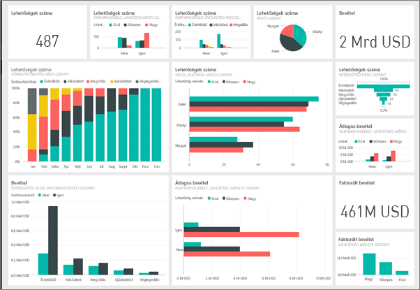
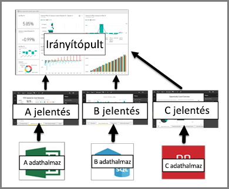

# Irányítópult a Power BI szolgáltatásban

A Power BI-***irányítópult*** egy gyakran vászonnak is nevezett oldal, amely vizualizációk segítségével mesél el egy történetet. Mivel az irányítópult egyetlen lapon jelenik meg, ezért a jól megtervezett irányítópult csak a történet legfontosabb elemeit tartalmazza.

Az irányítópulton látható vizualizációkat *csempéknek* nevezik, és a jelentésekből *rögzíthetők* az irányítópultra. Ha csak most kezdte el használni a Power BI-t, a [Power BI alapfogalmait](service-basic-concepts.md) elolvasva egyszerűen elsajátíthatja az alapokat.

> [!NOTE]
> Az irányítópult a Power BI szolgáltatás egyik funkciója, ezért a Power BI Desktopban nem érhető el. Mobileszközökön csak [megtekinteni és megosztani](mobile-apps-view-dashboard.md) lehet az irányítópultokat, létrehozni nem.
> 
> 

Az irányítópulton megjelenő vizualizációk a jelentéseken, az egyes jelentések pedig egy-egy adatkészleten alapulnak. Az irányítópultok tulajdonképpen az alapjául szolgáló jelentésekhez és adatkészletekhez való hozzáférési útnak is tekinthetők. Egy vizualizáció kiválasztásával hozzáférhet a létrehozásához használt jelentéshez (és adatkészlethez).

## Az irányítópultok előnyei
Az irányítópultok segítségével nagyszerűen nyomon követheti üzletmenetét, választ találhat kérdéseire, és egyetlen pillantással megtekintheti a legfontosabb mérőszámokat. Az irányítópulton található vizualizációk egy vagy több adatkészletből vagy jelentésből is származhatnak. Az irányítópult a helyi és a felhőben keletkezett adatokat ötvözi, és egyesített nézetet biztosít függetlenül attól, hogy az adatok hol találhatók.

Az irányítópult nem csak egy tetszetős kép, hanem egy interaktív, egyénre szabható funkció, amelyben az egyes csempék az alapul szolgáló adatok változásának megfelelően frissülnek.

## Irányítópultok és jelentések
A [Jelentések](service-reports.md) összekeverhetők az irányítópultokkal, mivel mind a kettő egy vizualizációkkal teli vászon. Azonban van köztük néhány alapvető különbség.

| **Képesség** | **Irányítópultok** | **Jelentések** |
| --- | --- | --- |
| Oldalak |Egy oldal |Egy vagy több oldal |
| Adatforrások |Egy vagy több jelentés és egy vagy több adatkészlet irányítópultonként |Egyetlen adatkészlet jelentésenként |
| Elérhető a Power BI Desktopban |Nem |Igen, a jelentések létrehozhatók és megtekinthetők a Desktopban |
| Rögzítés |Csak az aktuális irányítópultról képes a létező vizualizációkat (csempéket) más irányítópultokra rögzíteni |Bármelyik irányítópultra képes rögzíteni a vizualizációkat (csempékként). Teljes oldalakat rögzíthet a jelentésből bármely irányítópultra. |
| Előfizetés |Nem fizethet elő irányítópultra |Előfizethet jelentésoldalakra |
| Szűrés |Nem lehet szűrni és szeletelni |Számos szűrési, kiemelési és szeletelési móddal rendelkezik |
| Riasztások beállítása |Létrehozhat olyan riasztásokat, amelyek e-mailen keresztül értesítik, ha a feltételek teljesülnek |Nem |
| Kiemelés |Kiválaszthat és beállíthat egy „kiemelt” irányítópultot |Nem hozhat létre kiemelt jelentést |
| Természetes nyelven történő lekérdezések |Elérhető az irányítópultból |Nem érhető el a jelentésekből |
| Megváltoztathatja a vizualizáció típusát |Nem. Ha egy jelentéstulajdonos megváltoztatja a vizualizáció típusát a jelentésen belül, az irányítópulton rögzített vizualizáció nem fog frissülni |Igen |
| Láthatja az alapul szolgáló adatkészlet-táblázatokat és -mezőket |Nem. Exportálhatja az adatokat, de magán az irányítópulton nem fogja látni a táblázatokat és a mezőket. |Igen. Láthatja az adatkészlet-táblázatokat, -mezőket és -értékeket. |
| Létrehozhat vizualizációkat |Csak a widgetek irányítópulthoz történő hozzáadása lehetséges a „Csempe hozzáadása” lehetőség használatával |A Szerkesztési engedéllyel létrehozhat számos különböző vizualizációtípust, egyéni vizualizációkat adhat hozzá és szerkeszthet stb. |
| Testreszabás |Mozgathatja és rendezheti a vizualizációkat (csempéket), újraméretezheti őket és hivatkozásokat adhat hozzájuk, valamint átnevezheti, törölheti vagy teljes képernyőn jelenítheti meg őket. Maguk az adatok és a vizualizációk azonban csak olvashatók. |Az olvasási nézetben közzétehet, beágyazhat, szűrhet és exportálhat adatokat, letölthet .pbix-ként, megtekintheti a vonatkozó tartalmakat, QR-kódokat generálhat, exceles elemzést hajthat végre stb.  Szerkesztési nézetben a fent említettek mellett számos más dolgot is végrehajthat. |

## Az irányítópultok létrehozói és felhasználói
Szerepkörétől függően létrehozhat irányítópultokat saját maga vagy akár kollégái számára. Szeretné megtanulni, hogyan hozhat létre és oszthat meg irányítópultokat. Vagy más felhasználóktól is kapja az irányítópultokat. Szeretné megtanulni, hogyan kell értelmeznie és használnia azokat.

Összegyűjtöttünk önnek néhány témát szerepkör szerint, hogy segítsünk megtenni az első lépéseket.

A Power BI Pro az irányítópultok megosztásához és a megosztott irányítópultok megtekintéséhez is szükséges.

### Ha irányítópultokat szeretne létrehozni és megosztani
* Használja a megadott minták egyikét egy [irányítópult létrehozásához egy jelentésből](service-dashboard-create.md).
* Tudjon meg többet az [irányítópult-csempékről](service-dashboard-tiles.md) és a csempék irányítópulton való különböző rögzítési módjairól.
* Segítse irányítópult-felhasználóit azzal, hogy olyan irányítópultokat hoz létre, amelyek [könnyedén használhatók a természetes nyelvű Q&A lekérdezésekkel](service-prepare-data-for-q-and-a.md) és a [gyors elemzésekkel](service-insights-optimize.md).
* Fedezze fel hogyan [oszthat meg egy irányítópultot kollégáival](service-how-to-collaborate-distribute-dashboards-reports.md).

### Ha irányítópultokat fogad és használ
* [Minta-irányítópultjaink](sample-tutorial-connect-to-the-samples.md) egyikének megtekintése révén megismerkedhet az irányítópultok használatával.
* Ismerkedjen meg az [irányítópult-csempékkel](service-dashboard-tiles.md), és fedezze fel mi történik, ha kiválaszt egy csempét.
* Nem teszik egy adott irányítópult megjelenése?  [Átméretezheti, áthelyezheti és átnevezheti a csempéket](service-dashboard-edit-tile.md).
* Szeretne nyomon követni egy adott irányítópult-csempét, és e-mailes értesítést kapni, ha elér egy bizonyos küszöbértéket? [Riasztások létrehozása a csempéken](service-set-data-alerts.md).
* Tegye fel bátran az irányítópultokkal kapcsolatos kérdéseit. Fedezze fel, hogyan teheti fel az adatokkal kapcsolatos kérdéseit és szerezheti meg a válaszokat vizualizáció formájában a [Power BI Q&A](power-bi-tutorial-q-and-a.md) segítségével.

> [!TIP]
> Ha nem találta meg, amit keres, használja a bal oldalon található tartalomjegyzéket.
> 
> 

## Következő lépések
[Első lépések a Power BI-ban](service-get-started.md)  
[Power BI – Alapfogalmak](service-basic-concepts.md)  
[Power BI Premium – pontosan mi is ez?](service-premium.md)  

További kérdései vannak? [Kérdezze meg a Power BI közösségét](http://community.powerbi.com/)

