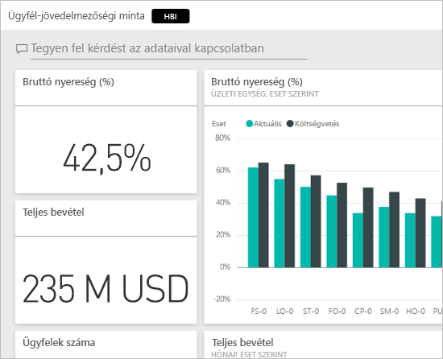
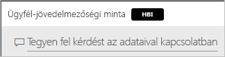
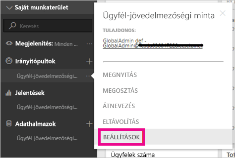
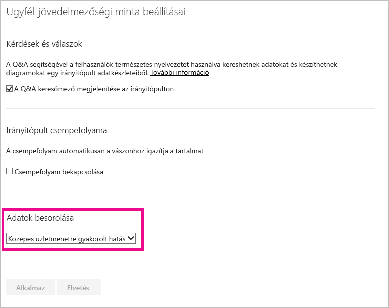
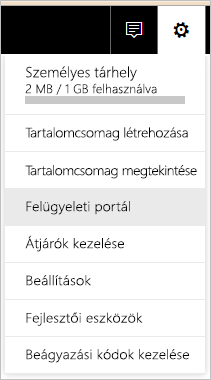
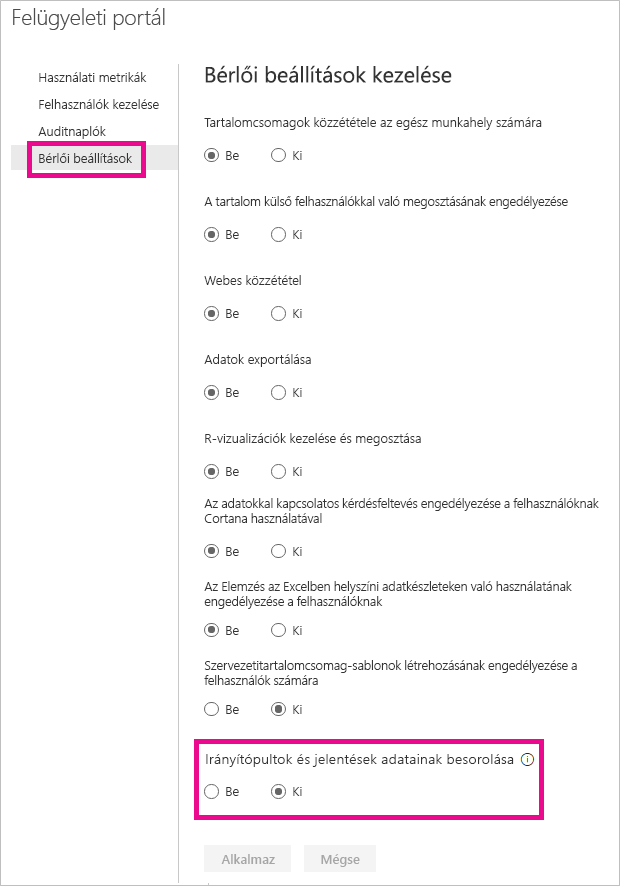
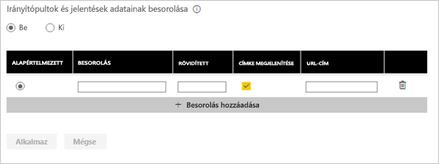
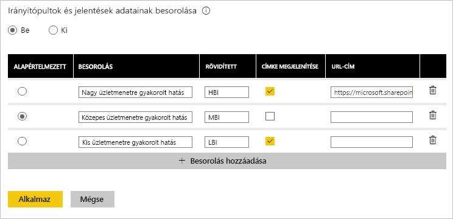

# Irányítópult adatainak besorolása
Minden irányítópult különbözik, és attól függően, hogy milyen adatforráshoz kapcsolódik, Önnek, és azoknak, akikkel az információkat megosztja, más-más intézkedéseket kell tennie az érzékeny adatok védelme érdekében. Néhány irányítópultot soha sem szabad kinyomtatni vagy cégen kívül megosztani, míg másokat szabadon lehet terjeszteni. Az irányítópultok adatainak a besorolásával fel tudja hívni az irányítópultokat megtekintő felhasználók figyelmét arra, hogy milyen szintű adatvédelmet kell alkalmazniuk. Az irányítópultokat felcímkézheti az IT osztály által definiált besorolásokkal, így az adatok érzékenységéről mindenki egyformán tájékozódhat, aki a tartalmat megtekinti.

## Adatbesorolási címkék
Az adatbesorolási címkék az irányítópult neve mellett jelennek meg. Bárki, aki megtekinti ezeket, tájékozódhat arról, hogy az irányítópult megjelenítésekor és az adatok kapcsán milyen szintű adatvédelemről kell gondoskodnia.

A címkék a Kedvencek listán szereplő irányítópult-csempék mellett is meg fognak jelenni.

Amikor a kurzort a címke fölé viszi, látni fogja a besorolás teljes nevét.

A rendszergazdák URL-címet is beállíthatnak a címkéhez, ahol kiegészítő információk lesznek elérhetők.

> [!NOTE]
> A rendszergazda által megadott besorolási beállításoktól függően előfordulhat, hogy néhány besorolástípus nem jelenik meg címkeként az irányítópulton. Ha egy irányítópultnak Ön a tulajdonosa, az irányítópult besorolásának típusát bármikor ellenőrizheti az irányítópult beállításai között.
> 
> 

## Irányítópult besorolásának beállítása
Ha a cégen belül be van kapcsolva az adatbesorolások használata, minden irányítópult egy alapértelmezett besorolással indul. Ezt a beállítást az irányítópult tulajdonosa módosíthatja, hogy megfeleljen a saját irányítópultjaihoz használt adatvédelmi szintnek.

A besorolás típusának a módosításához tegye a következőket.

1. Nyissa meg az irányítópult beállításait az irányítópult neve melletti **három pontra** kattintva és a **Beállítások** lehetőséget választva.
   
    
2. Az Irányítópultok lapfülön meg tudja tekinteni az irányítópult aktuális besorolását, és a legördülő listát használva módosítani tudja azt.
   
    
3. Ha elkészült, kattintson az **Alkalmaz** gombra.

A változtatás érvényesítése után mindenki, akivel az irányítópultot megosztja, látni fogja a frissített értéket, amikor betölti az irányítópultot.

## Adatbesorolási címkék kezelése rendszergazdaként
Az adatbesorolás alkalmazását a globális rendszergazda állíthatja be a cég számára. Az adatbesorolás bekapcsolásához tegye a következőket.

1. Kattintson a Beállítások fogaskerekére, majd kattintson a **Felügyeleti portál** lehetőségre.
   
    
2. A **bérlői beállítások** fülön kapcsolja *be* az **Adatbesorolás irányítópultokhoz** lehetőséget.
   
    

Ha bekapcsolta, a rendszer megjelenít egy űrlapot a különböző céges besorolások létrehozásához.

Mindegyik besorolás rendelkezik egy **névvel** és egy, az irányítópulton megjeleníthető **rövidítéssel**. A **Címke megjelenítése** lehetőség kiválasztásával minden egyes besorolásnál megadhatja, hogy a rövidítést tartalmazó címke megjelenjen-e az irányítópulton. Ha nem jeleníteni meg a besorolás típusát az irányítópulton, a tulajdonos akkor is megtekintheti azt az irányítópult beállításai között. Ezenkívül felvehet hozzá egy **URL-címet**, ahol további információk lesznek elérhetők a cégnél alkalmazott adatbesorolási irányelvekről és használati feltételekről.  

Legvégül pedig azt is el kell döntenie, hogy melyik besorolási típus legyen az alapértelmezett.  

Ha megadta a besorolási típusokat az űrlapon, a változtatások mentéséhez kattintson az **Alkalmaz** lehetőségre.

Ekkor a rendszer az összes irányítópulthoz hozzárendeli az alapértelmezett besorolást, az irányítópultok tulajdonosai pedig frissíteni tudják majd azt a megjelenített tartalomnak megfelelő módon. Később is bármikor visszatérhet ide, ha besorolási típust szeretne felvenni vagy eltávolítani, vagy módosítani szeretné az alapértelmezett értéket.  

> [!NOTE]
> Néhány dolgot fontos lesz majd emlékezetébe idéznie, amikor változtatási céllal tér vissza:
> 
> * Ha az adatbesorolás használatát kikapcsolja, egyik címkét sem fogja megjegyezni a rendszer. Ha később visszakapcsolja, mindent előröl kell majd kezdenie.  
> * Ha eltávolított egy besorolási típust, azon irányítópultok adatbesorolási értékét, melyek az eltávolított besorolást használták, az alapértelmezett értékre állítja vissza a rendszer.  
> * Ha módosítja az alapértelmezett értéket, minden olyan irányítópult adatbesorolási értékét, melyekhez még nem rendeltek adatbesorolási értéket, az új alapértelmezett értékre állítja a rendszer.
> 
> 

