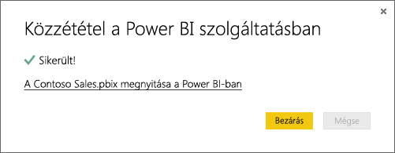

# Adatok lekérése Power BI Desktop-fájlokból

A **Power BI Desktop** megkönnyíti az üzleti intelligenciát és a jelentéskészítést. Attól függetlenül, hogy számos különböző adatforráshoz csatlakozik, adatokat kér le és alakít át, adatmodellezést végez vagy erőteljes és dinamikus jelentéseket hoz létre, a **Power BI Desktop** intuitívvá és gyorssá teszi az üzleti intelligenciával kapcsolatos feladatokat. Ha még nem ismeri a **Power BI Desktopot**, tekintse át az [Első lépések a Power BI Desktopban](desktop-getting-started.md) című cikket.

Miután adatokat visz a **Power BI Desktopba** és létrehoz néhány jelentést, ideje a **Power BI szolgáltatásba** helyezni a mentett fájlt.

## Számít a fájl mentési helye
**Helyi** – Ha a számítógépe egy helyi meghajtójára vagy egy egyéb helyre menti a fájlt a cégen belül, *importálhatja* azt vagy *közzéteheti* a Power BI Desktopból, hogy az adatok és a jelentések a Power BI-ba kerüljenek. A fájl valójában a helyi meghajtón marad, így nem helyezi a teljes fájlt a Power BI-ba. Igazából az történik, hogy létrejön egy új adatkészlet a Power BI-ban, majd a rendszer ebbe az adatkészletbe tölti be a Power BI Desktop-fájlból származó adatokat és adatmodellt. Ha a fájlban vannak jelentések, azok a Power BI-webhely Jelentések területén jelennek meg.

**OneDrive – vállalati** – Ha rendelkezik a OneDrive Vállalati verzióval, és ugyanazzal a fiókkal jelentkezik be abba is, mint amellyel a Power BI-ba, az messze a leghatékonyabb módja a Power BI Desktopban lévő munkái és a Power BI-ban lévő adatkészlet, jelentések és irányítópultok szinkronban tartásának. Mivel a Power BI és a OneDrive is a felhőben van, a Power BI óránként *csatlakozik* a OneDrive-on tárolt fájlhoz. Ha a rendszer bármilyen változást érzékel, az adatbázis, a jelentések és az irányítópultok automatikusan frissülnek a Power BI-ban.

**OneDrive – személyes** – Ha a saját OneDrive-fiókjába menti a fájlokat, számos olyan előnyre tehet szert, mint a OneDrive Vállalati verziójának használatakor. A legnagyobb különbség az, hogy amikor először csatlakozik a fájlhoz (az Adatok lekérése > Fájlok > OneDrive – személyes paranccsal), a Microsoft-fiókjával kell bejelentkeznie a OneDrive-ra, amely általában különbözik a Power BI-ba való bejelentkezéskor használt fióktól. Amikor a Microsoft-fiókjával jelentkezik be a OneDrive-ba, mindenképp jelölje be a Bejelentkezve szeretnék maradni lehetőséget. Így a Power BI képes óránként csatlakozni a fájlhoz, hogy biztosítsa a Power BI-ban lévő adatok szinkronizálását.

**SharePoint – csoportwebhelyek** – A Power BI Desktop-fájlok SharePoint – csoportwebhelyekre való mentése sokban hasonlít a OneDrive Vállalati verziójába való mentéshez. A legnagyobb különbség a fájlhoz a Power BI-ból való csatlakozás módja. Megadhat egy URL-címet vagy csatlakozhat a gyökérmappához.

## Power BI Desktop-fájlok importálása és elérése a Power BI-ból
>[!IMPORTANT]
>A Power BI-ba importálható maximális fájlméret 1 gigabájt.

1. A Power BI navigációs panelén kattintson az ** Adatok lekérése** lehetőségre.
   
   
2. A **Fájlok** területen kattintson a **Lekérés** lehetőségre.
   
   
3. Keresse meg a fájlt. A Power BI Desktop-fájlok .PBIX kiterjesztéssel rendelkeznek.
   
   

## Fájl közzététele a Power BI Desktopból a Power BI-webhelyre
A Power BI Desktop Közzététel parancsának használata gyakorlatilag ugyanaz, mint a Power BI Adatok lekérése parancsának használata: mindkettővel importálhatja a fájlt egy helyi meghajtóról, illetve a OneDrive-hoz csatlakoztathatja azt.  Itt találja a gyors útmutatót, de további információért megtekintheti a [Közzététel a Power BI Desktopból](desktop-upload-desktop-files.md) című témakört.

1. A Power BI Desktopban kattintson a  **Fájl** > **Közzététel** > **Közzététel a Power BI-ban** lehetőségre, vagy a menüszalag **Közzétesz** elemére.
   
   
2. Jelentkezzen be a Power BI szolgáltatásba. Ezt csak az első alkalommal kell megtennie.
   
   Ha végzett, egy hivatkozást kap, amellyel megnyithatja a jelentést a Power BI-webhelyén.
   
   

## Következő lépések
**Az adatok áttekintése** – Miután a fájlból a Power BI-ba helyezte az adatokat és jelentéseket, ideje áttekinteni azokat. Ha a fájlban már vannak jelentések, a navigációs panel **Jelentések** területén jelennek meg. Ha a fájlban csak adatok vannak, új jelentéseket hozhat létre; egyszerűen kattintson a jobb gombbal az új adatkészletre, majd kattintson az **Áttekintés** gombra.

**Külső adatforrások frissítése** – Ha a Power BI Desktop-fájl külső adatforrásokhoz csatlakozik, ütemezett frissítést állíthat be, hogy az adatkészlet mindig naprakész maradjon. Az ütemezett frissítés beállítása a legtöbb esetben elég egyszerű, de ebben a cikkben nem térünk ki a részletekre. További információkért lásd: [Adatfrissítés a Power BI-ban](refresh-data.md).

