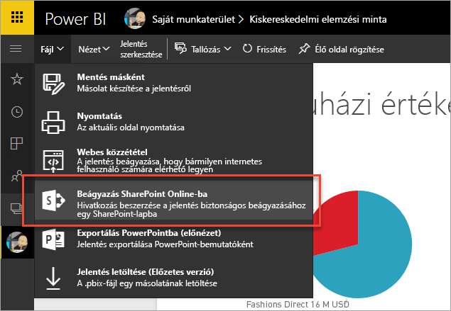
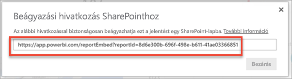
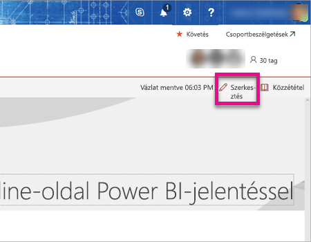
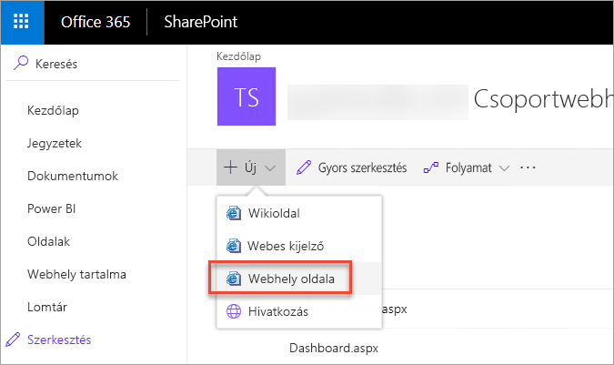
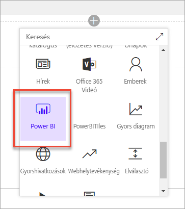
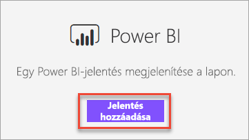
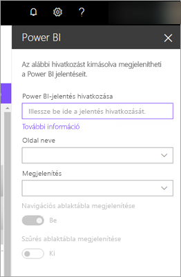
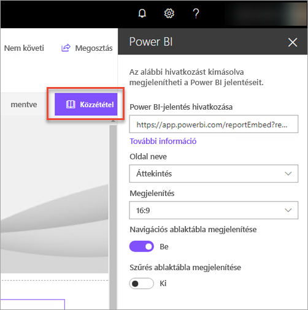
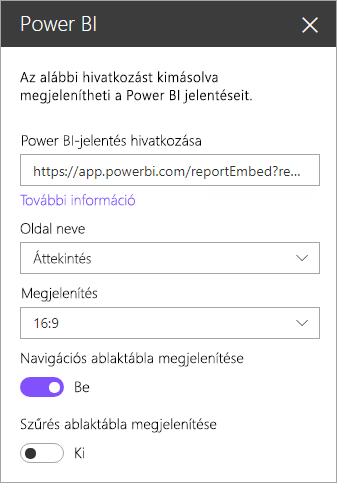
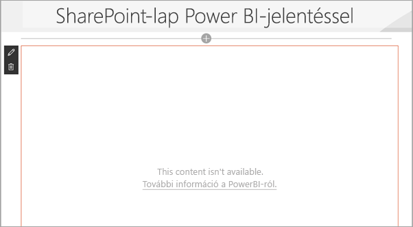

# Beágyazás jelentéskijelzővel a SharePoint Online-ban

A Power BI új beágyazás jelentéskijelzővel a SharePoint Online-ban funkciójának használatával interaktív Power BI-jelentéseit könnyedén SharePoint Online-oldalakba illesztheti.

Az új **Beágyazás a SharePoint Online-ban** funkció használatával a beágyazott jelentések teljes biztonságban vannak, így könnyedén hozhat létre biztonságos belső portálokat.

## Követelmények

Ahhoz, hogy a **Beágyazás a SharePoint Online-ban** funkció működjön, teljesülnie kell néhány követelménynek.

* A Power BI-jelentéskijelző a SharePoint Online-hoz csak [Modern weblapokkal](https://support.office.com/article/Allow-or-prevent-creation-of-modern-site-pages-by-end-users-c41d9cc8-c5c0-46b4-8b87-ea66abc6e63b) működik.

## A jelentés beágyazása

Ahhoz, hogy a jelentést beágyazza a SharePoint Online-ba, először is szükség van a jelentés URL-címére, amelyet majd a Power BI-kijelzőben kell megadni a SharePoint Online-ban.

### A jelentésre mutató URL-cím beszerzése

1. Nyissa meg a jelentést a Power BI szolgáltatásban.

2. Válassza ki a **Fájl** menüpont.

3. Válassza a **Beágyazás a SharePoint Online-ban** lehetőséget.
   
    

4. Másolja be az URL-címet a párbeszédpanelről.

    

   > [!NOTE]
   > Használhatja azt az URL-címet is, amely a jelentés megtekintésekor a böngésző címsorában van feltüntetve. Ez az URL az éppen megtekintett jelentés oldalára mutat. Ha másik oldalt szeretne használni, el kell távolítania a jelentésre hivatkozó szakaszt az URL-ből.

### A Power BI-jelentés hozzáadása a SharePoint Online laphoz

1. Nyissa meg a kívánt lapot a SharePoint Online-ban, és válassza ki a **Szerkesztés** lehetőséget.

    

    Vagy hozzon létre egy új modern weblapot a SharePoint Online-ban a **+ Új** lehetőség kiválasztásával.

    

2. Válassza a **+** lehetőséget, ezután pedig a **Power BI**-kijelzőt.

    

3. Válassza ki a **Jelentés hozzáadása** lehetőséget.

    

4. Illessze be a jelentés URL-címét a tulajdonság ablaktáblába. Ez az az URL-cím, amelyet a korábbi lépéseknél másolt be. A jelentés automatikusan betöltődik.

    

5. Válassza a **Közzététel** lehetőséget ahhoz, hogy a változtatásokat a többi SharePoint Online-felhasználó is megtekinthesse.

    

## Hozzáférés biztosítása a jelentésekhez

Egy jelentés beágyazása a SharePoint Online-ba még nem ad automatikusan engedélyt a felhasználóknak arra, hogy megtekinthessék a jelentést. A megtekintési engedélyeket a Power BI szolgáltatásban kell beállítani.

> [!IMPORTANT]
> Tekintse át kik láthatják a jelentést a Power BI szolgáltatásban, és adjon hozzáférést azoknak, akik még nem szerepelnek a listában.

A Power BI szolgáltatásban kétféleképpen lehet egy jelentéshez hozzáférést adni. Ha a SharePoint Online-csoportwebhely létrehozásához Office 365-csoportot használ, akkor a felhasználót hozzáadhatja az alkalmazás-munkaterülethez a Power BI szolgáltatásban. Ez biztosítja, hogy a felhasználók láthassák az adott csoport tartalmát. További információ: [Alkalmazások létrehozása és terjesztése a Power BI-ban](service-create-distribute-apps.md).

A másik mód, amellyel hozzáférést adhat a felhasználóknak a jelentéshez, a következő:

1. Adja a jelentés egyik csempéjét egy irányítópulthoz.

2. Ossza meg az irányítópultot azokkal a felhasználókkal, akiknek szükséges hozzáférniük a jelentéshez. További információ: [Irányítópult megosztása munkatársakkal és másokkal](service-share-dashboards.md)

## Jelentésekhez való hozzáférés engedélyezése az ingyenes verzió felhasználói számára

A SharePoint Online Power BI-kijelzőjébe ágyazott jelentéseket az ingyenes verzió felhasználói is megtekinthetik. Az ingyenes verzió felhasználóinak ugyanolyan módon adhat hozzáférést, mint a Pro verzió felhasználóinak, úgy, ahogy azt fentebb, a [Hozzáférés biztosítása a jelentésekhez](#granting-access-to-reports) szakaszban bemutattuk. A jelentést tartalmazó munkaterületnek Power BI Premium-kapacitással kell rendelkeznie. 

Ha például a jelentés egy alkalmazás-munkaterületen van, akkor az alkalmazás-munkaterülethez Power BI Premium-kapacitást kell hozzárendelni. Továbbá, az ingyenes verzió felhasználóit hozzá kell adni a munkaterület tagjainak listájához.

## A jelentéskijelző beállításai

Alább megtekintheti a SharePoint Online Power BI-kijelzőjének módosítható beállításait és azok leírását.

| Tulajdonság | Leírás |
| --- | --- |
| Oldal neve |Beállítja a jelentéskijelzőn alapértelmezetten megjelenő oldalt. Válasszon ki egy értéket a legördülő listából. Ha nem jelenik meg egyetlen oldal sem a listában, akkor vagy csak egyetlen oldalból áll a jelentés, vagy a bemásolt URL-cím már tartalmazza az egyik oldal nevét. Ahhoz, hogy a listából választhasson ki egy adott oldalt, el kell távolítani a jelentésre hivatkozó szakaszt az URL-címből. |
| Megjelenítés |A jelentés SharePoint Online-oldalon belüli igazítására szolgáló beállítás. |
| Navigációs ablaktábla megjelenítése |Megjeleníti vagy elrejti az oldal navigációs ablaktábláját. |
| Szűrés ablaktábla megjelenítése |Megjeleníti vagy elrejti a szűrés ablaktábláját. |

## Többtényezős hitelesítés

Ha a Power BI-környezetbe való belépéshez többtényezős hitelesítésre van szükség, akkor előfordulhat, hogy a rendszer arra kéri, hogy bejelentkezéskor egy biztonsági eszközzel igazolja személyazonosságát. Ez olyankor fordul elő, amikor a SharePoint Online-ba nem többtényezős hitelesítés használatával jelentkezik be, a Power BI-környezetbe való belépéshez viszont biztonsági eszközzel igazolt fiók szükséges.

> [!NOTE]
> A többtényezős hitelesítést az Azure Active Directory 2.0 még nem támogatja. A felhasználók egy *Hiba* feliratú üzenetet fognak kapni. Ha a felhasználó egy biztonsági eszköz használatával újból bejelentkezik a SharePoint Online-ba, akkor megtekintheti a jelentést.

## Nem betöltődő jelentések

Előfordulhat, hogy a jelentés nem töltődik be a Power BI-kijelző felületén, hanem a következő hibaüzenet olvasható:

*Ez a tartalom nem érhető el.*

Ennek általában két oka lehet:

1. Nem rendelkezik hozzáféréssel az adott jelentéshez.
2. A jelentést időközben törölték.

A probléma elhárításához lépjen kapcsolatba a SharePoint Online-oldal tulajdonosával.

## Ismert problémák és korlátozások

* **Hiba: „Hiba történt, kérjük jelentkezzen ki, és újból be, majd nyissa meg ismét az oldalt. Korrelációs azonosító: nincs definiálva, HTTP-válasz állapota: 400, kiszolgálói hibakód 10001, üzenet: Hiányzó frissítési token”**
  
  Ha ez a hibaüzenet jelenik meg, próbálja meg a következők egyikét:
  
  1. Jelentkezzen ki a SharePoint-ból, majd jelentkezzen ismét be. Ügyeljen rá, hogy az összes böngészőablakot bezárja az újbóli bejelentkezés előtt.

  2. Ha a felhasználói fiókba való belépéshez többtényezős hitelesítés szükséges, ügyeljen rá, hogy a többtényezős hitelesítéshez használt eszközzel jelentkezzen be a SharePoint Online-ba (telefonalkalmazás, intelligens kártya stb).

* A Power BI nem ugyanazokat a honosított nyelveket támogatja mint a SharePoint Online. Emiatt előfordulhat, hogy a beágyazott jelentés nem megfelelően honosított nyelven jelenik meg.

* Ha Internet Explorer 10-es böngészőt használ, előfordulhat, hogy problémákba ütközik. Tekintse át mely [böngészők használatát támogatja a Power BI](service-browser-support.md) és az [Office 365](https://products.office.com/office-system-requirements#Browsers-section).

## További lépések

[Modern weboldalak végfelhasználók általi létrehozásának engedélyezése vagy letiltása](https://support.office.com/article/Allow-or-prevent-creation-of-modern-site-pages-by-end-users-c41d9cc8-c5c0-46b4-8b87-ea66abc6e63b)  
[Alkalmazások létrehozása és terjesztése a Power BI-ban](service-create-distribute-apps.md)  
[Irányítópult megosztása munkatársakkal és másokkal](service-share-dashboards.md)  
[Mi a Power BI Premium?](service-premium.md)  

További kérdései vannak? [Kérdezze meg a Power BI közösségét](http://community.powerbi.com/)

