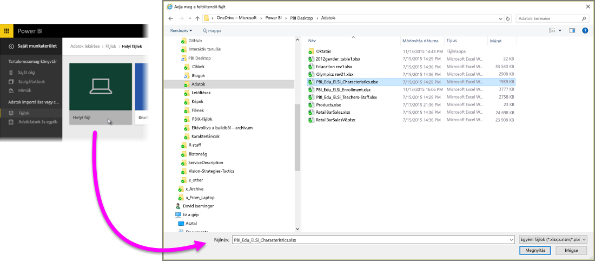
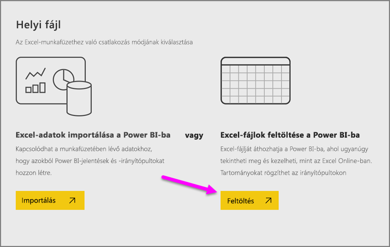
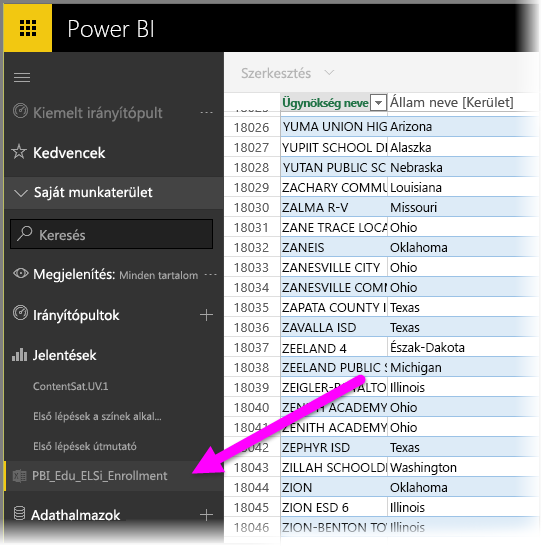

# Adatok elérése Excel-munkafüzetfájlokból

A Microsoft Excel az egyik leggyakrabban használt üzleti alkalmazás. Az Excel emellett az adatok Power BI-ba való beolvasásának egyik leggyakoribb módját is szolgáltatja.

## Milyen munkafüzettípusokat támogat a Power BI?
A Power BI az Excel 2007 vagy újabb verziókban létrehozott munkafüzetek importálását és csatlakoztatását támogatja. A munkafüzeteknek .xlsx vagy .xlsm fájltípusúnak kell lenniük, és nem lehetnek nagyobbak 1 GB-nál. A jelen cikkben ismertetett egyes funkciók csak az Excel későbbi verzióiban elérhetők.

### Adattartományokat vagy -táblákat tartalmazó munkafüzetek
Ha a munkafüzet adattartományokat tartalmazó egyszerű munkalapokból áll, akkor ahhoz, hogy a legtöbbet hozhassa ki adataiból a Power BI-ban, formázza a tartományokat táblákként. Így ha jelentéseket készít a Power BI-ban, nevesített táblákat és oszlopokat lát majd a Mezők ablaktáblán, ami nagyban megkönnyíti az adatok megjelenítését.

### Adatmodelleket tartalmazó munkafüzetek
A munkafüzetek adatmodelleket is tartalmazhatnak, amelyekbe egy vagy több adattábla is betölthető csatolt táblázatok, Power Query (Beolvasás és átalakítás az Excel 2016-ban) vagy Power Pivot használatával. A Power BI az összes adatmodell-tulajdonságot támogatja (pl.: kapcsolatokat, mértékeket, hierarchiákat és KPI-ket).

> [!NOTE]
> Az adatmodelleket tartalmazó munkafüzetek nem oszthatók meg a Power BI-bérlők között. Például egy felhasználó, aki *contoso.com* fiókkal jelentkezik be a Power BI-ba, nem oszthat meg munkafüzetet egy olyan felhasználóval, aki a *woodgrovebank.com* tartományból származó fiókkal jelentkezik be.
> 
> 

### Külső adatforrásokhoz kapcsolódó munkafüzetek
Ha külső adatforráshoz csatlakozik az Excel használatával, akkor mihelyst bekerült a munkafüzet a Power BI-ba, jelentéseket és irányítópultokat készíthet a csatlakoztatott adatforrás adatai alapján. Ütemezett frissítés beállításával automatikusan csatlakozhat közvetlenül az adatforráshoz, és beszerezheti a legfrissebb adatokat. Többé nem kell manuálisan frissítenie az adatokat az Excel Adatok menüszalagjáról. Az adatforrás adatain alapuló jelentések vizualizációi és az irányítópultok csempéi automatikusan frissülnek. További tudnivalókért lásd a [Power BI-ban történő adatfrissítést](refresh-data.md) ismertető szakaszt.

### Power View-lapokat, kimutatásokat és diagramokat tartalmazó munkafüzetek
A PowerView-lapok és kimutatások megjelenítése vagy elrejtése a Power BI-ban attól függ, hogy hol van a munkafüzet mentve, és hogyan viszi azt át a Power BI-ba. A részleteket az alábbiakban olvashatja.

## Adattípusok
A Power BI az alábbi adattípusok használatát támogatja: egész szám, tizedes tört, pénznem, dátum, igaz/hamis, szöveg. Ha az adatokat konkrét adattípusokként adja meg az Excelben, azzal javíthatja a Power BI teljesítményét.

## Munkafüzet előkészítése a Power BI-ban való használatra
Az alábbi hasznos videóból megtudhatja, hogyan győződhet meg arról, hogy Excel-munkafüzetei készen állnak a Power BI-ban való használatra.

<iframe width="500" height="281" src="https://www.youtube.com/embed/l2wy4XgQIu0" frameborder="0" allowfullscreen></iframe>

## A munkafüzet mentési helye sokat számít
**Helyi** – Ha a munkafüzetfájlt a számítógép egyik helyi meghajtójára vagy egy, a cégen belüli más helyre menti, akkor betöltheti azt a Power BI-ba. A fájl igazából a helyi meghajtón marad, tehát a teljes fájl nem lesz importálva a Power BI-ba. Valójában egy új adatkészlet jön létre a Power BI-ban, a rendszer pedig betölti a munkafüzet adatait és adatmodelljét (ha van) az adatkészletbe. Ha a munkafüzet rendelkezik Power View-lapokkal, ezek a Power BI-webhelyén, a Jelentések területen lesznek láthatók. Az Excel 2016 emellett a **Közzététel** funkcióval is rendelkezik (ez a **Fájl** menüben található). A **Közzététel** funkció a hatását tekintve megegyezik a Power BI **Adatok lekérése > Fájlok > Helyi fájl** lehetőségével, de gyakran egyszerűbb a Power BI-ban frissíteni az adatkészletet, ha rendszeresen módosítja a munkafüzetet.

**OneDrive vállalati verzió** – Ha rendelkezik a OneDrive vállalati verziójával, és bejelentkezik a Power BI-ban használt fiókkal, az messze a leghatékonyabb módja az Excelben végzett munka, valamint a Power BI-ban található adatkészlet, jelentések és irányítópultok szinkronban tartásának. Mivel a Power BI és a OneDrive is a felhőben található, a Power BI nagyjából óránként *csatlakozik* a OneDrive-on tárolt munkafüzethez. Ha módosításokat talál, az adatkészlet, a jelentések és az irányítópultok automatikusan frissülnek a Power BI-ban. Csakúgy, mint a helyi meghajtóra mentett munkafüzetek esetében, a Közzététel funkcióval azonnal is frissítheti a Power BI-adatkészletét és jelentéseit. Ellenkező esetben a Power BI automatikusan szinkronizálja az adatokat, általában egy órán belül.

**Személyes OneDrive** – Ha saját OneDrive-fiókjára menti a munkafüzetfájlokat, számos, a OneDrive vállalati verziója esetén is biztosított előnyt élvezhet. A legnagyobb különbség az, hogy amikor először csatlakozik a fájlhoz (az Adatok lekérése > Fájlok > OneDrive – személyes paranccsal), a Microsoft-fiókjával kell bejelentkeznie a OneDrive-ra, amely általában különbözik a Power BI-ba való bejelentkezéskor használt fióktól. Amikor a Microsoft-fiókjával jelentkezik be a OneDrive-ba, mindenképp jelölje be a Bejelentkezve szeretnék maradni lehetőséget. Így a Power BI képes lesz kb. óránként csatlakozni a munkafüzetfájlhoz, és a Power BI-adatkészlete és jelentései naprakészek lesznek.

**SharePoint – csoportwebhelyek** – A Power BI Desktop-fájlok SharePoint – csoportwebhelyekre való mentése sokban hasonlít a OneDrive Vállalati verziójába való mentéshez. A legnagyobb különbség a fájlhoz a Power BI-ból való csatlakozás módja. Megadhat egy URL-címet vagy csatlakozhat a gyökérmappához.

## Egy Excel-munkafüzet – két használati mód
Ha a **OneDrive**-ra menti munkafüzetfájljait, több módon is böngészheti adatait a Power BI-ban

### Excel-adatok importálása a Power BI-ba
Az **Importálás** funkció használatakor a rendszer az összes támogatott adattáblát és/vagy az adatmodellt is importálja egy új adatkészletbe a Power BI-ban. Ha rendelkezik Power View-lapokkal, azok jelentésekként jelennek majd meg a Power BI-ban.

Tovább szerkesztheti a munkafüzetet. A módosítások mentése után a rendszer szinkronizálja ezeket a Power BI-adatkészletével – mindezt általában egy órán belül. Ha biztosra szeretne menni, a Közzététel gombra kattintva azonnal exportálhatja a módosításokat. A jelentésekben és irányítópultokban található vizualizációk szintén frissítve lesznek.

Használja ezt a megoldást, ha adatok beolvasásával és átalakításával vagy a Power Pivottal adatokat töltött be egy adatmodellbe, vagy ha a munkafüzet olyan vizualizációkkal rendelkező Power View-lapokat tartalmaz, amelyeket a Power BI-ban is látni szeretne.

Az Excel 2016 esetében a Közzététel > Exportálás lehetőséget is használhatja. Ez gyakorlatilag ugyanazt fogja eredményezni. További tudnivalókért lásd [a Power BI-ban Excel 2016-ból történő közzétételt](service-publish-from-excel.md) ismertető szakaszt.

### Excel-adatok elérése, kezelése és megtekintése a Power BI-ban
A **Csatlakozás** lehetőség kiválasztásakor a munkafüzet ugyanúgy jelenik meg a Power BI-ban, mint az Excel Online-ban. Az Excel Online-nal ellentétben azonban ebben az esetben néhány kiváló funkció segítségével rögzítheti a munkalapok egyes elemeit közvetlenül az irányítópulton.

A Power BI-ban nincs lehetőség a munkafüzet szerkesztésére. Ha azonban módosításokra van szüksége, a Szerkesztés elemre kattintva kiválaszthatja, hogy az Excel Online-ban szeretné szerkeszteni a munkafüzetet, vagy megnyitja azt a számítógépen, az Excelben. A rendszer menti az összes módosítást a OneDrive-on található munkafüzetbe.

Ebben az esetben nem jön létre adatkészlet a Power BI-ban. A munkafüzet a Power BI-munkaterület navigációs ablaktábláján, a Jelentések területen lesz látható. A csatlakoztatott munkafüzetek egy különleges Excel-ikonnal rendelkeznek.

Válassza ezt a lehetőséget, ha csak adatok vannak a munkalapokon, vagy ha tartományokat, kimutatásokat és diagramokat szeretne az irányítópulton rögzíteni.

Az Excel 2016 esetében a Közzététel > Feltöltés lehetőséget is használhatja. Ez gyakorlatilag ugyanazt fogja eredményezni. További tudnivalókért lásd [a Power BI-ban Excel 2016-ból történő közzétételt](service-publish-from-excel.md) ismertető szakaszt.

## Excel-munkafüzet importálása vagy csatlakoztatása a Power BI-ban
1. A Power BI navigációs ablaktábláján kattintson az **Adatok lekérése** elemre.
   
   
2. A Fájlok területen kattintson a **Lekérés** lehetőségre.
   
   
3. Keresse meg a fájlt.
   
   
4. Ha a munkafüzetfájl a OneDrive-on vagy SharePoint-csoportwebhelyeken található, válassza az **Importálás** vagy a **Csatlakozás** lehetőséget.

## Helyi Excel-munkafüzetek
Helyi Excel-fájlt is használhat, és feltöltheti azt a Power BI-ba. Egyszerűen válassza a **Helyi fájl** lehetőséget az előző menüben, majd keresse meg az Excel-munkafüzetek mentési helyét.

Ha kiválasztotta a fájlt, kattintson a Feltöltés elemre a fájl Power BI-ba történő feltöltéséhez.

A munkafüzet sikeres feltöltése után kapni fog egy értesítést, hogy a munkafüzet használatra kész.

Ha a munkafüzet használatra kész, a Power BI **Jelentések** területén lesz látható.

## Közzététel a Power BI-webhelyen Excel 2016-ból
Az Excel 2016 **Közzététel a Power BI-ban** funkciója a fájlok importálását vagy csatlakoztatását illetően gyakorlatilag megegyezik a Power BI **Adatok lekérése** funkciójával. Itt most nem megyünk bele a részletekbe, de a [Power BI-ban Excel 2016-ból történő közzétételt](service-publish-from-excel.md) ismertető cikkben további információkat olvashat.

## Hibaelhárítás
Túl nagy a munkafüzetfájl? Tekintse meg az [Excel-munkafüzet a Power BI-ban történő megtekintéshez való méretcsökkentését](reduce-the-size-of-an-excel-workbook.md) ismertető szakaszt.

Az Importálás funkció kiválasztása esetén a Power BI jelenleg csak a nevesített táblákban vagy egy adatmodellben található adatokat importálja. Ennek következtében, ha a munkafüzet nem tartalmaz nevesített táblákat, Power View-lapokat vagy Excel-adatmodelleket, az alábbi hibaüzenet jelenhet meg: **„Nem található adat az Excel-munkafüzetben”**. [Ez a cikk](service-admin-troubleshoot-excel-workbook-data.md) ismerteti, hogyan javíthatja ki a munkafüzet hibáit, és importálhatja azt újra.

## Következő lépések
**Az adatok áttekintése** – Miután a fájlból a Power BI-ba helyezte az adatokat és jelentéseket, ideje áttekinteni azokat. Kattintson a jobb gombbal az új adatkészletre, majd kattintson a Tallózás elemre. Ha a 4. lépésben egy OneDrive-on tárolt fájl csatlakoztatása mellett döntött, a munkafüzet a Jelentések területen fog megjelenni. Ha rákattint, a munkafüzet ugyanúgy megnyílik, mintha Excel Online-ban lenne.

**Frissítés ütemezése** – Ha az Excel-munkafüzetfájl külső adatforrásokhoz csatlakozik, vagy helyi meghajtóról importálta azt, ütemezett frissítések beállításával biztosíthatja, hogy az adatkészlet vagy jelentések mindig naprakészek legyenek. Az ütemezett frissítés beállítása a legtöbb esetben elég egyszerű, de ebben a cikkben nem térünk ki a részletekre. További információkért lásd: [Adatfrissítés a Power BI-ban](refresh-data.md).

[Közzététel a Power BI-ban Excel 2016-ból](service-publish-from-excel.md)

[Excelhez készült Power BI Publisher](publisher-for-excel.md)

[Adatfrissítés a Power BI-ban](refresh-data.md)

