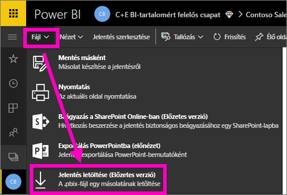
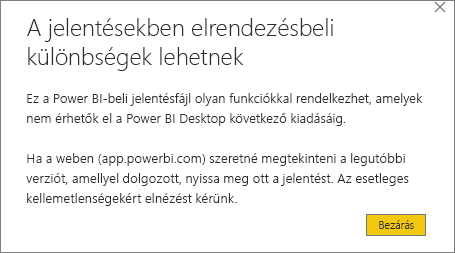
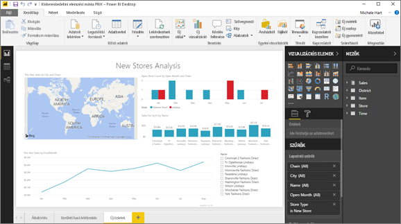

# Jelentés exportálása a Power BI szolgáltatásból a Desktopba (előzetes verzió)
A Power BI Desktopban exportálhat (más kifejezéssel *letölthet*) jelentést a Power BI szolgáltatásba, ha menti a jelentést, és a **Közzététel** lehetőséget választja. Exportálhat a másik irányba is, és letöltheti a jelentést a Power BI szolgáltatásból a Desktopba. Az exportált fájlok kiterjesztése mindkét irány esetében *.pbix*.

Néhány korlátozást és szempontot figyelembe kell venni – ezekről a cikk későbbi szakaszában lesz szó.

## Jelentés letöltése .pbix-fájlként
A .pbix-fájl letöltéséhez kövesse az alábbi lépéseket:

1. A **Power BI szolgáltatásban** nyissa meg a letölteni kívánt jelentést [Szerkesztési nézetben](consumer/end-user-reading-view.md).
2. A menüsávon válassza a **Fájl > Jelentés letöltése** lehetőséget.
   
   > [!NOTE]
   > Ahhoz, hogy a jelentés letölthető legyen, a [Power BI Desktop használatával létrehozott](guided-learning/publishingandsharing.yml?tutorial-step=2), 2016. november 23. utáni – és azóta frissített – jelentésnek kell lennie. Ha nem az, akkor a Power BI szolgáltatás *Jelentés letöltése* menüpontja halványítva jelenik meg.
   > 
   > 
3. A .pbix-fájl létrehozása közben egy állapotsáv jelzi a folyamat előrehaladását. Amikor a fájl elkészül, a rendszer felszólítja a .pbix-fájl megnyitására vagy mentésére. A fájl neve megegyezik a jelentés címével.
   
    
   
    Most már lehetősége van megnyitni a .pbix-fájlt a Power BI szolgáltatásban (app.powerbi.com) vagy a Power BI Desktopban.     
4. A fájl azonnali megnyitásához a Desktopban válassza a **Megnyitás** lehetőséget. Ha egy Ön által meghatározott helyre szeretné menteni a fájlt, válassza a **Mentés > Mentés másként** lehetőséget. Ha még nem tette, [telepítse a Power BI Desktopot](desktop-get-the-desktop.md).
   
    Előfordulhat, hogy amikor megnyitja a jelentést a Desktopban, figyelmeztető üzenetet kap arról, hogy a Power BI szolgáltatásbeli jelentés egyes funkciói esetleg nem elérhetők a Desktopban.
   
    

5. A Power BI szolgáltatásban és a Power BI Desktopban használt jelentésszerkesztő nagyon hasonló.  
   
    

## Megfontolandó szempontok és hibaelhárítás
A *.pbix*-fájlnak a Power BI szolgáltatásból történő letöltésekor (exportálásakor) figyelembe kell venni néhány lényeges szempontot és korlátozást.

* A fájl letöltéséhez szerkesztési jogosultsággal kell hozzáférnie a jelentéshez.
* Fontos, hogy a jelentést a **Power BI Desktoppal** legyen létrehozva, és *közzé legyen téve* a **Power BI szolgáltatásban**, vagy a .pbix-fájl legyen *feltöltve* a szolgáltatásba.
* A jelentéseknek 2016. november 23. után közzétett – vagy azóta frissített – jelentéseknek kell lenniük. Az ennél korábban közzétett jelentések nem tölthetők le.
* Ez a funkció nem működik az eredetileg a **Power BI szolgáltatással** létrehozott jelentésekkel, beleértve a tartalomcsomagokat is.
* Letöltött fájlok megnyitásához javasolt mindig a **Power BI Desktop** legújabb verzióját használni. A letöltött *.pbix*-fájlok olykor nem nyílnak meg a **Power BI Desktop** régebbi verzióiban.
* Ha a rendszergazdája kikapcsolta az adatok exportálásának lehetőségét, akkor ez a funkció nem jelenik meg a **Power BI szolgáltatásban**.
* Növekményes frissítéssel rendelkező adathalmazt nem lehet *.pbix* fájlba letölteni.

## Következő lépések
Tekintse meg a **Guy in a Cube** csatorna erről a funkcióról szóló egyperces videóját:

<iframe width="560" height="315" src="https://www.youtube.com/embed/ymWqU5jiUl0" frameborder="0" allowfullscreen></iframe>

Néhány további cikk is segíthet elsajátítani a **Power BI szolgáltatás** használatát:

* [Jelentések a Power BI-ban](consumer/end-user-reports.md)
* [Power BI – Alapfogalmak](consumer/end-user-basic-concepts.md)

A **Power BI Desktop** telepítése után a következő tartalmak segíthetnek a gyors kezdésben:

* [Első lépések a Power BI Desktop alkalmazással](desktop-getting-started.md)

További kérdései vannak? [Kérdezze meg a Power BI közösségét](http://community.powerbi.com/)   

