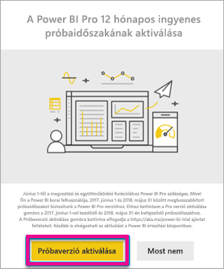
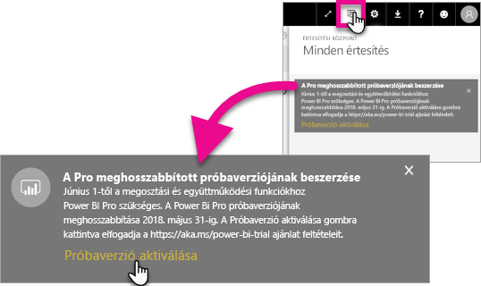
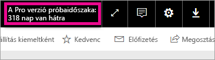

# A Kiterjesztett Pro-próbaverzió aktiválása
2017. június 1-től kezdődően minden jogosult felhasználó csatlakozni tud a Power BI szolgáltatás Kiterjesztett Pro-próbaverziójához.

<iframe width="640" height="360" src="https://www.youtube.com/embed/tPsNoPyY9aA?showinfo=0" frameborder="0" allowfullscreen></iframe>

A [2017. május 3-i Power BI Premium hirdetmény](https://powerbi.microsoft.com/blog/microsoft-accelerates-modern-bi-adoption-with-power-bi-premium/) részeként a Microsoft bejelentett néhány változást az ingyenes Power BI szolgáltatással kapcsolatban. A változások keretében többek közt kiterjesztette a hozzáférést az összes adatforrásra, magasabb tárolási korlátokat biztosított a munkaterületekhez és magasabb frissítési és streaming-rátákat engedélyezett az ingyenes szolgáltatáshoz, azaz egyenlővé tette a Power BI Pro szolgáltatással.

További változás, hogy a megosztási és az együttműködési szolgáltatások ezentúl csak a Pro felhasználók számára lesznek elérhetők. Ilyen szolgáltatások például a társközi irányítópult-megosztás, a most már alkalmazás-munkaterületnek nevezett csoport-munkaterület használata, a PowerPointba exportálás és az Excelben történő elemzés Power BI alkalmazásokkal. A CSV-be/Excelbe és PowerPointba exportálás a május 3-i közlemény szerint csak Power BI Próból elérhető lehetőség lett volna, de a felhasználók széles körétől kapott visszajelzések alapján a stratégia annyiban módosult, hogy ezek a lehetőségek az ingyenes szolgáltatás felhasználói számára is elérhetővé váltak.

2017. június 1-től kezdődően az ingyenes szolgáltatás elmúlt egy évben (2017. május 2-án vagy azt megelőzően) aktív meglévő felhasználói jogosultak lesznek a Power BI 12 hónapos Kiterjesztett Pro-próbaverziójára. A közösség szerepének elismeréseképpen az ajánlat lehetővé teszi, hogy a következő év során a felhasználók teljes körűen kihasználhassák a Power BI Próban rejlő lehetőségeket, továbbá időt biztosít a változásokhoz történő alkalmazkodásra.

2017. június 1-én a jogosult felhasználók számára a szolgáltatásba történő bejelentkezés után megjelenik egy értesítés, amely tájékoztatja őket az életbe lépett változásokról, és kéri, hogy regisztráljanak a Kiterjesztett Power BI Pro szolgáltatásra. A felhasználók rendszergazdája nem tudja vezérelni a terméken belül megjelenő értesítéseket, és nem tud regisztrálni sem a Kiterjesztett Power BI Pro szolgáltatásra a felhasználók nevében. Minden egyes felhasználónak saját magának kell végigmennie a folyamaton.

A 12 hónapos időtartam alatt a felhasználók bármikor dönthetnek úgy, hogy regisztrálnak az ajánlatra, ugyanakkor a Kiterjesztett Pro-próbaverzió igénybevételének lehetősége minden felhasználó számára véget ér 2018. május 31-én. Ekkor a felhasználónak lehetősége lesz megvásárolni a Power BI Pro szolgáltatást, vagy átváltani a Power BI megosztási és együttműködési szolgáltatások nélküli ingyenes verziójára, ha nem szeretnék megvásárolni a Power BI Prót.

Maga a Power BI Pro nem fog változni. Felhasználói nem lesznek érintve, és nem jelenik meg számukra értesítés, amikor 2017. június 1-én vagy ezt követően bejelentkeznek a szolgáltatásba. Azok a felhasználók, akik nem élnek a kiterjesztett Power BI Pro-próbaverzió használatára vonatkozó lehetőséggel vagy nem jogosultak rá, továbbra is a Power BI ingyenes verzióját fogják használni, a megosztási és az együttműködési lehetőségek nélkül. Ők bármikor regisztrálhatnak a Power BI Pro normál, 60 napos próbaverziójára a Power BI [webhelyén](https://powerbi.microsoft.com/get-started/).

## Jogosultság a Kiterjesztett Pro-próbaverzióra
A Kiterjesztett Pro-próbaverzióra akkor lehet regisztrálni, ha a felhasználói fiók megfelel az alábbi követelményeknek.

* Az ingyenes Power BI szolgáltatás azon felhasználói, akik 2016. május 3. és 2017. május 2. között már aktívak voltak, regisztrálhatnak a kiterjesztett Pro-próbaverzióra.
* Azok a felhasználók, akik korábban használták vagy jelenleg használják a *60 napos, terméken belüli Pro-próbaverziót*, regisztrálhatnak a kiterjesztett Pro-próbaverzióra.

> [!NOTE]
> Azok a felhasználók, akik az Office 365-ön belüli Power BI Pro vagy Power BI Pro-próbaverzió előfizetésből hozzárendelt licenccel rendelkeznek, nem vehetik igénybe ezt a lehetőséget.
> 
> 

## Az aktiválás módja
A Kiterjesztett Pro-próbaverzió kétféleképpen aktiválható. Először a Power BI-ba történő bejelentkezéskor. Ha ezt elmulasztja, az értesítések területén is rendelkezésre áll majd egy lehetőség.

> [!NOTE]
> A terméken belüli kommunikációt nem a rendszergazda vezérli. Az értesítést a rendszer küldi ki a jogosult felhasználóknak.
> 
> 

### Aktiválás bejelentkezéskor
Amikor bejelentkezik a Power BI szolgáltatásba, megjelenik egy értesítés. Ha a **Próbaverzió aktiválása** lehetőségre kattint, elindul a Kiterjesztett Pro-próbaverzió. További lépéseket nem kell tennie.

Ettől kezdve a próbaverzió időszakában el tudja érni az összes megosztott irányítópultot és jelentést.

Ha a **Most nem** lehetőségre kattint, a Kiterjesztett Pro-próbaverziót 2018. május 31-ig, a próbaidőszak végéig később is bármikor aktiválhatja.

### Aktiválás későbbi időpontban
Ha átugrotta a felugró ablakban elérhető lehetőséget a **Most nem** lehetőség választásával, 2018. május 31-ig, a próbaidőszak végéig később is bármikor aktiválhatja a Kiterjesztett Pro-próbaverziót. Ehhez az **Értesítési központba** kell lépnie.

Az Értesítési központban látni fogja a Kiterjesztett Pro-próbaverzióra vonatkozó értesítést. Az értesítés addig nem tűnik el, amíg a felhasználó nem aktiválja a Kiterjesztett próbaverziót.

A próbaverzió használatának megkezdéséhez kattintson a **Próbaverzió aktiválása** lehetőségre. További lépéseket nem kell tennie.

Ettől kezdve a próbaverzió időszakában el tudja érni az összes megosztott irányítópultot és jelentést.

## Aktiválás után
Aktiválás után a jobb felső sarokban látni fogja, hány nap van hátra a próbaidőszakból.

A használati feltételeket a [Kiterjesztett Pro-próbaverzió használati feltételeinek](https://aka.ms/power-bi-trial) oldalán tekintheti meg. A Kiterjesztett Pro-próbaverzió 2018. május 31-ig lesz elérhető a jogosult felhasználók számára.

## Gyakran feltett kérdések
**Mi történik a 2017. május 3. után regisztráló új felhasználókkal?**

A Power BI (ingyenes) szolgáltatásba 2017. május 3-án vagy azt követően regisztrált felhasználók nem jogosultak a Kiterjesztett Pro-próbaverzió használatára. Jogosultak ugyanakkor a normál, 60 napos próbaverzióra.

**Hogyan deríthetem ki, hogy mely munkatársaim jogosultak a kiterjesztett Pro-próbaverzió használatára?**

Bár nem létezik közvetlen módszer ennek kiderítésére, az Azure Active Directory integrált alkalmazásokat tartalmazó jelentésében megtekintheti, hogy munkahelyéről mely felhasználók voltak aktívak az elmúlt 30 napban. Ez támpontot nyújthat annak eldöntéséhez, hogy ki lehet jogosult a próbaverzióra. További információért tekintse át a [Bejelentkezett Power BI-felhasználók keresése](service-admin-access-usage.md) témát.

A jogosultsági időszakban lévő, ingyenes licenceket használó aktív felhasználók felbukkanó ablakban kapnak értesítést. 

> [!NOTE]
> Az Azure AD-jelentésben nem látható, hogy az adott felhasználó a Power BI ingyenes vagy Pro verziót használja-e. Csak az tekinthető meg, hogy mely felhasználók regisztráltak a Power BI-ba, és mikor jelentkeztek be. Ha egy felhasználó szerepel ebben a jelentésben, az nem feltétlenül jelenti azt, hogy az adott felhasználó jogosult a kiterjesztett Pro-próbaverzió használatára.
> 
> 

**Korlátozhatják a rendszergazdák, hogy mely felhasználók aktiválhatják a Kiterjesztett Pro-próbaverziót?**

Nem. A rendszergazdák nem korlátozhatják a Power BI Pro Kiterjesztett Pro-próbaverzióját vagy a terméken belüli 60 napos próbaverzióját aktiváló felhasználók körét.

## További lépések
[Kiterjesztett Pro-próbaverzió használati feltételei](https://aka.ms/power-bi-trial)  
[A Power BI szolgáltatási szerződése egyéni felhasználók számára](https://powerbi.microsoft.com/terms-of-service/)  
[A Power BI Premium hirdetménye](https://aka.ms/pbipremium-announcement)  
[Bejelentkezett Power BI-felhasználók keresése](service-admin-access-usage.md)

További kérdései vannak? [Kérdezze meg a Power BI közösségét](https://community.powerbi.com/)

