# A Microsoft Flow és a Power BI

A [Microsoft Flow](https://flow.microsoft.com/en-us/documentation/getting-started) SaaS-szolgáltatással munkafolyamatokat automatizálhat az üzleti felhasználók által használt, egyre növekvő számú alkalmazás és SaaS-szolgáltatás között. A Flow segítségével kedvenc alkalmazásait és szolgáltatásait (többek között a Power BI-t) integrálva automatizálhatja az értesítések küldését, a fájlok szinkronizálását, az adatgyűjtést és még sok más feladatot. A munkafolyamatok automatizálásával egyszerűbben végezhetők el az ismétlődő feladatok.

[Kezdjen el megismerkedni a Flow-val most.](https://flow.microsoft.com/documentation/getting-started)

Nézze meg, hogyan hoz létre Sirui egy olyan folyamatot, amely részletes e-mailt küld a munkatársainak, amikor valamilyen esemény adatriasztást vált ki a Power BI-ban. Ha végzett, a videó alatti részletes útmutatást követve próbálja ki Ön is.

<iframe width="560" height="315" src="https://www.youtube.com/embed/YhmNstC39Mw" frameborder="0" allowfullscreen></iframe>

## Power BI-adatriasztás által indított folyamat létrehozása

### Előfeltételek
Ez az oktatóanyag bemutatja, hogyan hozzon létre két különböző folyamatot; az egyiket sablonból, a másikat teljesen az alapoktól. A feladat elvégzéséhez [hozzon létre egy adatriasztást a Power BI-ban](service-set-data-alerts.md), hozzon létre egy ingyenes Slack-fiókot, majd [iratkozzon fel a Microsoft Flow](https://flow.microsoft.com/en-us/#home-signup) szolgáltatásra (ingyenes).

## Power BI-t használó folyamat létrehozása sablonból
Ennek a feladatnak a végrehajtása során sablon alapján hozunk létre egy egyszerű folyamatot, amelyet egy Power BI-adatriasztás (értesítés) indít majd el.

1. Jelentkezzen be a Microsoft Flow-ba (flow.microsoft.com).
2. Kattintson a **Saját folyamatok** lehetőségre.
   
   
3. Kattintson a **Létrehozás sablonból** lehetőségre.
   
    
4. A keresőmezőt használva keressen Power BI-sablonokat, majd válassza ki az **Adatvezérelt Power BI-riasztás esetén e-mail értesítés küldése bárkinek > Folytatás** lehetőséget.
   
    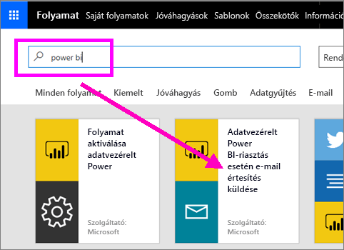

### A folyamat létrehozása
Ez a sablon egy triggerből (Power BI-adatriasztás újabb ír olimpiai érem megszerzésekor) és egy műveletből (e-mail küldése) áll. Amikor kiválaszt egy mezőt, a Flow megjelenít egy dinamikus tartalmat, amit belefoglalhat az üzenetbe.  Ebben a példában a csempe értékét és a csempe URL-címét foglaljuk bele az üzenet szövegébe.

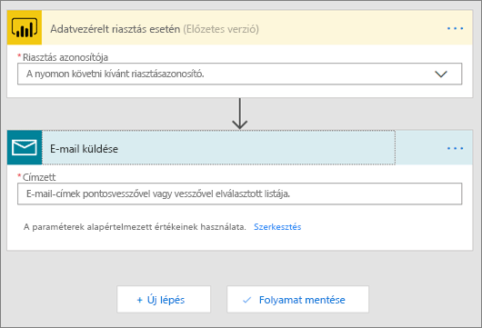

1. A triggerek legördülő menüjéből válassza ki a Power BI-adatriasztás lehetőséget. Válassza az **Új érem Írországnak** (New medal for Ireland) lehetőséget. A riasztások létrehozásával kapcsolatban tekintse meg a [Power BI-beli adatriasztásokról](service-set-data-alerts.md) szóló cikket.
   
   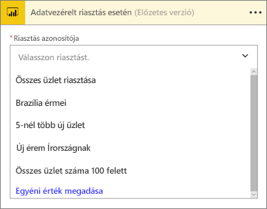
2. Adjon meg egy vagy több érvényes e-mail-címet, majd válassza a **Szerkesztés** lehetőséget (lásd alább) vagy a **Dinamikus tartalom hozzáadása** lehetőséget. 
   
   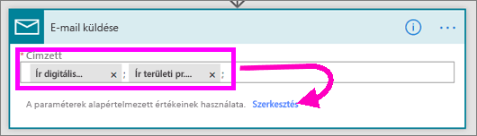

3. A Flow létrehoz egy címet és egy üzenetet, amelyet megtarthat vagy módosíthat. Minden olyan érték elérhető és használható, amelyet a riasztás létrehozásakor állított be a Power BI-ban. Használatukhoz mindössze a kiemelt szürke terület fölé kell vinnie a kurzort. 

   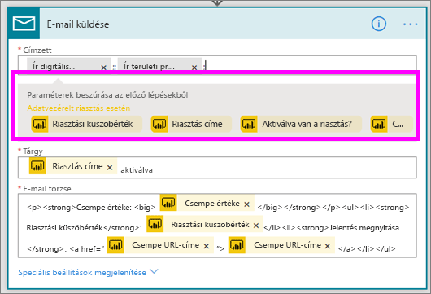

1.  Ha például a riasztás címekét beállította a **Újabb érmet nyertünk** szöveget, a **Riasztás címe** lehetőség kiválasztásával felhasználhatja ezt a szöveget az e-mail tárgyának szövegeként.

    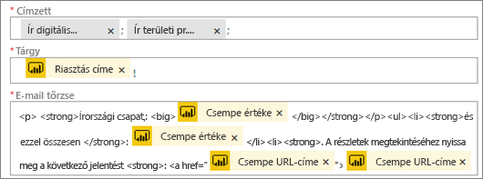

    Az e-mail törzseként elfogadhatja az alapbeállítás szerinti szöveget, de létrehozhat saját szöveget is. A fenti példában az alapértelmezett üzenetben néhány változtatás látható.

1. Ha elkészült, válassza a **Folyamat létrehozása** vagy a **Folyamat mentése** lehetőséget.  A rendszer létrehozza és ellenőrzi a folyamatot.  A Flow értesíteni fogja, ha hibát észlel.
2. Hibák esetén a **Folyamat szerkesztése** lehetőségre kattintva hárítsa el azokat. Ha nincsenek hibák, a **Kész** gombra kattintva futtathatja az új folyamatot.
   
   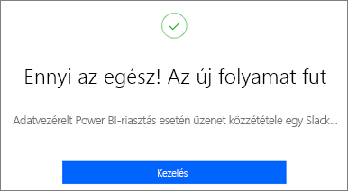
5. Ha az adatriasztás megtörténik, a rendszer a megadott e-mail-címekre üzenetet küld.  
   
   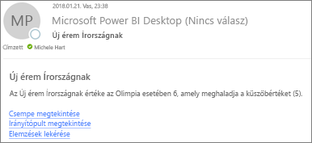

## Power BI-t használó folyamat létrehozása sablon nélkül
Ennek a feladatnak a végrehajtása során sablon nélkül hozunk létre egy egyszerű folyamatot, amelyet egy Power BI-adatriasztás (értesítés) indít majd el.

1. Jelentkezzen be a Microsoft Flow-ba.
2. Kattintson a **Saját folyamatok** > **Üres folyamat létrehozása** lehetőségre.
   
   
3. A keresőmezőt használva keressen rá a Power BI-triggerekre, majd válassza a **Power BI – adatriasztás esetén** lehetőséget.

### A folyamat létrehozása
1. A legördülő listából válassza ki a riasztás nevét.  A riasztások létrehozásával kapcsolatban tekintse meg a [Power BI-beli adatriasztásokról](service-set-data-alerts.md) szóló cikket.
   
    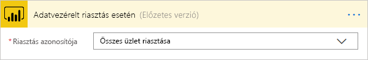
2. Kattintson az **Új lépés** > **Művelet hozzáadása** lehetőségre.
   
   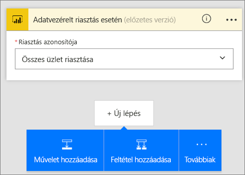
3. Keressen rá az **Outlook** kifejezésre, majd kattintson a **Create event** (Esemény létrehozása) lehetőséget tartalmazó találatra.
   
   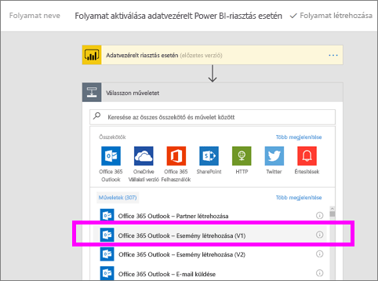
4. Töltse ki az eseményhez kapcsolódó mezőket. Amikor kiválaszt egy mezőt, a Flow megjelenít egy dinamikus tartalmat, amit belefoglalhat az üzenetbe.
   
   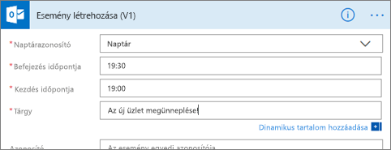
5. Ha elkészült, kattintson a **Folyamat létrehozása** lehetőségre.  A Flow menti és ellenőrzi a folyamatot. Ha nincsenek hibák, a **Kész** gombra kattintva tudja futtatni a folyamatot.  Az új folyamatot a rendszer felveszi a **Saját folyamatok** lapra.
   
   
6. Amikor egy Power BI-adatriasztás elindítja a folyamatot, az alábbihoz hasonló Outlook-eseményértesítést fog kapni.
   
    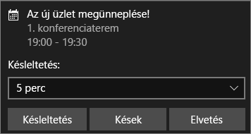

## Következő lépések
* [Microsoft Flow ‒ első lépések](https://flow.microsoft.com/en-us/documentation/getting-started/)
* [Adatriasztások beállítása a Power BI szolgáltatásban](service-set-data-alerts.md)
* [Adatriasztások beállítása az iPhone-on](mobile-set-data-alerts-in-the-mobile-apps.md)
* [Adatriasztások beállítása a Windows 10-hez készült Power BI mobilalkalmazásban](mobile-set-data-alerts-in-the-mobile-apps.md)
* További kérdései vannak? [Kérdezze meg a Power BI közösségét](http://community.powerbi.com/)

