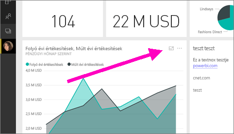
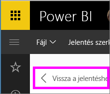

# Irányítópult-csempe vagy jelentésvizualizáció megjelenítése Fókusz módban
<iframe width="560" height="315" src="https://www.youtube.com/embed/dtdLul6otYE" frameborder="0" allowfullscreen></iframe>

## A Fókusz mód
A ***Fókusz*** mód lehetővé teszi, hogy a csempéket további részletek megtekintése érdekében kibontsa (megjelenítse egy kiugró ablakban).  A Fókusz módban lehetőség van a vizualizáció létrehozásakor alkalmazott szűrők megjelenítésére és módosítására.  

> [!NOTE]
> A Fókusz mód más, mint a [teljes képernyős mód](service-tile-fullscreen-mode.md).
> 
> 

1. Helyezze a kurzort az egyik vizualizáció fölé, majd válassza a  **Fókusz mód** ikont.  
   
   
2. A rendszer megnyitja a vizualizációt, és kitölti vele a vásznat. Az irányítópult-csempék és a jelentésvizualizációk Fókusz módja hasonló, de van néhány eltérés. Egy jelentés Fókusz módú megjelenítéséből például a **Vissza a jelentéshez** lehetőségre kattintva léphet ki. Az irányítópultok fókusz módú megjelenítéséből pedig a **Kilépés a fókusz módból** lehetőségre kattintva lehet kilépni. A többi különbségről a lejjebb olvasható **Megfontolandó szempontok és hibaelhárítás** részben olvashat.
   
   
3. A vizualizáció létrehozásához használt szűrők megjelenítéséhez bontsa ki a Szűrők ablaktáblát.
   
   
4. Elemezze tovább adatait a szűrők módosításával, és ha talál valami érdekeset, tűzze ki a vizualizációt az irányítópultra.   
5. Hagyja el a Fókusz módot, és térjen vissza az irányítópulthoz a vizualizáció bal felső sarkában látható **< Kilépés a fókusz módból** lehetőségre kattintva.
   
        
   
    Hagyja el a Fókusz módot, és térjen vissza a jelentéshez a **Vissza a jelentéshez** lehetőségre kattintva.    
   
    

## Váltás Fókusz módról Teljes képernyős módra
Ha már Fókusz módban van, a csempét vagy vizualizációt megtekintheti [Teljes képernyős](service-tile-fullscreen-mode.md) módban. Teljes képernyős módban a figyelmet elterelő menük és navigációs gombok nem láthatók.

## Megfontolandó szempontok és hibaelhárítás
* Jelentésvizualizációk Fókusz módban történő megtekintésekor az összes szűrőt, azaz a vizualizációs elem szintű, a lapszintű, és jelentésszintű szűrőket is módosítani tudja.    
* Irányítópult-vizualizációk Fókusz módú megjelenítésekor csak a vizualizációs elem szintű szűrőket tudja módosítani.

További kérdései vannak? [Felteheti azokat a Power BI-közösségnek](http://community.powerbi.com/)

