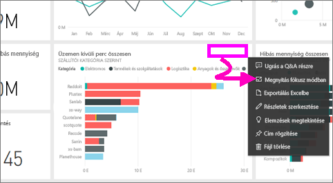
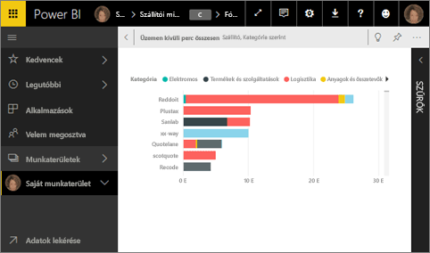
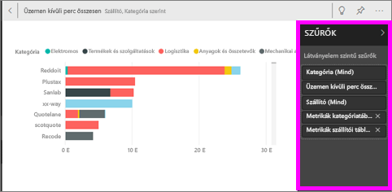
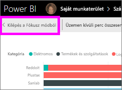

# Irányítópult-csempe vagy jelentésvizualizáció megjelenítése Fókusz módban

<iframe width="560" height="315" src="https://www.youtube.com/embed/dtdLul6otYE" frameborder="0" allowfullscreen></iframe>

## A Fókusz mód

***Fókusz*** módban kibonthatja a tartalmat, így részletesebben megjelenítheti azt.  A Fókusz módban lehetőség van a vizualizáció létrehozásakor alkalmazott szűrők megjelenítésére és módosítására.  A Power BI szolgáltatásban a fókusz mód irányítópult csempéjén vagy jelentés vizualizációján használható, míg a Power BI Desktopban [jelentésvizualizációban](desktop-report-view.md) használhatja azt.

> [!NOTE]
> A Fókusz mód más, mint a [teljes képernyős mód](service-fullscreen-mode.md).
> 

## Irányítópult-csempék fókusz módban

1. Helyezze a kurzort a csempevizualizáció fölé, válassza a három pont (...) lehetőséget, majd a **Megnyitás fókusz módban** lehetőséget. 

    .

2. A rendszer megnyitja a csempét, és kitölti vele a jelentésvásznat. 

   

3. A vizualizáció létrehozásához használt szűrők megjelenítéséhez bontsa ki a Szűrők ablaktáblát.
   
   

4. Elemezze tovább adatait a szűrők módosításával, és ha talál valami érdekeset, tűzze ki a vizualizációt az irányítópultra.

5. Hagyja el a Fókusz módot, és térjen vissza az irányítópulthoz a vizualizáció bal felső sarkában látható **< Kilépés a fókusz módból** lehetőséget választva.
   
        

## Fókusz mód jelentésvizualizációkhoz

1. Vigye az egeret a jelentésvizualizáció fölé, és válassza a **fókusz mód** ikont .  
   
   
2. A rendszer megnyitja a vizualizációt, és kitölti vele a teljes vásznat. 

   
3. A vizualizáció létrehozásához használt szűrők megjelenítéséhez bontsa ki a Szűrők ablaktáblát.
   
   
4. Elemezze tovább adatait a szűrők módosításával, és ha talál valami érdekeset, tűzze ki a vizualizációt az irányítópultra.   
5. Hagyja el a Fókusz módot, és térjen vissza a jelentéshez vizualizáció bal felső sarkában látható **Vissza a jelentéshez** lehetőségre kattintva. 
   
      

## Váltás Fókusz módról Teljes képernyős módra
Ha már Fókusz módban van, a csempét vagy vizualizációt megtekintheti [Teljes képernyős (TV)](service-fullscreen-mode.md) módban. Teljes képernyős módban a figyelmet elterelő menük és navigációs gombok nem láthatók.

## Megfontolandó szempontok és hibaelhárítás
* Jelentésvizualizációk fókusz módban történő megtekintésekor az összes szűrőt, azaz a vizualizációs elem szintű, a lapszintű, a részletezés szintű és a jelentésszintű szűrőket is módosítani tudja.    
* Irányítópult-vizualizációk fókusz módú megjelenítésekor csak a vizualizációs elem szintű szűrőket tudja módosítani.

További kérdései vannak? [Kérdezze meg a Power BI közösségét](http://community.powerbi.com/)

