# Excel-munkafüzettől egy lenyűgöző jelentésig villámgyorsan
A főnöke azt szeretné, hogy még ma készítsen el egy kombinált jelentést a tavalyi év értékesítési mutatóiról és az előző kampánnyal kapcsolatos benyomásairól. A legutóbbi adatok azonban különböző külső gyártók rendszerein és a saját laptopján lévő fájlokban találhatók. Korábban több óráig is eltartott egy vizualizáció létrehozása és egy jelentés formázása. Kezd nyugtalan lenni?

Nincs miért aggódnia. A Power BI-jal villámgyorsan létrehozhat egy lenyűgöző jelentést.

Ebben a példában feltöltünk egy Excel-fájlt egy helyi rendszerről, létrehozunk egy új jelentést, és megosztjuk a munkatársakkal – mindezt a Power BI-ban.

## Adatok előkészítése
Vegyünk példaként egy egyszerű Excel-fájlt. Mielőtt betöltené az Excel-fájlt a Power BI-ba, előbb rendszereznie kell az adatokat egy egyszerű táblában. Vagyis minden oszlopnak azonos adattípusú értékeket, például szöveget, dátumokat, számokat vagy pénznemeket kell tartalmaznia. Egy fejléc sorra is szükség van, ugyanakkor egyetlen sor vagy oszlop sem jeleníthet meg összesített értékeket.

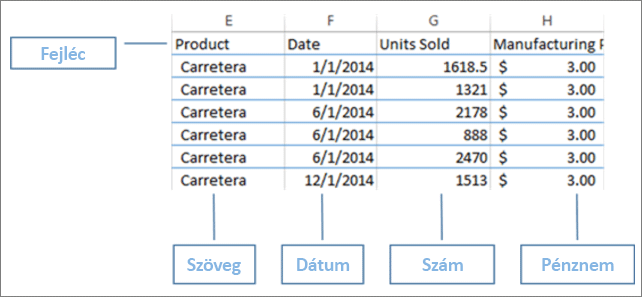

Ezután formázza az adatokat táblázatként. Az Excelben a Kezdőlapon a Stílusok csoportban válassza a **Formázás táblázatként** lehetőséget. Válassza ki a táblázat stílusát, hogy alkalmazza a formázást a munkafüzetén. Az Excel-munkafüzete ekkor már betölthető a Power BI-ba.

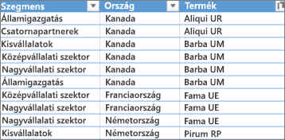

## Excel-fájl feltöltése a Power BI-ba
A Power BI több adatforráshoz is képes csatlakozni, köztük a számítógépén található Excel-fájlokhoz. Első lépésként jelentkezzen be a Power BI-ba. Ha még nem regisztrált, [akkor ezt ingyen megteheti](https://powerbi.com).

Érdemes létrehozni egy új irányítópultot. Nyissa meg a **Saját munkaterületet**, majd válassza a **+ Létrehozás** ikont.

Válassza az **Irányítópult** lehetőséget, adjon meg egy nevet, majd válassza a **Létrehozás** gombot. Ekkor megjelenik az új irányítópult, de még nem tartalmaz adatokat.

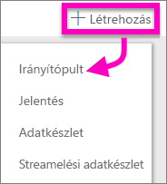

A bal oldalon lévő navigációs ablaktáblán válassza az **Adatok lekérése** elemet. Az Adatok lekérése oldalon az Adatok importálása vagy csatlakoztatása alatt válassza a Fájlok terület **Beolvasás** gombját.

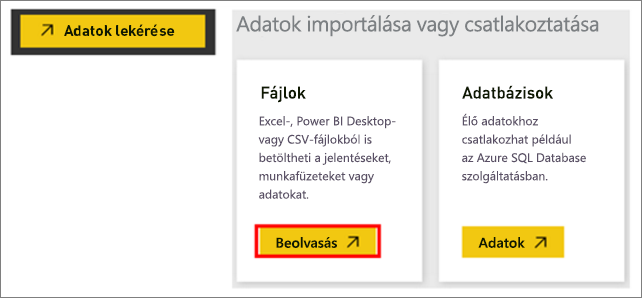

A Fájlok oldalon válassza a **Helyi fájl** lehetőséget. Keresse meg a számítógépén az Excel-munkafüzetet, majd válassza ki, hogy betöltse a Power BI-ba. Válassza az **Importálás** lehetőséget.

> **MEGJEGYZÉS**: Hogy követni tudja az oktatóanyag következő részeiben leírtakat, használja a [pénzügyi mintát tartalmazó munkafüzetet](sample-financial-download.md).
> 
> 

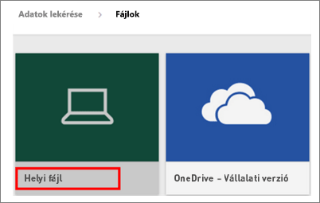

## Jelentés készítése
Miután a Power BI befejezte az Excel-fájl importálását, nekiláthat a jelentés készítésének. Amikor megjelenik az **Adatkészlet készen áll** üzenet, válassza az **Adatkészlet megtekintése** lehetőséget.  Ekkor a Power BI megnyitja a Szerkesztő nézetet, és megjelenít egy üres jelentésvásznat. A jobb oldalon találhatók a Megjelenítések, a Szűrők és a Mezők ablaktáblái.

Észrevehető, hogy az Excel-munkafüzet táblázatadatai a Mezők ablaktáblán jelennek meg. A Power BI a táblázat neve alatt egyéni mezőkként listázza az oszlopok fejléceit.

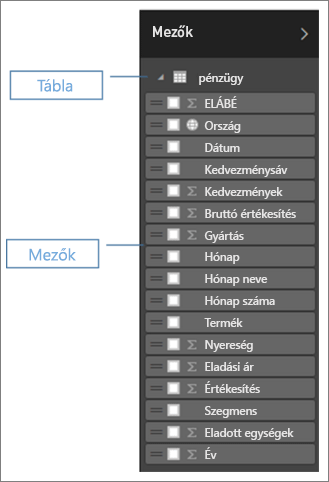

Most már nekiláthat a vizualizáció létrehozásának. A főnöke szeretné látni a nyereséget az idő függvényében. A Mezők ablaktábláról húzza a **Profit** (Nyereség) elemet a jelentésvászonra. A Power BI ekkor alapértelmezés szerint egy oszlopdiagramot jelenít meg. Ezután húzza a **Date** (Dátum) elemet a jelentésvászonra. A Power BI frissíti az oszlopdiagramot, és a nyereséget dátum szerint jeleníti meg.

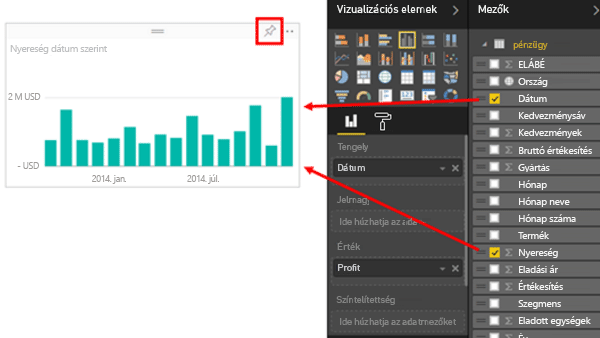

> **TIPP**: Ha a diagramja nem úgy néz ki, mint ahogy gondolta, ellenőrizze az összesítéseit. Például az **Érték** gyűjtőben kattintson a jobb gombbal az imént hozzáadott mezőre, és ellenőrizze, hogy az adatok összesítése úgy történik-e, ahogyan Ön szeretné.  Ebben a példában az **Összeg** lehetőséget használjuk.
> 
> 

A főnöke tudni szeretné, hogy melyek a leginkább nyereséges országok. Nyűgözze le egy térkép-vizualizációval. Válassza ki a vászon egy üres területét, majd húzza oda a Mezők ablaktábláról a **Country** (Ország), majd a **Profit** (Nyereség) mezőket. A Power BI ekkor létrehoz egy térkép-vizualizációt, amelyen buborékok jelölik az egyes helyek relatív nyereségét.

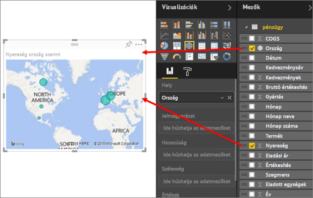

Megjelenítene még egy olyan vizualizációt is, amelyen az értékesítések a termékek és a piaci szegmensek szerint láthatók? Nem nehéz. A Mezők ablaktáblán jelölje be a jelölőnégyzeteket a Sales (Értékesítés), a Product (Termék) és a Segment (Szegmens) mezők mellett. A Power BI ekkor azonnal létrehoz egy oszlopdiagramot. A Megjelenítés menü egy ikonját kiválasztva módosítsa a diagram típusát. Módosítsa például Halmozott oszlopdiagram típusúra.  A diagram rendezéséhez válassza a három pontot (...), majd a **Rendezés szempontja:** elemet.

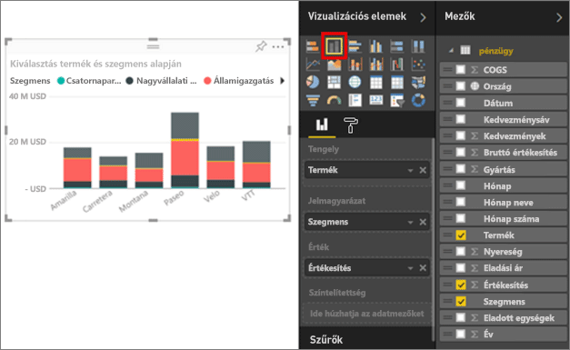

Rögzítse az összes vizualizációt az irányítópulton. Készen áll arra, hogy megossza az irányítópultját a munkatársaival.

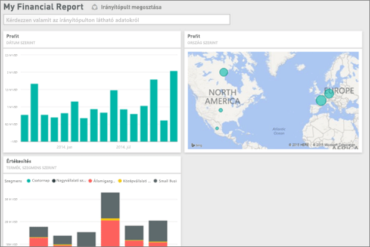

## Irányítópult megosztása
Szeretné megosztani az irányítópultját a főnökével, Paulával. Az irányítópultját és az alapjául szolgáló jelentést megoszthatja bármelyik munkatársával, aki rendelkezik Power BI-fiókkal. Használhatják a jelentéseket, azonban nem tudják menteni a módosításokat.

A jelentés megosztásához válassza a **Megosztás** lehetőséget az irányítópult tetején.

A Power BI ekkor megjeleníti az Irányítópult megosztása oldalt. A felső részen adja meg a címzettek e-mail-címeit. Adjon meg egy üzenetet az alul található mezőben. Jelölje be az **Irányítópult megosztásának engedélyezése a címzetteknek** lehetőséget, hogy a címzettek megoszthassák másokkal az irányítópultját. Válassza a **Megosztás** gombot.

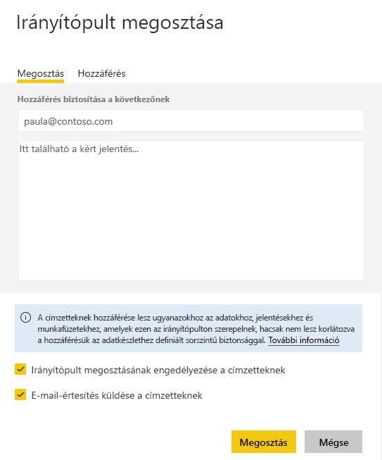

Következő lépések

* [A Power BI szolgáltatás használatának első lépései](service-get-started.md)
* [Első lépések a Power BI Desktoppal](desktop-getting-started.md)
* [Power BI – Alapfogalmak](service-basic-concepts.md)
* További kérdései vannak? [Kérdezze meg a Power BI közösségét](http://community.powerbi.com/)

